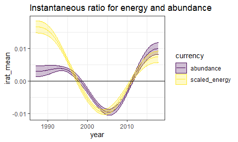
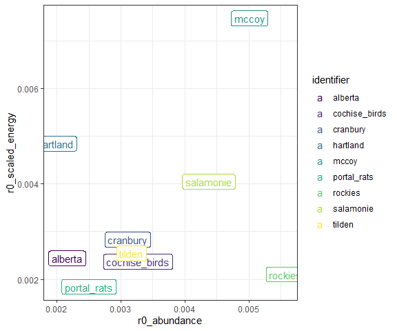

Use r0 of first derivative to make comparisons
================

``` r
knitr::opts_chunk$set(echo = FALSE)
knitr::opts_chunk$set(fig.dim = c(5,3))

library(dplyr)
```

    ## 
    ## Attaching package: 'dplyr'

    ## The following objects are masked from 'package:stats':
    ## 
    ##     filter, lag

    ## The following objects are masked from 'package:base':
    ## 
    ##     intersect, setdiff, setequal, union

``` r
library(gratia)
```

    ## Warning: package 'gratia' was built under R version 4.0.3

``` r
library(ggplot2)
load_mgcv()

ts <- read.csv(here::here("gams", "working_datasets.csv"))

unique_sites <- unique(ts$site_name)

site_dfs <- lapply(unique_sites, FUN = function(site, full_ts) return(filter(full_ts, site_name == site)), full_ts = ts)

source(here::here("gams", "gam_fxns", "wrapper_fxns.R"))
```

#### With mccoy

    ## Joining, by = "row"
    ## Joining, by = "row"
    ## Joining, by = "row"

<!-- -->

E and N are on different scales. Rescaled energy divides energy by the
mean percapita metabolic rate, putting it in units **closer** to the
scale of the abundance values.

<!-- --><!-- --><!-- --><!-- -->

    ## `summarise()` ungrouping output (override with `.groups` argument)

    ## # A tibble: 3 x 4
    ##   currency      mean_derivative mean_rnaught rnaught_dev
    ##   <chr>                   <dbl>        <dbl>       <dbl>
    ## 1 abundance             -0.0583         1.00     0.00501
    ## 2 energy              1858.             1.00     0.00750
    ## 3 scaled_energy          5.93           1.00     0.00748

<!-- -->

    ## Joining, by = "row"
    ## Joining, by = "row"
    ## Joining, by = "row"
    ## Joining, by = "row"
    ## Joining, by = "row"
    ## Joining, by = "row"
    ## Joining, by = "row"
    ## Joining, by = "row"
    ## Joining, by = "row"
    ## Joining, by = "row"
    ## Joining, by = "row"
    ## Joining, by = "row"
    ## Joining, by = "row"
    ## Joining, by = "row"
    ## Joining, by = "row"
    ## Joining, by = "row"
    ## Joining, by = "row"
    ## Joining, by = "row"
    ## Joining, by = "row"
    ## Joining, by = "row"
    ## Joining, by = "row"
    ## Joining, by = "row"
    ## Joining, by = "row"
    ## Joining, by = "row"
    ## Joining, by = "row"
    ## Joining, by = "row"
    ## Joining, by = "row"

<!-- --><!-- --><!-- --><!-- --><!-- --><!-- -->

    ## `summarise()` regrouping output by 'currency' (override with `.groups` argument)

<!-- --><!-- -->

    ## Joining, by = "identifier"

<!-- --><!-- -->

``` 
```

## `summarise()` regrouping output by ‘seed’, ‘identifier’ (override with `.groups` argument)

``` 
```

## `summarise()` regrouping output by ‘identifier’ (override with `.groups` argument)

``` 
```

## `summarise()` regrouping output by ‘currency’ (override with `.groups` argument)

``` 
```

## Joining, by = c(“identifier”, “currency”)

\`\`\`

<!-- -->
