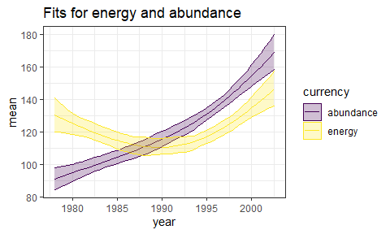
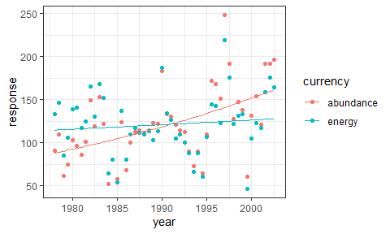
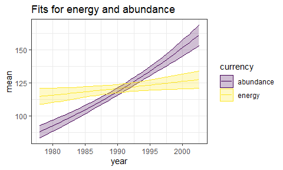
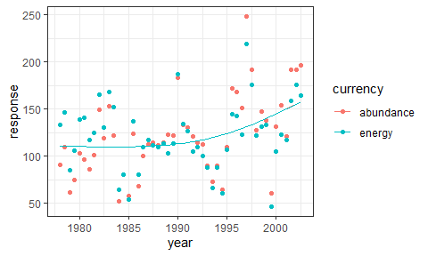
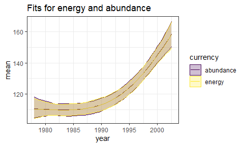

Rats - energy v abundance
================

``` r
knitr::opts_chunk$set(echo = FALSE)
knitr::opts_chunk$set(fig.dim = c(5,3))

library(dplyr)
```

    ## 
    ## Attaching package: 'dplyr'

    ## The following objects are masked from 'package:stats':
    ## 
    ##     filter, lag

    ## The following objects are masked from 'package:base':
    ## 
    ##     intersect, setdiff, setequal, union

``` r
library(gratia)
```

    ## Warning: package 'gratia' was built under R version 4.0.3

``` r
library(ggplot2)
load_mgcv()

ts <- read.csv(here::here("gams", "working_datasets.csv"))

unique_sites <- unique(ts$site_name)

site_dfs <- lapply(unique_sites, FUN = function(site, full_ts) return(filter(full_ts, site_name == site)), full_ts = ts)

source(here::here("gams", "gam_fxns", "wrapper_fxns.R"))
```

#### With portal

<!-- -->

  - This is energy rescaled to be on a similar scale to abundance.
  - They **kind of** track, but note:
      - Abundance starts lower and ends higher than energy
      - There is decoupling in the late 90s

<!-- end list -->

    ## Joining, by = "row"
    ## Joining, by = "row"
    ## Joining, by = "row"

<!-- -->

  - The GAM fits picked right up on the divergence in energy and
    abundance. They fit a U-shape to energy and a more monotonic
    increase to abundance.

### do I need to fit both variables in one model

    ##     year richness abundance biomass   energy mean_energy mean_mass   site_name
    ## 1 1978.0        5        91    6753 132.9584    139.1168  74.20879 portal_rats
    ## 2 1978.5        6       110    7216 146.3616    126.6893  65.60000 portal_rats
    ## 3 1979.0        4        61    4166  84.5011    131.8979  68.29508 portal_rats
    ## 4 1979.5        6        75    5351 106.0765    134.6676  71.34667 portal_rats
    ## 5 1980.0        5       103    6939 139.4661    128.9249  67.36893 portal_rats
    ## 6 1980.5        6        96    7191 141.0675    139.9140  74.90625 portal_rats
    ##   time rescaled_energy
    ## 1    1        132.9584
    ## 2    2        146.3616
    ## 3    3         84.5011
    ## 4    4        106.0765
    ## 5    5        139.4661
    ## 6    6        141.0675

<!-- -->

    ## Joining, by = "row"

    ## # A tibble: 6 x 8
    ##     row  draw fitted  year currency   mean upper lower
    ##   <int> <int>  <dbl> <dbl> <chr>     <dbl> <dbl> <dbl>
    ## 1     1     1   88.0 1978  abundance  88.1  92.9  83.4
    ## 2     2     1  118.  1978  energy    115.  121.  109. 
    ## 3     3     1   89.1 1978. abundance  89.2  93.9  84.6
    ## 4     4     1  118.  1978. energy    115.  121.  109. 
    ## 5     5     1   90.1 1979  abundance  90.3  94.9  85.8
    ## 6     6     1  118.  1979  energy    115.  121.  110.

<!-- -->

### do I need to fit both variables in one model

    ##     year richness abundance biomass   energy mean_energy mean_mass   site_name
    ## 1 1978.0        5        91    6753 132.9584    139.1168  74.20879 portal_rats
    ## 2 1978.5        6       110    7216 146.3616    126.6893  65.60000 portal_rats
    ## 3 1979.0        4        61    4166  84.5011    131.8979  68.29508 portal_rats
    ## 4 1979.5        6        75    5351 106.0765    134.6676  71.34667 portal_rats
    ## 5 1980.0        5       103    6939 139.4661    128.9249  67.36893 portal_rats
    ## 6 1980.5        6        96    7191 141.0675    139.9140  74.90625 portal_rats
    ##   time rescaled_energy
    ## 1    1        132.9584
    ## 2    2        146.3616
    ## 3    3         84.5011
    ## 4    4        106.0765
    ## 5    5        139.4661
    ## 6    6        141.0675

<!-- -->

    ## Joining, by = "row"

    ## # A tibble: 6 x 8
    ##     row  draw fitted  year currency   mean upper lower
    ##   <int> <int>  <dbl> <dbl> <chr>     <dbl> <dbl> <dbl>
    ## 1     1     1   111. 1978  abundance  110.  118.  105.
    ## 2     2     1   108. 1978  energy     110.  117.  104.
    ## 3     3     1   111. 1978. abundance  110.  117.  105.
    ## 4     4     1   108. 1978. energy     110.  116.  105.
    ## 5     5     1   111. 1979  abundance  110.  117.  105.
    ## 6     6     1   108. 1979  energy     110.  116.  105.

<!-- -->

Interestingly - this fits a simpler model to energy.

I’m generally inclined to fit them jointly because of broader modeling
intuition, but I don’t know specifically that that’s what’s called for
here.
