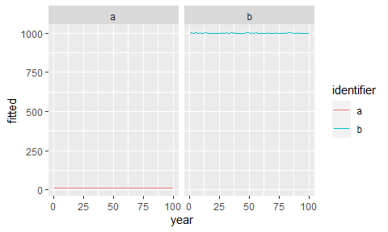
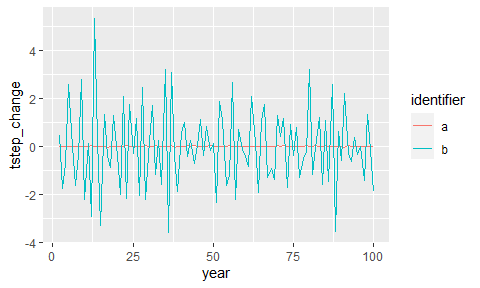
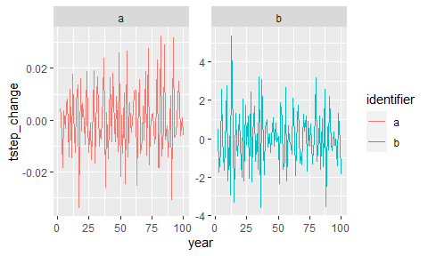
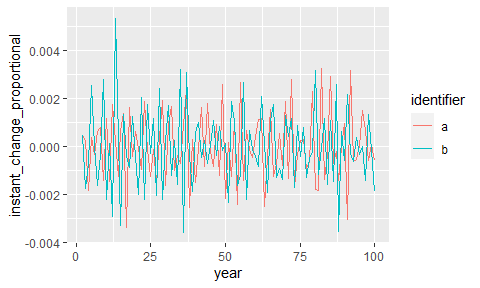
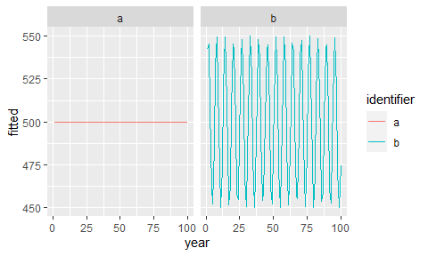
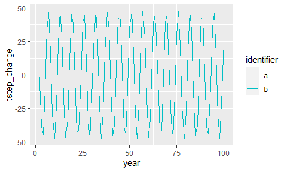
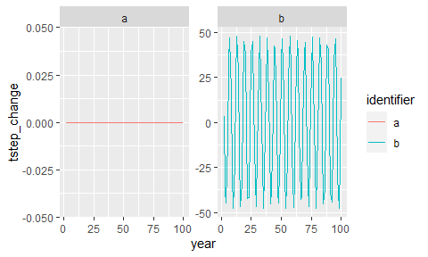
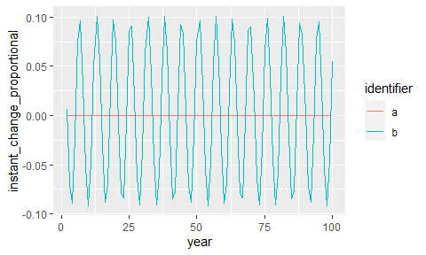

Instantaneous change demos
================

``` r
knitr::opts_chunk$set(echo = FALSE)
knitr::opts_chunk$set(fig.dim = c(5,3))

library(dplyr)
```

    ## 
    ## Attaching package: 'dplyr'

    ## The following objects are masked from 'package:stats':
    ## 
    ##     filter, lag

    ## The following objects are masked from 'package:base':
    ## 
    ##     intersect, setdiff, setequal, union

``` r
library(gratia)
```

    ## Warning: package 'gratia' was built under R version 4.0.3

``` r
library(ggplot2)
load_mgcv()
source(here::here("gams", "gam_fxns", "wrapper_fxns.R"))
source(here::here("gams", "gam_fxns", "sunrise_fxns.R"))
```

The “instantaneous change” I talk about probably has precedent. It’s
basically the derivative divided by the function, where the function is
the actual or fitted time series and the derivative is the change from
timestep to timestep (or very small interval to very small interval).

I started using it because, unlike the derivative, it is comparable even
when the functions involve different actual numbers.

## Differences in scale

A has generally very small numbers, B has much larger numbers.

<!-- -->

    ## Joining, by = c("draw", "row", "currency", "identifier")
    ## Joining, by = c("draw", "row", "currency", "identifier")

<!-- --><!-- --><!-- -->

    ## `summarise()` ungrouping output (override with `.groups` argument)

    ## # A tibble: 2 x 3
    ##   identifier mean_abs_derivative mean_abs_ichange
    ##   <chr>                    <dbl>            <dbl>
    ## 1 a                       0.0114          0.00114
    ## 2 b                       1.29            0.00129

a and b are just noise from a normal with different means but the same
c.v. we can’t compare the derivatives directly because the actual
numbers for b are so much larger. However the instant change scaled by
the values is appropriately comparable.

<!-- -->

    ## Joining, by = c("draw", "row", "currency", "identifier")
    ## Joining, by = c("draw", "row", "currency", "identifier")

<!-- --><!-- --><!-- -->

    ## `summarise()` ungrouping output (override with `.groups` argument)

    ## # A tibble: 2 x 3
    ##   identifier mean_abs_derivative mean_abs_ichange
    ##   <chr>                    <dbl>            <dbl>
    ## 1 a                        0.121           0.0141
    ## 2 b                       12.1             0.0141

## Different functional forms

Sin vs no variation

<!-- -->

    ## Joining, by = c("draw", "row", "currency", "identifier")
    ## Joining, by = c("draw", "row", "currency", "identifier")

<!-- --><!-- --><!-- -->

    ## `summarise()` ungrouping output (override with `.groups` argument)

    ## # A tibble: 2 x 3
    ##   identifier mean_abs_derivative mean_abs_ichange
    ##   <chr>                    <dbl>            <dbl>
    ## 1 a                          0             0     
    ## 2 b                         30.3           0.0609

<!-- -->

    ## Joining, by = c("draw", "row", "currency", "identifier")
    ## Joining, by = c("draw", "row", "currency", "identifier")

<!-- --><!-- --><!-- -->

    ## `summarise()` ungrouping output (override with `.groups` argument)

    ## # A tibble: 2 x 3
    ##   identifier mean_abs_derivative mean_abs_ichange
    ##   <chr>                    <dbl>            <dbl>
    ## 1 a                        0              0      
    ## 2 b                        0.939          0.00178

Sin with change

<!-- -->

    ## Joining, by = c("draw", "row", "currency", "identifier")
    ## Joining, by = c("draw", "row", "currency", "identifier")

<!-- --><!-- --><!-- -->

    ## `summarise()` ungrouping output (override with `.groups` argument)

    ## # A tibble: 2 x 3
    ##   identifier mean_abs_derivative mean_abs_ichange
    ##   <chr>                    <dbl>            <dbl>
    ## 1 a                         12.1           0.0141
    ## 2 b                         31.1           0.0363
