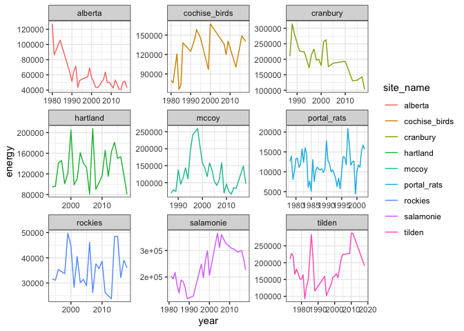
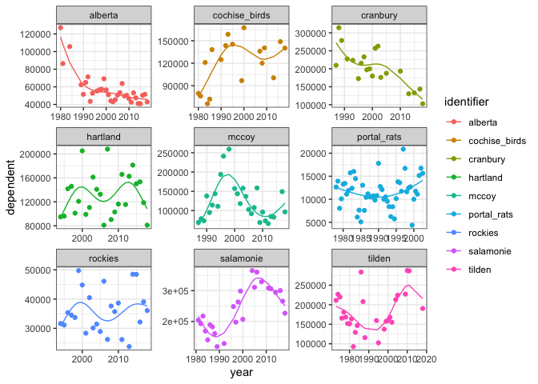
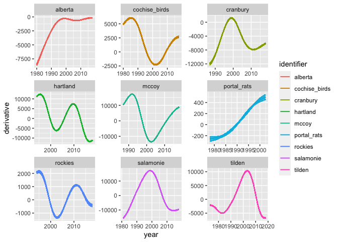
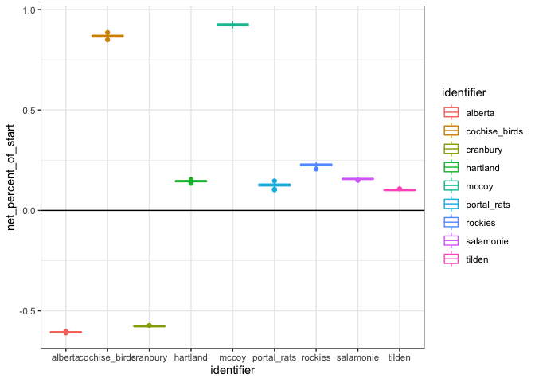
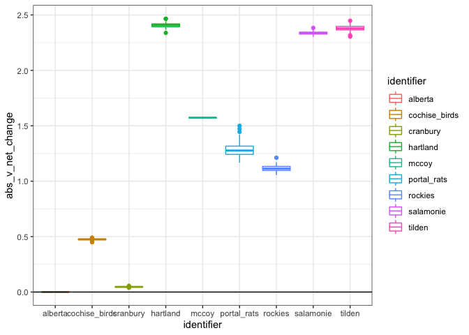
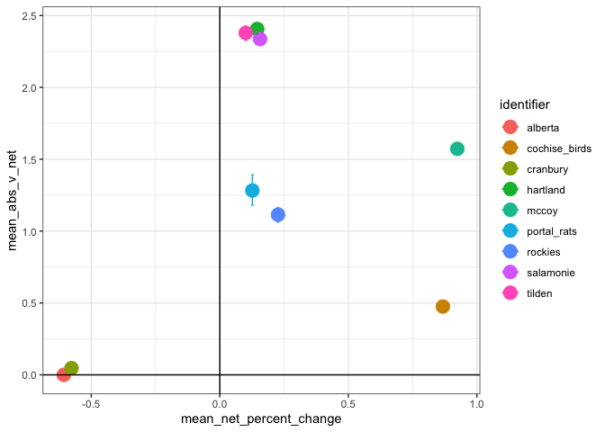

Several birds
================

``` r
library(dplyr)
```

    ## 
    ## Attaching package: 'dplyr'

    ## The following objects are masked from 'package:stats':
    ## 
    ##     filter, lag

    ## The following objects are masked from 'package:base':
    ## 
    ##     intersect, setdiff, setequal, union

``` r
library(gratia)
library(ggplot2)
load_mgcv()

ts <- read.csv(here::here("gams", "working_datasets.csv"))

unique_sites <- unique(ts$site_name)

site_dfs <- lapply(unique_sites, FUN = function(site, full_ts) return(filter(full_ts, site_name == site)), full_ts = ts)

source(here::here("gams", "gam_fxns", "wrapper_fxns.R"))
```

``` r
knitr::opts_chunk$set(echo = FALSE)


set.seed(1977)
energy_mods <- lapply(site_dfs, mod_wrapper, response_variable = "energy", k = 5, identifier = "site_name")
```

    ## Note: Using an external vector in selections is ambiguous.
    ## ℹ Use `all_of(response)` instead of `response` to silence this message.
    ## ℹ See <https://tidyselect.r-lib.org/reference/faq-external-vector.html>.
    ## This message is displayed once per session.

    ## Note: Using an external vector in selections is ambiguous.
    ## ℹ Use `all_of(ts_id)` instead of `ts_id` to silence this message.
    ## ℹ See <https://tidyselect.r-lib.org/reference/faq-external-vector.html>.
    ## This message is displayed once per session.

``` r
energy_fits <- lapply(energy_mods, fit_wrapper)
energy_derivs <- lapply(energy_mods, deriv_wrapper, seed_seed = NULL)
energy_deriv_summaries <- lapply(energy_derivs, derivs_summary)
```

    ## `summarise()` regrouping output by 'seed', 'identifier' (override with `.groups` argument)

    ## `summarise()` regrouping output by 'seed', 'identifier' (override with `.groups` argument)
    ## `summarise()` regrouping output by 'seed', 'identifier' (override with `.groups` argument)
    ## `summarise()` regrouping output by 'seed', 'identifier' (override with `.groups` argument)
    ## `summarise()` regrouping output by 'seed', 'identifier' (override with `.groups` argument)
    ## `summarise()` regrouping output by 'seed', 'identifier' (override with `.groups` argument)
    ## `summarise()` regrouping output by 'seed', 'identifier' (override with `.groups` argument)
    ## `summarise()` regrouping output by 'seed', 'identifier' (override with `.groups` argument)
    ## `summarise()` regrouping output by 'seed', 'identifier' (override with `.groups` argument)

``` r
energy_sign_summaries <- lapply(energy_derivs, sign_summary)
```

    ## `summarise()` ungrouping output (override with `.groups` argument)

    ## `summarise()` ungrouping output (override with `.groups` argument)
    ## `summarise()` ungrouping output (override with `.groups` argument)
    ## `summarise()` ungrouping output (override with `.groups` argument)
    ## `summarise()` ungrouping output (override with `.groups` argument)
    ## `summarise()` ungrouping output (override with `.groups` argument)
    ## `summarise()` ungrouping output (override with `.groups` argument)
    ## `summarise()` ungrouping output (override with `.groups` argument)
    ## `summarise()` ungrouping output (override with `.groups` argument)

``` r
fits <- bind_rows(energy_fits)

derivs <- bind_rows(energy_derivs)

derivs_summaries <- bind_rows(energy_deriv_summaries)

ggplot(ts, aes(year, energy, color = site_name)) +
  geom_line() +
  theme_bw() +
  facet_wrap(vars(site_name), scales = "free")
```

<!-- -->

``` r
ggplot(fits, aes(year, dependent, color = identifier)) +
  geom_point() +
  theme_bw() +
  geom_line(aes(year, fitted_value, color = identifier)) +
  facet_wrap(vars(identifier), scales = "free")
```

<!-- -->

``` r
ggplot(derivs, aes(year, derivative, group = seed, color = identifier)) +
  geom_line(alpha = .05) +
  geom_line(aes(year, mean)) +
  geom_line(aes(year, upper)) +
  geom_line(aes(year, lower)) +
  facet_wrap(vars(identifier), scales = "free")
```

<!-- -->

``` r
ggplot(derivs_summaries, aes(identifier, net_percent_of_start, color = identifier)) +
  geom_boxplot() +
  theme_bw()+
  geom_hline(yintercept = 0)
```

<!-- -->

``` r
ggplot(derivs_summaries, aes(identifier, abs_v_net_change, color = identifier)) +
  geom_boxplot() +
  theme_bw()+
  geom_hline(yintercept = 0)
```

<!-- -->

``` r
derivs_means <- derivs_summaries %>%
  group_by(identifier) %>%
  summarize(mean_net_change = mean(net_change),
            mean_net_percent_change = mean(net_percent_of_start),
         mean_abs_change = mean(abs_change),
         mean_abs_v_net = log(mean(exp(abs_v_net_change))),
         abs_v_net_2p5 = log(quantile(exp(abs_v_net_change), probs = .025)),
         abs_v_net_97p5 = log(quantile(exp(abs_v_net_change), probs = .975)),
         net_percent_2p5 = log(quantile(exp(net_percent_of_start), probs = .025)),
         net_percent_97p5 = log(quantile(exp(net_percent_of_start), probs = .975)))
```

    ## `summarise()` ungrouping output (override with `.groups` argument)

``` r
ggplot(derivs_means, aes(mean_net_percent_change, mean_abs_v_net, color = identifier)) +
  geom_point(size = 5) +
  geom_errorbar(aes(x = mean_net_percent_change, ymin = abs_v_net_2p5, ymax = abs_v_net_97p5)) +
    geom_errorbarh(aes(y = mean_abs_v_net, xmin = net_percent_2p5, xmax = net_percent_97p5)) +
  theme_bw() +
  #geom_label(aes(mean_net_percent_change, mean_abs_v_net, label = identifier), nudge_y = .5)
  geom_hline(yintercept = 0) +
  geom_vline(xintercept = 0)
```

<!-- -->

``` r
# 
# abund_sign_summaries <- bind_rows(abund_sign_summaries)
# 
# swap_na <- function(val) {
#   ifelse(is.na(val), 0, val)
# }
# 
# abund_sign_summaries <- abund_sign_summaries%>%
#   mutate_at(vars(positive, negative, zero), swap_na)
# 
# ggplot(abund_sign_summaries, aes(zero, positive, color = identifier)) +
#   geom_point(size = 5) +
#   theme_bw() +
#   geom_label(aes(zero, positive, label = identifier), nudge_x = .2) +
#   xlim(0,1) +
#   ylim(0,1)
```
