Rats - energy v abundance
================

``` r
knitr::opts_chunk$set(echo = FALSE)
knitr::opts_chunk$set(fig.dim = c(5,3))

library(dplyr)
```

    ## 
    ## Attaching package: 'dplyr'

    ## The following objects are masked from 'package:stats':
    ## 
    ##     filter, lag

    ## The following objects are masked from 'package:base':
    ## 
    ##     intersect, setdiff, setequal, union

``` r
library(gratia)
library(ggplot2)
load_mgcv()

ts <- read.csv(here::here("gams", "working_datasets.csv"))

unique_sites <- unique(ts$site_name)

site_dfs <- lapply(unique_sites, FUN = function(site, full_ts) return(filter(full_ts, site_name == site)), full_ts = ts)

source(here::here("gams", "gam_fxns", "wrapper_fxns.R"))
```

#### With portal

<!-- -->

  - This is energy rescaled to be on a similar scale to abundance.
  - They **kind of** track, but note:
      - Abundance starts lower and ends higher than energy
      - There is decoupling in the late 90s

<!-- end list -->

    ## Joining, by = "row"
    ## Joining, by = "row"
    ## Joining, by = "row"

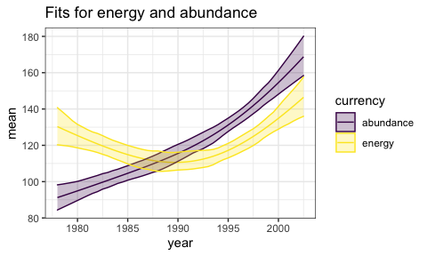<!-- -->

  - The GAM fits picked right up on the divergence in energy and
    abundance. They fit a U-shape to energy and a more monotonic
    increase to abundance.

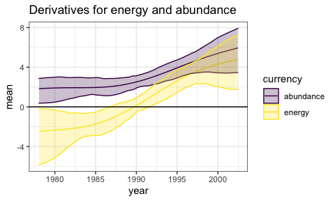<!-- -->

  - The derivatives also differ. Energy decreases and then increases,
    while abundance consistently increases.

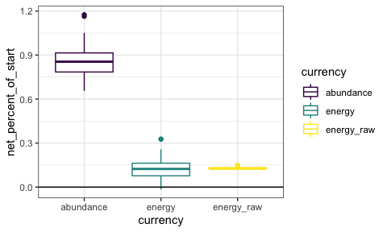<!-- -->

    ## `summarise()` regrouping output by 'draw' (override with `.groups` argument)

  - Leading to an average \~90% increase in abundance, and an average
    \~20% increase in energy. Note that energy sometimes crosses 0 in
    the estimated increase.

  - There’s much less variability in the fitted estimate for
    energy\_raw, but it has the same mean…?

# Scenarios

## Energy tracks abundance

Here we want to see what happens if energy tracks abundance.

Let’s say that the total energy use at each timestep is simply the mean
metabolic rate \* the number of individuals at that timestep.

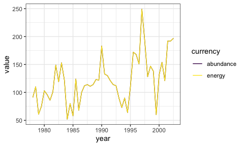<!-- -->

Well then they are just exactly the same, and that’s no fun.

Let’s then imagine that the individual metabolisms at each time step are
drawn from the overall individual energy distribution.

    ## Loading in data version 2.49.0

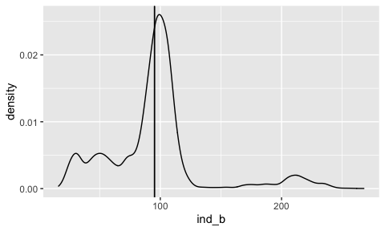<!-- -->

    ## `summarise()` ungrouping output (override with `.groups` argument)

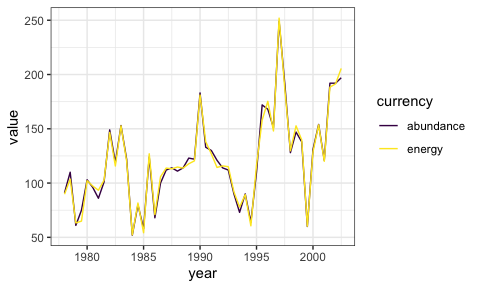<!-- -->

  - Now they track pretty closely, but there’s at least some wiggle.

<!-- end list -->

    ## Joining, by = "row"
    ## Joining, by = "row"

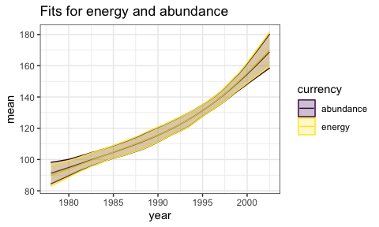<!-- -->

  - The GAMs are near-identical.

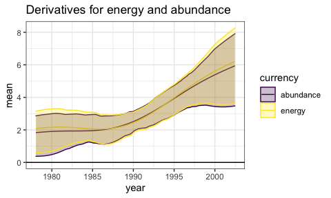<!-- -->

  - So are the derivatives…

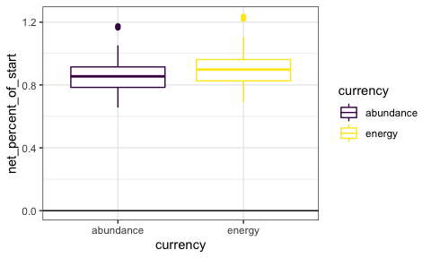<!-- -->

    ## `summarise()` regrouping output by 'draw' (override with `.groups` argument)

And the net change.

## Energy trades off to stay constant

Here we want to see what happens if the mean body size trades off to
maintain a near-constant energy use regardless of abundance.

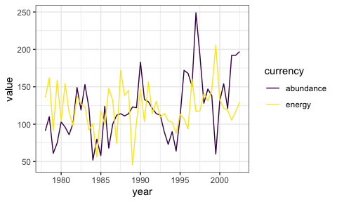<!-- -->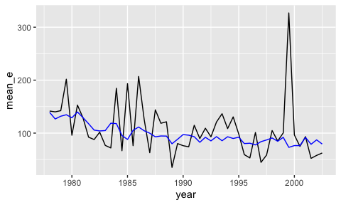<!-- -->

  - We’ve allowed substantial variation around a constant mean for
    energy, making it more variable even than the real mean\_e.

<!-- end list -->

    ## Joining, by = "row"
    ## Joining, by = "row"

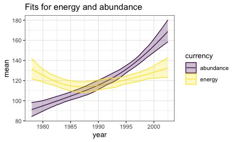<!-- -->

  - Interestingly - the GAM again fits a little bit of a U to energy.
    **We contrived it to be constant** but it has some shape that just
    happened via samples from a normal.

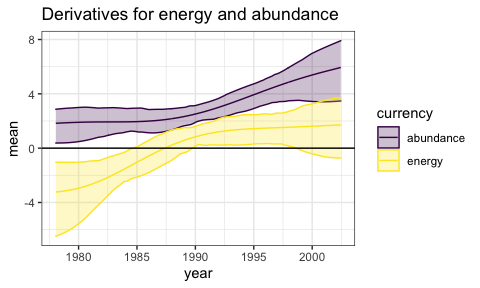<!-- -->

  - This derivative isn’t smack-on 0, either. However note that it
    spends a **lot** of time very near 0, which was not the case for the
    real data.

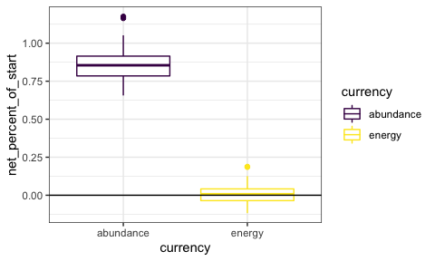<!-- -->

    ## `summarise()` regrouping output by 'draw' (override with `.groups` argument)

And, the net outcome is no consistent change in energy.
