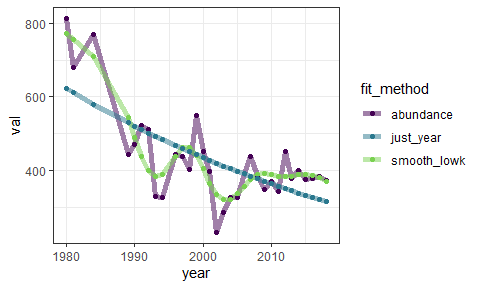
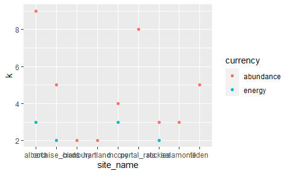

selecting nb of basis fxns
================

``` r
knitr::opts_chunk$set(echo = FALSE)
knitr::opts_chunk$set(fig.dim = c(5,3))

library(dplyr)
```

    ## 
    ## Attaching package: 'dplyr'

    ## The following objects are masked from 'package:stats':
    ## 
    ##     filter, lag

    ## The following objects are masked from 'package:base':
    ## 
    ##     intersect, setdiff, setequal, union

``` r
library(gratia)
```

    ## Warning: package 'gratia' was built under R version 4.0.3

``` r
library(ggplot2)
load_mgcv()

ts <- read.csv(here::here("gams", "working_datasets.csv"))

ts <- ts %>%
  group_by(site_name) %>%
  mutate(totale = sum(energy),
         totaln = sum(abundance)) %>%
  mutate(avg_perc_e = totale/totaln) %>%
  mutate(rescaled_energy = energy / avg_perc_e) %>%
  ungroup() %>%
  select(-totale, -totaln, -avg_perc_e) %>%
  mutate(rescaled_energy = round(rescaled_energy))

unique_sites <- unique(ts$site_name)

site_dfs <- lapply(unique_sites, FUN = function(site, full_ts) return(filter(full_ts, site_name == site)), full_ts = ts)

source(here::here("gams", "gam_fxns", "wrapper_fxns.R"))
source(here::here("gams", "gam_fxns", "sunrise_fxns.R"))
```

## Alberta energy

<!-- -->

    ##   k smooth      aic deviance     kscore k_pass
    ## 1 0  FALSE 732.1417 476.4970 100.000000   TRUE
    ## 2 3   TRUE 526.1741 266.5317   1.067366   TRUE

<!-- -->

    ## Joining, by = "row"
    ## Joining, by = "row"

<!-- -->

## Alberta abundance

<!-- -->

    ##   k smooth      aic deviance     kscore k_pass
    ## 1 0  FALSE 803.6922 547.9684 100.000000   TRUE
    ## 2 9   TRUE 486.5885 215.1430   1.031742   TRUE

<!-- -->

    ## Joining, by = "row"
    ## Joining, by = "row"

<!-- -->
<!-- --><!-- -->

<!-- -->

    ## Joining, by = "row"
    ## Joining, by = "row"

<!-- -->
