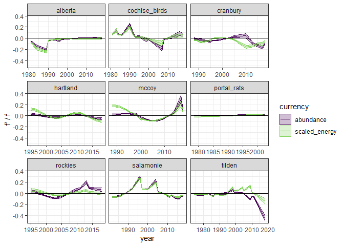

a trimmed-ish draft
================

``` r
knitr::opts_chunk$set(echo = FALSE)
#knitr::opts_chunk$set(fig.dim = c(5,3))

library(dplyr)
```

    ## 
    ## Attaching package: 'dplyr'

    ## The following objects are masked from 'package:stats':
    ## 
    ##     filter, lag

    ## The following objects are masked from 'package:base':
    ## 
    ##     intersect, setdiff, setequal, union

``` r
library(gratia)
```

    ## Warning: package 'gratia' was built under R version 4.0.3

``` r
library(ggplot2)
load_mgcv()

ts <- read.csv(here::here("gams", "results", "ts_w_rescaled_e.csv"))
```

<!-- -->

<!-- -->

<!-- -->

    ## `stat_bin()` using `bins = 30`. Pick better value with `binwidth`.

<!-- -->

<!-- -->

<!-- --><!-- -->

    ## Joining, by = c("draw", "currency", "identifier", "k")

<!-- --><!-- -->
