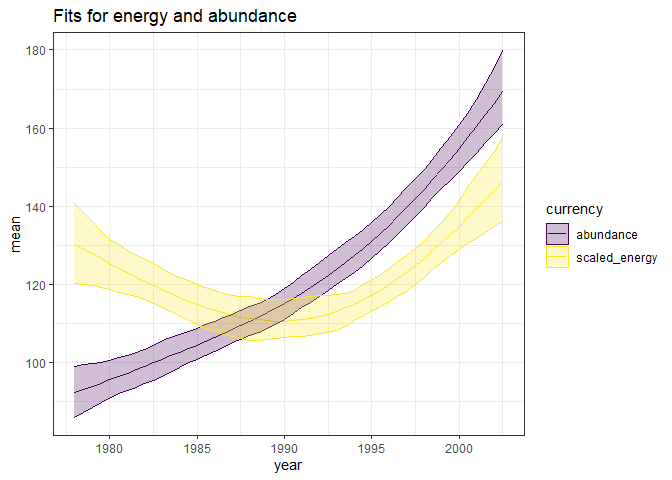

a trimmed-ish draft
================

``` r
knitr::opts_chunk$set(echo = FALSE)
knitr::opts_chunk$set(fig.dim = c(5,3))

library(dplyr)
```

    ## 
    ## Attaching package: 'dplyr'

    ## The following objects are masked from 'package:stats':
    ## 
    ##     filter, lag

    ## The following objects are masked from 'package:base':
    ## 
    ##     intersect, setdiff, setequal, union

``` r
library(gratia)
```

    ## Warning: package 'gratia' was built under R version 4.0.3

``` r
library(ggplot2)
load_mgcv()

ts <- read.csv(here::here("gams", "working_datasets.csv"))

unique_sites <- unique(ts$site_name)

site_dfs <- lapply(unique_sites, FUN = function(site, full_ts) return(filter(full_ts, site_name == site)), full_ts = ts)

source(here::here("gams", "gam_fxns", "wrapper_fxns.R"))
source(here::here("gams", "gam_fxns", "sunrise_fxns.R"))
```

#### With portal

<!-- -->

    ## Joining, by = "row"
    ## Joining, by = "row"

<!-- -->

Calculated off the samples, we can get:

  - the net change from beginning to end, plus a CI
  - a timeseries of the instantaneous rate of change, which we can
    summarize in order to get a sense of how much backtracking is
    occurring over the course of the timeseries

## Net change

<!-- -->

    ## `summarise()` regrouping output by 'currency' (override with `.groups` argument)

    ## # A tibble: 2 x 5
    ## # Groups:   currency [2]
    ##   currency   identifier  mean_net_proport~ lower_net_proport~ upper_net_proport~
    ##   <chr>      <chr>                   <dbl>              <dbl>              <dbl>
    ## 1 abundance  portal_rats             0.840             0.653               1.01 
    ## 2 scaled_en~ portal_rats             0.126             0.0257              0.245

So this is a way of saying

  - Abundance increases by about `83.9641752` percent, and energy
    increases by about `12.5562137`, with a CI given by the lower/upper.

## Instantaneous change and backtracking

    ## Joining, by = c("row", "draw", "identifier", "currency")
    ## Joining, by = c("row", "draw", "identifier", "currency")

    ## `summarise()` regrouping output by 'currency', 'identifier', 'row' (override with `.groups` argument)

<!-- -->

    ## `summarise()` regrouping output by 'currency', 'identifier' (override with `.groups` argument)

<!-- -->
