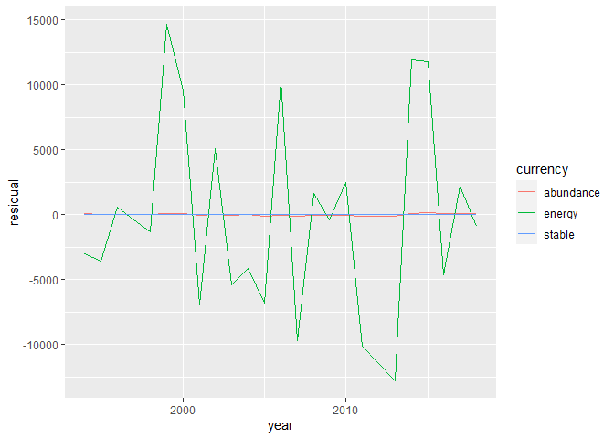
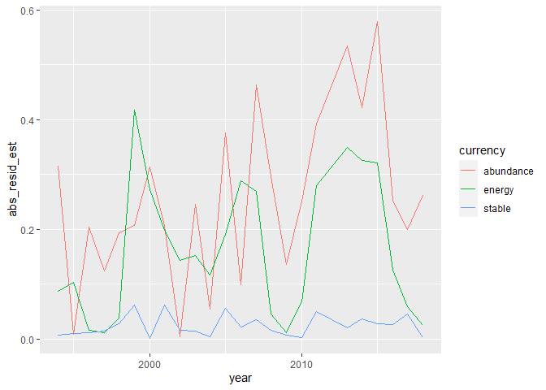
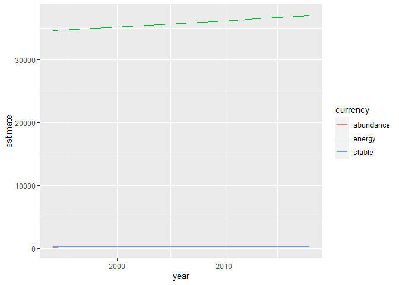
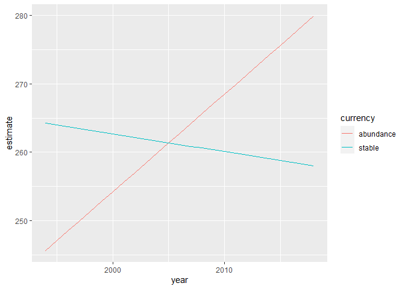

Slope and fuzz
================

I am trying to develop a way of summarizing a timeseries (or any
dataset, I guess) to extract the slope of a linear fit, and the fuzz
around the slope, without leaning heavily on p-values.

``` r
ibd <- readRDS("C:\\Users\\diaz.renata\\Documents\\GitHub\\BBSsize\\analysis\\isd_data\\ibd_isd_bbs_rtrg_304_17.Rds")


sv <- ibd %>%
  group_by(year) %>%
  summarize(richness = length(unique(id)),
            abundance = dplyr::n(),
            biomass = sum(ind_size),
            energy = sum(ind_b)) %>%
  ungroup() %>%
  mutate(mean_energy = energy / abundance,
         mean_mass = biomass/abundance)


sv_long <- sv %>%
  tidyr::pivot_longer(-year, names_to = "currency", values_to = "value")

ggplot(sv_long, aes(x = year, y = value, color = currency)) +
  geom_line() +
  theme_bw() +
  facet_wrap(vars(currency), scales = "free_y")
```

<!-- -->

So let’s focus here on the abundance and energy time series, and maybe
create a third TS that we consider more stable:

``` r
set.seed(1977)
sv$stable <- rnorm(nrow(sv), mean = mean(sv$abundance), sd = sd(sv$abundance) / 10)


sv_long <- sv %>%
  select(year, abundance, energy, stable) %>%
  tidyr::pivot_longer(-year, names_to = "currency", values_to = "value")

ggplot(sv, aes(year, abundance)) + 
  geom_line()+
  ylim(0, max(sv$abundance)) +
  theme_bw()
```

<!-- -->

``` r
ggplot(sv, aes(year, energy)) + 
  geom_line()+
  ylim(0, max(sv$energy)) +
  theme_bw()
```

<!-- -->

``` r
ggplot(sv, aes(year, stable)) + 
  geom_line()+
  ylim(0, max(sv$stable)) +
  theme_bw()
```

<!-- -->

We can fit a linear model and pull out the R2, but I don’t think that’s
quite going to work…

``` r
n_lm <- lm((abundance) ~ year, sv)

summary(n_lm)
```

    ## 
    ## Call:
    ## lm(formula = (abundance) ~ year, data = sv)
    ## 
    ## Residuals:
    ##     Min      1Q  Median      3Q     Max 
    ## -145.77  -64.49   -1.56   59.12  159.37 
    ## 
    ## Coefficients:
    ##              Estimate Std. Error t value Pr(>|t|)
    ## (Intercept) -2602.827   4659.084  -0.559    0.582
    ## year            1.429      2.323   0.615    0.545
    ## 
    ## Residual standard error: 82.53 on 22 degrees of freedom
    ## Multiple R-squared:  0.0169, Adjusted R-squared:  -0.02779 
    ## F-statistic: 0.3782 on 1 and 22 DF,  p-value: 0.5449

``` r
e_lm <- lm((energy) ~ year, sv)

summary(e_lm)
```

    ## 
    ## Call:
    ## lm(formula = (energy) ~ year, data = sv)
    ## 
    ## Residuals:
    ##      Min       1Q   Median       3Q      Max 
    ## -12749.6  -4820.3   -659.6   3108.5  14628.5 
    ## 
    ## Coefficients:
    ##               Estimate Std. Error t value Pr(>|t|)
    ## (Intercept) -162207.42  430285.05  -0.377     0.71
    ## year             98.71     214.52   0.460     0.65
    ## 
    ## Residual standard error: 7622 on 22 degrees of freedom
    ## Multiple R-squared:  0.009532,   Adjusted R-squared:  -0.03549 
    ## F-statistic: 0.2117 on 1 and 22 DF,  p-value: 0.6499

``` r
s_lm <- lm((stable) ~ year, sv)

summary(s_lm)
```

    ## 
    ## Call:
    ## lm(formula = (stable) ~ year, data = sv)
    ## 
    ## Residuals:
    ##      Min       1Q   Median       3Q      Max 
    ## -16.3711  -4.4057   0.4637   4.5633  16.1405 
    ## 
    ## Coefficients:
    ##             Estimate Std. Error t value Pr(>|t|)
    ## (Intercept) 786.9958   468.7398   1.679    0.107
    ## year         -0.2621     0.2337  -1.122    0.274
    ## 
    ## Residual standard error: 8.304 on 22 degrees of freedom
    ## Multiple R-squared:  0.0541, Adjusted R-squared:  0.01111 
    ## F-statistic: 1.258 on 1 and 22 DF,  p-value: 0.2741

For Hartland: - Abundance: - p = .04 - slope = -3.18 - r2 = .1692, .1331
- Energy: - p = .556 - slope = 607 - r2 = .015, -.027 - Stable: - p =
.533 - slope = -66.4 - r2 = .0171, -.02557

I want something to tell me that stable is more tightly around a 0-slope
line than is energy.

``` r
sv_residuals <- data.frame(
  year = sv$year,
  abundance = resid(n_lm),
  energy = resid(e_lm),
  stable = resid(s_lm)
) %>%
  tidyr::pivot_longer(cols = c(abundance, energy, stable), names_to = "currency", values_to = "residual")

sv_ests <- data.frame(
  year = sv$year,
  abundance = predict(n_lm),
  energy = predict(e_lm),
  stable = predict(s_lm)
)%>%
  tidyr::pivot_longer(cols = c(abundance, energy, stable), names_to = "currency", values_to = "estimate")

sv_slopes <- data.frame(
  abundance = n_lm$coefficients["year"],
  energy = e_lm$coefficients["year"],
  stable = s_lm$coefficients["year"]
)%>%
  tidyr::pivot_longer(cols = c(abundance, energy, stable), names_to = "currency", values_to = "slope")

ggplot(sv_residuals, aes(year, residual, color =currency)) +
  geom_line()
```

<!-- -->

``` r
sv_err <- left_join(sv_residuals, sv_ests) %>%
  left_join(sv_slopes) %>%
  mutate(abs_residual = abs(residual)) %>%
  mutate(abs_resid_est = abs_residual / estimate)
```

    ## Joining, by = c("year", "currency")

    ## Joining, by = "currency"

``` r
ggplot(sv_err, aes(year, abs_resid_est, color =currency)) +
  geom_line()
```

<!-- -->

``` r
sv_err %>%
  group_by(currency) %>%
  summarize(mean_abs_resid_est = mean(abs_resid_est),
            mean_est = mean(estimate),
            slope = mean(slope)) %>%
  mutate(scaled_slope = slope / mean_est)
```

    ## # A tibble: 3 x 5
    ##   currency  mean_abs_resid_est mean_est  slope scaled_slope
    ##   <chr>                  <dbl>    <dbl>  <dbl>        <dbl>
    ## 1 abundance             0.256      262.  1.43       0.00544
    ## 2 energy                0.163    35780. 98.7        0.00276
    ## 3 stable                0.0239     261. -0.262     -0.00100

``` r
ggplot(sv_err, aes(year, estimate, color = currency)) +
  geom_line()
```

<!-- -->

``` r
ggplot(filter(sv_err, currency != "energy"), aes(year, estimate, color = currency)) +
  geom_line()
```

<!-- -->

So what I have done here is:

  - Fit a linear model
  - Compute the estimates + residuals for that linear model
  - Compute abs(residual) / estimate for every point
  - Compute mean of that ratio

This gives a measure of how large the residuals are relative to the
estimates. Scale() and center() break this kind of approach…

Then I got the slopes from the lms(), but because the slopes depend on
the magnitude of the variables, I rescaled them to slope /
mean(estimated value).

The mean\_abs\_resid\_est and scaled\_slope values align with what I
generally want them to, but it’s all extremely rough. I may have
reinvented some wheels.
