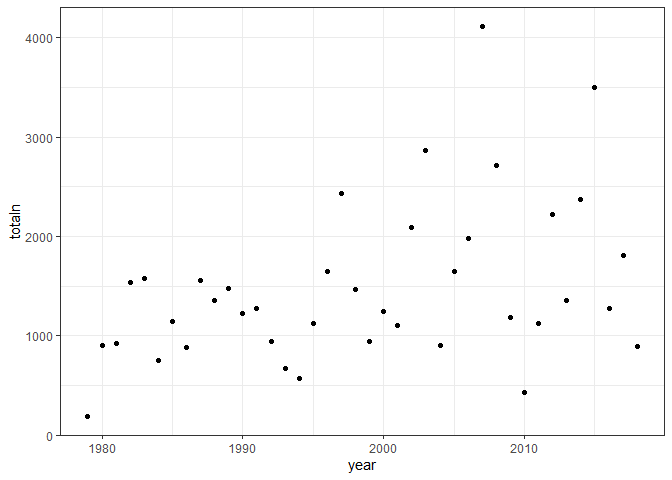
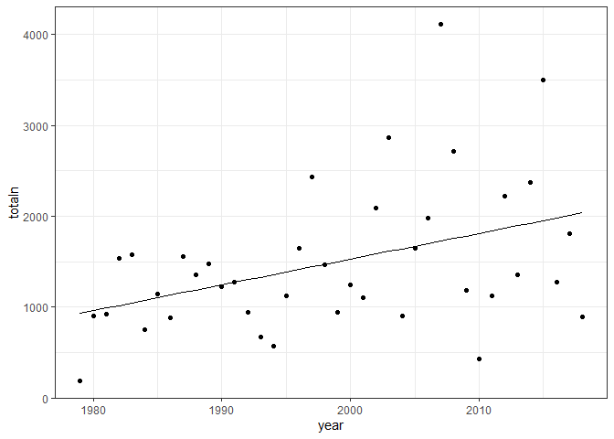
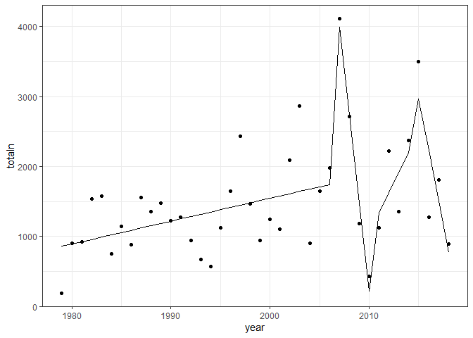
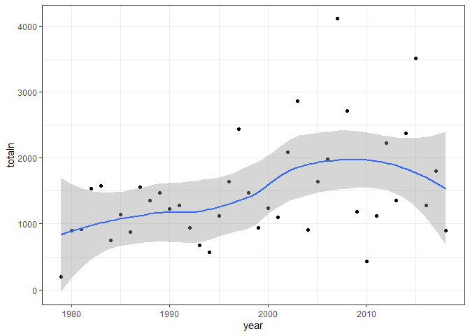

smooth
================

``` r
abund_ts <- portalr::abundance(time = "date")
```

    ## Loading in data version 2.18.0

``` r
abund_years <- substr(abund_ts$censusdate, 0, 4)

abund_ts <- abund_ts %>%
  select(-censusdate) %>%
  mutate(totaln = rowSums(.)) %>%
  select(totaln) %>%
  mutate(year = abund_years) %>%
  group_by(year) %>%
  summarize(totaln = sum(totaln)) %>%
  mutate(year = as.numeric(year))
```

    ## `summarise()` ungrouping output (override with `.groups` argument)

``` r
ggplot(abund_ts, aes(year, totaln)) + geom_point() + theme_bw()
```

<!-- -->

Linear model vs changepoint model vs smooth….

``` r
abund_ts$lm_fit <- predict(lm(totaln ~ year, data = abund_ts))
ggplot(abund_ts, aes(year, totaln)) + geom_point() + theme_bw() + geom_line(aes(year, lm_fit))
```

<!-- -->

``` r
fit_breakpoints <- function(dat, h = 4) {
  
  
  bp_int <- breakpoints(formula = response ~ 1, data = dat, h =h)
  
  bp_slope <- breakpoints(formula = response ~ time, data = dat, h = h)
  
  int_BIC <- BIC(bp_int)
  slope_BIC <- BIC(bp_slope)
  
  if(int_BIC < slope_BIC) {
    return(bp_int)
  } else {
    return(bp_slope)
  }
  
}


bp <- fit_breakpoints(rename(abund_ts, response = totaln, time = year))
abund_ts$bp_fit <- fitted(bp)
ggplot(abund_ts, aes(year, totaln)) + geom_point() + theme_bw() + geom_line(aes(year, bp_fit))
```

<!-- -->

``` r
gam_fit <- mgcv::gam(totaln ~ s(year), data = abund_ts)

abund_ts$gam_fit <- gam_fit$fitted.values

ggplot(abund_ts, aes(year, totaln)) + geom_point() + theme_bw() + geom_smooth(method = "loess")
```

    ## `geom_smooth()` using formula 'y ~ x'

<!-- -->
