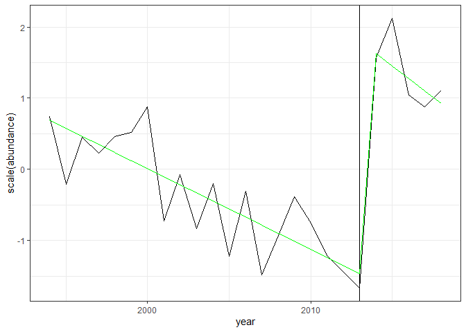

Comanche Peak, CO - Segments
================

### Load route

Another route - Comanche Peak, near where I grew up (ish). Also started
in 1994\!

Here is how abundance and energy have changed over those years:

    ## `summarise()` ungrouping output (override with `.groups` argument)

<!-- -->

I am using this route to play around with segments because I think it is
an example of one that is well-described via segments (more so than a
single linear fit).

    ## 
    ## Call:
    ## lm(formula = abundance ~ year, data = sv)
    ## 
    ## Residuals:
    ##     Min      1Q  Median      3Q     Max 
    ## -145.77  -64.49   -1.56   59.12  159.37 
    ## 
    ## Coefficients:
    ##              Estimate Std. Error t value Pr(>|t|)
    ## (Intercept) -2602.827   4659.084  -0.559    0.582
    ## year            1.429      2.323   0.615    0.545
    ## 
    ## Residual standard error: 82.53 on 22 degrees of freedom
    ## Multiple R-squared:  0.0169, Adjusted R-squared:  -0.02779 
    ## F-statistic: 0.3782 on 1 and 22 DF,  p-value: 0.5449

<!-- -->

    ## 
    ## Call:
    ## lm(formula = energy ~ year, data = sv)
    ## 
    ## Residuals:
    ##      Min       1Q   Median       3Q      Max 
    ## -12749.6  -4820.3   -659.6   3108.5  14628.5 
    ## 
    ## Coefficients:
    ##               Estimate Std. Error t value Pr(>|t|)
    ## (Intercept) -162207.42  430285.05  -0.377     0.71
    ## year             98.71     214.52   0.460     0.65
    ## 
    ## Residual standard error: 7622 on 22 degrees of freedom
    ## Multiple R-squared:  0.009532,   Adjusted R-squared:  -0.03549 
    ## F-statistic: 0.2117 on 1 and 22 DF,  p-value: 0.6499

<!-- -->

So what’s demonstrated here is, neither abundance nor energy finds a
significantly non-zero slope. The fitted slopes are flat and obscure
enormous amounts of variation thru time. For abundance, but perhaps not
for energy, it seems likely that a break-point model will be more
appropriate. It looks like there’s a pronounced negative slope from
1994-2013, and then a jump in the late 2010s.

# Segmented

    ## 
    ##  ***Regression Model with Segmented Relationship(s)***
    ## 
    ## Call: 
    ## segmented.lm(obj = abundance_lm, control = seg.control(fix.npsi = FALSE))
    ## 
    ## Estimated Break-Point(s):
    ##                Est. St.Err
    ## psi1.year 2009.909  1.428
    ## 
    ## Meaningful coefficients of the linear terms:
    ##              Estimate Std. Error t value Pr(>|t|)  
    ## (Intercept) 17539.059   6552.611   2.677   0.0145 *
    ## year           -8.640      3.274  -2.639   0.0157 *
    ## U1.year        36.248      8.739   4.148       NA  
    ## ---
    ## Signif. codes:  0 '***' 0.001 '**' 0.01 '*' 0.05 '.' 0.1 ' ' 1
    ## 
    ## Residual standard error: 60.37 on 20 degrees of freedom
    ## Multiple R-Squared: 0.5219,  Adjusted R-squared: 0.4502 
    ## 
    ## Convergence attained in 3 iter. (rel. change 0)

<!-- -->

Segmented constrains the break points to be continuous.

# bcp

    ## Loading required package: grid

<!-- -->

    ## 
    ## Bayesian Change Point (bcp) summary:
    ## 
    ## 
    ## Probability of a change in mean and posterior means:
    ## 
    ##    Probability     y
    ## 1        0.030 302.7
    ## 2        0.046 295.9
    ## 3        0.016 292.3
    ## 4        0.030 287.2
    ## 5        0.018 282.6
    ## 6        0.030 277.2
    ## 7        0.212 271.7
    ## 8        0.054 248.0
    ## 9        0.050 239.9
    ## 10       0.020 230.1
    ## 11       0.034 223.2
    ## 12       0.020 215.0
    ## 13       0.014 208.3
    ## 14       0.026 201.3
    ## 15       0.014 195.0
    ## 16       0.018 188.9
    ## 17       0.044 182.2
    ## 18       0.022 174.0
    ## 19       0.996 160.5
    ## 20       0.036 375.7
    ## 21       0.114 373.0
    ## 22       0.046 362.3
    ## 23       0.028 357.3
    ## 24          NA 354.0

## envcpt

    ## Loading required package: changepoint

    ## Loading required package: zoo

    ## 
    ## Attaching package: 'zoo'

    ## The following objects are masked from 'package:base':
    ## 
    ##     as.Date, as.Date.numeric

    ## Successfully loaded changepoint package version 2.2.2
    ##  NOTE: Predefined penalty values changed in version 2.2.  Previous penalty values with a postfix 1 i.e. SIC1 are now without i.e. SIC and previous penalties without a postfix i.e. SIC are now with a postfix 0 i.e. SIC0. See NEWS and help files for further details.

    ## Loading required package: MASS

    ## 
    ## Attaching package: 'MASS'

    ## The following object is masked from 'package:dplyr':
    ## 
    ##     select

    ## Fitting 12 models

    ##   |                                                                              |                                                                      |   0%  |                                                                              |======                                                                |   8%  |                                                                              |============                                                          |  17%  |                                                                              |==================                                                    |  25%  |                                                                              |=======================                                               |  33%  |                                                                              |=============================                                         |  42%  |                                                                              |===================================                                   |  50%  |                                                                              |=========================================                             |  58%  |                                                                              |===============================================                       |  67%  |                                                                              |====================================================                  |  75%  |                                                                              |==========================================================            |  83%  |                                                                              |================================================================      |  92%  |                                                                              |======================================================================| 100%

    ##            mean  meancpt  meanar1  meanar2 meanar1cpt meanar2cpt    trend
    ## logLik 278.2644 238.6055 271.4738 271.3538   271.4738   271.4738 277.9976
    ## nparam   2.0000   8.0000   3.0000   4.0000     3.0000     4.0000   3.0000
    ##        trendcpt trendar1 trendar2 trendar1cpt trendar2cpt
    ## logLik 252.4087 259.5376 248.8768    204.9024    186.1876
    ## nparam   7.0000   4.0000   5.0000     14.0000     17.0000

    ##        mean     meancpt     meanar1     meanar2  meanar1cpt  meanar2cpt 
    ##    282.2644    254.6055    277.4738    279.3538    277.4738    279.4738 
    ##       trend    trendcpt    trendar1    trendar2 trendar1cpt trendar2cpt 
    ##    283.9976    266.4087    267.5376    258.8768    232.9024    220.1876

<!-- -->

### Strucchange

    ## Loading required package: sandwich

    ## 
    ##   Optimal 2-segment partition: 
    ## 
    ## Call:
    ## breakpoints.formula(formula = abundance ~ year, h = 3, data = sv)
    ## 
    ## Breakpoints at observation number:
    ## 19 
    ## 
    ## Corresponding to breakdates:
    ## 0.7916667

    ## 
    ##   Optimal (m+1)-segment partition: 
    ## 
    ## Call:
    ## breakpoints.formula(formula = abundance ~ year, h = 3, data = sv)
    ## 
    ## Breakpoints at observation number:
    ##                        
    ## m = 1                19
    ## m = 2     7          19
    ## m = 3     7       15 19
    ## m = 4     7    13 16 19
    ## m = 5   3 7    13 16 19
    ## m = 6   3 7 10 13 16 19
    ## 
    ## Corresponding to breakdates:
    ##                                                                    
    ## m = 1                                                              
    ## m = 2         0.291666666666667                                    
    ## m = 3         0.291666666666667                                    
    ## m = 4         0.291666666666667                   0.541666666666667
    ## m = 5   0.125 0.291666666666667                   0.541666666666667
    ## m = 6   0.125 0.291666666666667 0.416666666666667 0.541666666666667
    ##                                            
    ## m = 1                     0.791666666666667
    ## m = 2                     0.791666666666667
    ## m = 3   0.625             0.791666666666667
    ## m = 4   0.666666666666667 0.791666666666667
    ## m = 5   0.666666666666667 0.791666666666667
    ## m = 6   0.666666666666667 0.791666666666667
    ## 
    ## Fit:
    ##                                                                   
    ## m   0        1        2        3        4        5        6       
    ## RSS 149863.5  29601.6  21267.2  17058.2  14293.4  13068.7  13033.6
    ## BIC    287.4    258.0    259.6    263.8    269.1    276.5    286.0

<!-- -->

    ##                                        (Intercept)       year
    ## 0.0416666666666667 - 0.791666666666667    17588.05  -8.663986
    ## 0.833333333333333 - 1                     35651.80 -17.500000

<!-- -->

    ## 
    ##   Optimal 2-segment partition: 
    ## 
    ## Call:
    ## breakpoints.formula(formula = scale(sqrt(abundance)) ~ year, 
    ##     h = 3, data = sv)
    ## 
    ## Breakpoints at observation number:
    ## 19 
    ## 
    ## Corresponding to breakdates:
    ## 0.7916667

    ## 
    ##   Optimal (m+1)-segment partition: 
    ## 
    ## Call:
    ## breakpoints.formula(formula = scale(sqrt(abundance)) ~ year, 
    ##     h = 3, data = sv)
    ## 
    ## Breakpoints at observation number:
    ##                        
    ## m = 1                19
    ## m = 2     7          19
    ## m = 3     7       15 19
    ## m = 4     7    13 16 19
    ## m = 5   3 7    13 16 19
    ## m = 6   3 7 10 13 16 19
    ## 
    ## Corresponding to breakdates:
    ##                                                                    
    ## m = 1                                                              
    ## m = 2         0.291666666666667                                    
    ## m = 3         0.291666666666667                                    
    ## m = 4         0.291666666666667                   0.541666666666667
    ## m = 5   0.125 0.291666666666667                   0.541666666666667
    ## m = 6   0.125 0.291666666666667 0.416666666666667 0.541666666666667
    ##                                            
    ## m = 1                     0.791666666666667
    ## m = 2                     0.791666666666667
    ## m = 3   0.625             0.791666666666667
    ## m = 4   0.666666666666667 0.791666666666667
    ## m = 5   0.666666666666667 0.791666666666667
    ## m = 6   0.666666666666667 0.791666666666667
    ## 
    ## Fit:
    ##                                                     
    ## m   0      1      2      3      4      5      6     
    ## RSS 22.845  4.818  3.620  2.685  2.104  1.953  1.948
    ## BIC 76.460 48.641 51.316 53.678 57.363 65.104 74.577

<!-- -->

    ##                                        (Intercept)       year
    ## 0.0416666666666667 - 0.791666666666667    227.0520 -0.1135206
    ## 0.833333333333333 - 1                     357.1113 -0.1765057

<!-- -->

This seems like a reasonable description of the dynamics. Strucchange
allows the intercept to change and allows model selection via BIC.

It doesn’t seem sensitive to scale(sqrt()).

Maybe trying it on energy?

Energy I am less confident has any breakpoints:

<!-- -->

    ## 
    ##   Optimal 1-segment partition: 
    ## 
    ## Call:
    ## breakpoints.formula(formula = energy ~ year, h = 3, data = sv)
    ## 
    ## Breakpoints at observation number:
    ## NA 
    ## 
    ## Corresponding to breakdates:
    ## NA

    ## 
    ##   Optimal (m+1)-segment partition: 
    ## 
    ## Call:
    ## breakpoints.formula(formula = energy ~ year, h = 3, data = sv)
    ## 
    ## Breakpoints at observation number:
    ##                        
    ## m = 1             19   
    ## m = 2     7       19   
    ## m = 3   5   12    19   
    ## m = 4   5 8 12    19   
    ## m = 5   5 8 12 15 19   
    ## m = 6   5 8 12 15 18 21
    ## 
    ## Corresponding to breakdates:
    ##                                                                              
    ## m = 1                                                 0.791666666666667      
    ## m = 2                     0.291666666666667           0.791666666666667      
    ## m = 3   0.208333333333333                   0.5       0.791666666666667      
    ## m = 4   0.208333333333333 0.333333333333333 0.5       0.791666666666667      
    ## m = 5   0.208333333333333 0.333333333333333 0.5 0.625 0.791666666666667      
    ## m = 6   0.208333333333333 0.333333333333333 0.5 0.625 0.75              0.875
    ## 
    ## Fit:
    ##                                                                          
    ## m   0         1         2         3         4         5         6        
    ## RSS 1.278e+09 9.619e+08 7.014e+08 5.302e+08 4.024e+08 3.647e+08 3.791e+08
    ## BIC 5.046e+02 5.073e+02 5.093e+02 5.121e+02 5.150e+02 5.222e+02 5.327e+02

<!-- -->

    ##                        (Intercept)     year
    ## 0.0416666666666667 - 1   -162207.4 98.70988

<!-- -->

Is there a way to tell if this slope is “significantly” different from
0?

    ## 
    ##   Optimal (m+1)-segment partition: 
    ## 
    ## Call:
    ## breakpoints.formula(formula = energy ~ 1, h = 3, data = sv)
    ## 
    ## Breakpoints at observation number:
    ##                        
    ## m = 1                19
    ## m = 2     7          19
    ## m = 3   4 7          19
    ## m = 4   4 7       16 19
    ## m = 5   4 7    12 16 19
    ## m = 6   4 7 10 13 16 19
    ## 
    ## Corresponding to breakdates:
    ##                                                                                
    ## m = 1                                                                          
    ## m = 2                     0.291666666666667                                    
    ## m = 3   0.166666666666667 0.291666666666667                                    
    ## m = 4   0.166666666666667 0.291666666666667                                    
    ## m = 5   0.166666666666667 0.291666666666667                   0.5              
    ## m = 6   0.166666666666667 0.291666666666667 0.416666666666667 0.541666666666667
    ##                                            
    ## m = 1                     0.791666666666667
    ## m = 2                     0.791666666666667
    ## m = 3                     0.791666666666667
    ## m = 4   0.666666666666667 0.791666666666667
    ## m = 5   0.666666666666667 0.791666666666667
    ## m = 6   0.666666666666667 0.791666666666667
    ## 
    ## Fit:
    ##                                                                          
    ## m   0         1         2         3         4         5         6        
    ## RSS 1.291e+09 1.128e+09 1.039e+09 8.819e+08 8.390e+08 7.929e+08 8.274e+08
    ## BIC 5.017e+02 5.048e+02 5.092e+02 5.116e+02 5.168e+02 5.218e+02 5.291e+02

    ## [1] 501.6714

    ## [1] 504.6196

    ## 'log Lik.' -247.6577 (df=2)

    ## 'log Lik.' -247.5427 (df=3)

    ## [1] "df is 3, intercept, slope, and variance"

    ## [1] "loglik is higher for slope model, but parameter penalty means no intercept (barely) wins"

<!-- -->

Contrast this to if I fit abundance with an intercept-only model…

    ## 
    ##   Optimal 3-segment partition: 
    ## 
    ## Call:
    ## breakpoints.formula(formula = abundance ~ 1, h = 3, data = sv)
    ## 
    ## Breakpoints at observation number:
    ## 7 19 
    ## 
    ## Corresponding to breakdates:
    ## 0.2916667 0.7916667

    ## 
    ##   Optimal (m+1)-segment partition: 
    ## 
    ## Call:
    ## breakpoints.formula(formula = abundance ~ 1, h = 3, data = sv)
    ## 
    ## Breakpoints at observation number:
    ##                        
    ## m = 1                19
    ## m = 2     7          19
    ## m = 3     7    13    19
    ## m = 4     7 11    16 19
    ## m = 5   4 7 11    16 19
    ## m = 6   4 7 10 13 16 19
    ## 
    ## Corresponding to breakdates:
    ##                                                                                
    ## m = 1                                                                          
    ## m = 2                     0.291666666666667                                    
    ## m = 3                     0.291666666666667                   0.541666666666667
    ## m = 4                     0.291666666666667 0.458333333333333                  
    ## m = 5   0.166666666666667 0.291666666666667 0.458333333333333                  
    ## m = 6   0.166666666666667 0.291666666666667 0.416666666666667 0.541666666666667
    ##                                            
    ## m = 1                     0.791666666666667
    ## m = 2                     0.791666666666667
    ## m = 3                     0.791666666666667
    ## m = 4   0.666666666666667 0.791666666666667
    ## m = 5   0.666666666666667 0.791666666666667
    ## m = 6   0.666666666666667 0.791666666666667
    ## 
    ## Fit:
    ##                                                                   
    ## m   0        1        2        3        4        5        6       
    ## RSS 152439.8  76873.2  30747.7  25622.3  24231.7  23072.8  23682.1
    ## BIC    284.6    274.5    258.9    260.9    265.9    271.1    278.1

<!-- -->

    ##                                        (Intercept)
    ## 0.0416666666666667 - 0.291666666666667    298.1429
    ## 0.333333333333333 - 0.791666666666667     196.0000
    ## 0.833333333333333 - 1                     371.8000

<!-- -->

    ## [1] 258.9097

    ## [1] 257.9981

    ## 'log Lik.' -119.9207 (df=6)

    ## 'log Lik.' -119.4649 (df=6)

Haha, you can have 3 segments if you fit the intercept, or 2 segments +
slopes. The BIG is pretttttttty close, but the slopes win out just
barely. (I don’t think a difference in BIC of 1 unit is super
meaningful)
