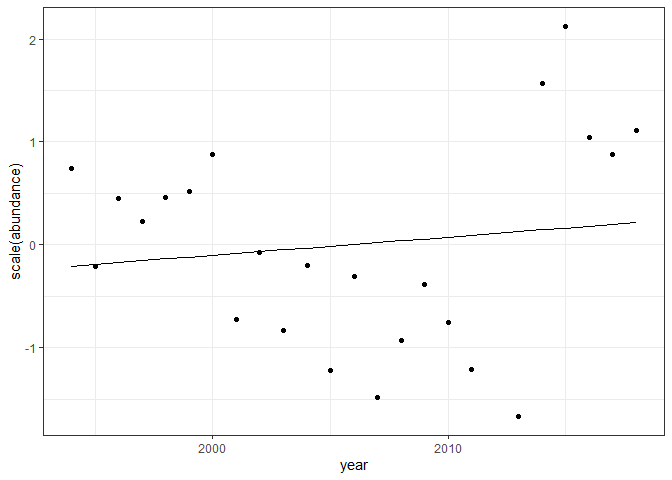
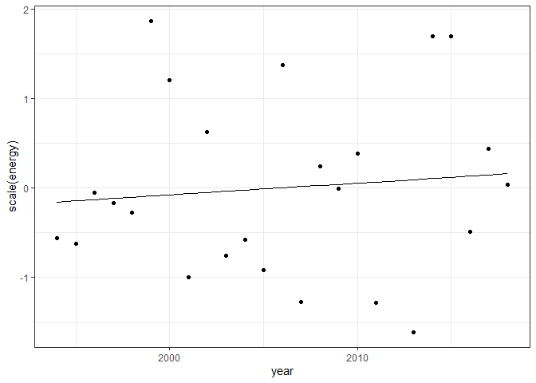

Comanche Peak, CO
================

### Load route

Another route - Comanche Peak, near where I grew up (ish). Also started
in 1994\!

Here are the species present in this route over the past 25 years:

    ## Joining, by = "id"

    ## # A tibble: 79 x 3
    ##    id     mean_size english_common_name     
    ##    <chr>      <dbl> <chr>                   
    ##  1 sp4320      3.56 Broad-tailed Hummingbird
    ##  2 sp7510      5.66 Blue-gray Gnatcatcher   
    ##  3 sp7490      6.21 Ruby-crowned Kinglet    
    ##  4 sp7480      6.26 Golden-crowned Kinglet  
    ##  5 sp6850      7.20 Wilson's Warbler        
    ##  6 sp6440      7.22 Virginia's Warbler      
    ##  7 sp5300      7.79 Lesser Goldfinch        
    ##  8 sp7260      8.39 Brown Creeper           
    ##  9 sp7280      9.74 Red-breasted Nuthatch   
    ## 10 sp4690     10.4  Dusky Flycatcher        
    ## # ... with 69 more rows

    ## [1] "...79 species total"

    ## `stat_bin()` using `bins = 30`. Pick better value with `binwidth`.

<!-- -->

Here is how species richness, abundance, biomass, and energy have
changed over those years:

<!-- -->

Before getting too invested in models, here are observations from the
state variable time series….

  - Energy is highly variable without a pronounced trend or structure.
  - Abundance and *mean energy* (or mean mass) have a somewhat different
    structure. I would argue for three distinguishable time chunks: that
    in the 1990s, we have medium abundance of small individuals; that in
    the early 2000s we have low abundances of *large* individuals, and
    that abruptly in the late 2010s we have low abundances of small
    individuals again. Is this an echo/signature of some kind of
    compensation/constraint? Hard to say: Energy is definitely not
    fixed, but, the apparent co-variation between mean energy and
    abundance *has the outcome of* buffering total energy use against
    fluctuations in either N or mean e. It is hard to think or talk
    about this because there is a lot of circularity.
  - I am not at all confident that the patterns - that I think are
    pretty robust - in N and mean\_e will come out in linear models;
    they’re not straightforward trends.

### Trends/tradeoffs in E and N

    ## 
    ## Call:
    ## lm(formula = scaled_value ~ year, data = filter(sv_long, currency == 
    ##     "abundance"))
    ## 
    ## Residuals:
    ##      Min       1Q   Median       3Q      Max 
    ## -1.79058 -0.79213 -0.01916  0.72618  1.95758 
    ## 
    ## Coefficients:
    ##              Estimate Std. Error t value Pr(>|t|)
    ## (Intercept) -35.19462   57.22888  -0.615    0.545
    ## year          0.01755    0.02853   0.615    0.545
    ## 
    ## Residual standard error: 1.014 on 22 degrees of freedom
    ## Multiple R-squared:  0.0169, Adjusted R-squared:  -0.02779 
    ## F-statistic: 0.3782 on 1 and 22 DF,  p-value: 0.5449

    ##                     2.5 %      97.5 %
    ## (Intercept) -153.88004759 83.49081315
    ## year          -0.04162535  0.07671907

<!-- -->

    ## 
    ## Call:
    ## lm(formula = scaled_value ~ year, data = filter(sv_long, currency == 
    ##     "energy"))
    ## 
    ## Residuals:
    ##      Min       1Q   Median       3Q      Max 
    ## -1.70207 -0.64351 -0.08805  0.41498  1.95290 
    ## 
    ## Coefficients:
    ##              Estimate Std. Error t value Pr(>|t|)
    ## (Intercept) -26.43126   57.44295   -0.46     0.65
    ## year          0.01318    0.02864    0.46     0.65
    ## 
    ## Residual standard error: 1.018 on 22 degrees of freedom
    ## Multiple R-squared:  0.009532,   Adjusted R-squared:  -0.03549 
    ## F-statistic: 0.2117 on 1 and 22 DF,  p-value: 0.6499

    ##                    2.5 %      97.5 %
    ## (Intercept) -145.5606502 92.69812671
    ## year          -0.0462158  0.07257129

<!-- -->

As I suspected, there’s not support for a *linear* fit to abundance \~
time. Nor is there for energy.

<!-- -->

    ## 
    ## Call:
    ## lm(formula = scale(mean_energy) ~ scale(abundance), data = sv)
    ## 
    ## Residuals:
    ##      Min       1Q   Median       3Q      Max 
    ## -0.81543 -0.49607 -0.06003  0.44090  1.28612 
    ## 
    ## Coefficients:
    ##                    Estimate Std. Error t value Pr(>|t|)    
    ## (Intercept)      -1.468e-16  1.330e-01   0.000        1    
    ## scale(abundance) -7.709e-01  1.358e-01  -5.676 1.04e-05 ***
    ## ---
    ## Signif. codes:  0 '***' 0.001 '**' 0.01 '*' 0.05 '.' 0.1 ' ' 1
    ## 
    ## Residual standard error: 0.6513 on 22 degrees of freedom
    ## Multiple R-squared:  0.5942, Adjusted R-squared:  0.5758 
    ## F-statistic: 32.22 on 1 and 22 DF,  p-value: 1.043e-05

Here we see *strong* support for a negative relationship between
abundance and mean energy.

    ## [1] "energy sd/mean"

    ## [1] 0.2093535

    ## [1] "abundance sd/mean"

    ## [1] 0.3102372

Energy has lower variability than abundance. I am *not sure* if that is
a trivially expected outcome of a scenario where shifts in mean\_e run
counter to shifts in abundance, but I think it is.

I *might* describe this as evidence/consistent with a tradeoff between
abundance and mean energy with neither a trending nor an obviously
regulated energetic budget. It seems significant to me that shifts in
mean energy run so counter to abundance. This is not always the case.

That said, abundance also predicts *total* energy. To a point. If
mean\_e were completely offsetting changes in abundance, I think we
would expect the E \~ N relationship to be decoupled. So perhaps size
shifts are *weakening* the relationship, but not rendering it totally
invariant…

<!-- -->

    ## 
    ## Call:
    ## lm(formula = scale(energy) ~ scale(abundance), data = sv)
    ## 
    ## Residuals:
    ##     Min      1Q  Median      3Q     Max 
    ## -1.1812 -0.4800 -0.2407  0.6222  1.5885 
    ## 
    ## Coefficients:
    ##                   Estimate Std. Error t value Pr(>|t|)    
    ## (Intercept)      1.901e-16  1.547e-01    0.00 1.000000    
    ## scale(abundance) 6.715e-01  1.580e-01    4.25 0.000327 ***
    ## ---
    ## Signif. codes:  0 '***' 0.001 '**' 0.01 '*' 0.05 '.' 0.1 ' ' 1
    ## 
    ## Residual standard error: 0.7577 on 22 degrees of freedom
    ## Multiple R-squared:  0.4509, Adjusted R-squared:  0.426 
    ## F-statistic: 18.07 on 1 and 22 DF,  p-value: 0.0003273

### Fixed or variable ISDs

This is moving towards a somewhat more nuanced look at how the ISD
(which we have so far looked at mostly via mean\_e) is shifting over
time.

Just based on the state variable timeseries, we expect there to be
variability in the ISD over time.

    ## `stat_bin()` using `bins = 30`. Pick better value with `binwidth`.

<!-- --><!-- --><!-- -->

This site kicks up an important point about the distinction between
pooling all indiivduals to construct the “if it were all just one ISD”
ISD, and taking some kind of mean across years. For this site, the shape
of the ISD is strongly associated with the total number of individuals;
the ones skewed towards small individuals also have a lot mroe
individuals. So when you weight the ISD from each year equally, you get
more density spread towards the larger end of the spectrum because you
are giving relatively more weight to years that have larger individuals
and also (coincidentally?\!?\!?\!?\!?) fewer individuals.

I did the randomization that follows based on just pooling all
individuals.

<!-- -->

This is the distribution of sizes of all the individuals we’ve ever seen
on this route.

One possibility is that we’re equally likely to draw any of these
individuals at any time step, and so we expect the ISD we observe at any
time step to be a random sample of \(N_t\) of all of these individuals.
Alternatively, there could be substantively different underlying ISDs we
are drawing our \(N_t\) individuals from, and the underlying ISDs could
vary systematically over time or orthogonal/not-detectably-parallel-to
time.

Energy could vary without a systematic trend, and be positively
associated with abundance, if the ISD at each time step is generated via
the random draws from an ur-ISD.

### Energy variability from a randomized isd

    ## Joining, by = "year"

<!-- --><!-- -->

    ## `stat_bin()` using `bins = 30`. Pick better value with `binwidth`.

<!-- -->
It’s maybe not a huge surprise that we see the observed energy diverging
from the trajectory if were were sampling N\_t individuals from a single
conglomerate ISD. I’m not sure how reasonable that scenario is for this
site, given what you can see just from the sv plots\!

It’s pretty interesting that observed energy is *less* variable over the
entire timeseries than if it were coming from all one ISD. I think this
tracks with the negative relationship between mean\_e and N……and
contrasts with what you see in New Hartford.

What would we expect for mean\_e in the sampling-one-ISD scenario? I
guess that it would be fixed and invariant wrt to abundance…

<!-- -->
