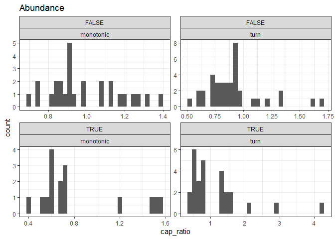
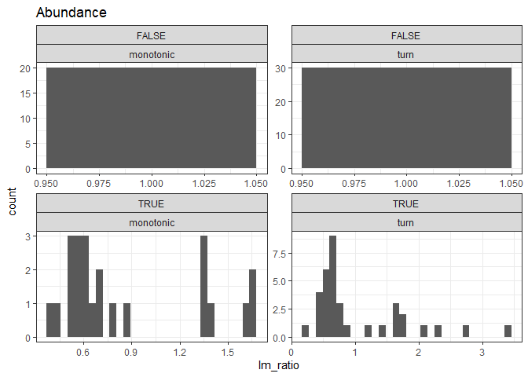

Interpreting breakpoint fits
================

## An idea

Look specifically at the predictions from the best-fitting breakpoint
model. (This model could be: no breakpoints + no slope, no breakpoints +
slope, n breakpoints + no slope, n breakpoints + slopes).

There’s some qualitative behaviors we can extract from the predictions
(that come logically but less elegantly from the parameters, etc).

Two axes:

1.  **Monotonic or squiggly:** Monotonic can encompass all linear
    (no-break) models, *and* any models with breakpoints that do not
    result in changes in direction.
2.  **Net change or net 0:** The ratio of the end:beginning
    *prediction*.

The 2x2:

1.  **Monotonic** and **net change**: This would be some kind of overall
    trend, either steady (probably would show as a 1-segment linear
    model), possibly accelerating or decelerating across the timeseries
    (would show as multiple segments with slopes), or even as a series
    of abrupt changes (would show as multiple segments with *no*
    slopes).
2.  **Monotonic** and **no net change**: This can basically only be
    accomplished as a one-segment linear model with a slope very close
    to 0. (Theoretically you could have many verrrrry gently sloping
    segments, but I doubt we have the statistical power such that
    something like that would emerge as the best fit). I think this is
    either very stable or *so* variable that not even many breakpoints
    can adequately capture the variability.
3.  **Turnpoints** and **net change**: The TS changes direction at least
    once, and ends up somewhere other than where it started. This *must*
    involve breakpoints. At the moment I think I have less confidence in
    such an outcome as evidence of systematic directional change - it
    seems potentially sensitive to, if we stopped surveying 5 years
    earlier, would we have a totally different trend?
4.  **Turnpoints** and **no net change**: Qualitatively different from,
    monotonic and no net change….Again, I am not sure how confident I am
    in this as a signal of any kind of regulation/buffering. But maybe.

### Illustration via a few real datasets

    ## `summarise()` ungrouping output (override with `.groups` argument)
    ## `summarise()` ungrouping output (override with `.groups` argument)
    ## `summarise()` ungrouping output (override with `.groups` argument)
    ## `summarise()` ungrouping output (override with `.groups` argument)
    ## `summarise()` ungrouping output (override with `.groups` argument)
    ## `summarise()` ungrouping output (override with `.groups` argument)
    ## `summarise()` ungrouping output (override with `.groups` argument)
    ## `summarise()` ungrouping output (override with `.groups` argument)
    ## `summarise()` ungrouping output (override with `.groups` argument)
    ## `summarise()` ungrouping output (override with `.groups` argument)
    ## `summarise()` ungrouping output (override with `.groups` argument)
    ## `summarise()` ungrouping output (override with `.groups` argument)
    ## `summarise()` ungrouping output (override with `.groups` argument)
    ## `summarise()` ungrouping output (override with `.groups` argument)
    ## `summarise()` ungrouping output (override with `.groups` argument)
    ## `summarise()` ungrouping output (override with `.groups` argument)
    ## `summarise()` ungrouping output (override with `.groups` argument)
    ## `summarise()` ungrouping output (override with `.groups` argument)
    ## `summarise()` ungrouping output (override with `.groups` argument)
    ## `summarise()` ungrouping output (override with `.groups` argument)
    ## `summarise()` ungrouping output (override with `.groups` argument)
    ## `summarise()` ungrouping output (override with `.groups` argument)
    ## `summarise()` ungrouping output (override with `.groups` argument)
    ## `summarise()` ungrouping output (override with `.groups` argument)
    ## `summarise()` ungrouping output (override with `.groups` argument)
    ## `summarise()` ungrouping output (override with `.groups` argument)
    ## `summarise()` ungrouping output (override with `.groups` argument)
    ## `summarise()` ungrouping output (override with `.groups` argument)
    ## `summarise()` ungrouping output (override with `.groups` argument)
    ## `summarise()` ungrouping output (override with `.groups` argument)
    ## `summarise()` ungrouping output (override with `.groups` argument)
    ## `summarise()` ungrouping output (override with `.groups` argument)
    ## `summarise()` ungrouping output (override with `.groups` argument)
    ## `summarise()` ungrouping output (override with `.groups` argument)
    ## `summarise()` ungrouping output (override with `.groups` argument)
    ## `summarise()` ungrouping output (override with `.groups` argument)
    ## `summarise()` ungrouping output (override with `.groups` argument)
    ## `summarise()` ungrouping output (override with `.groups` argument)
    ## `summarise()` ungrouping output (override with `.groups` argument)
    ## `summarise()` ungrouping output (override with `.groups` argument)
    ## `summarise()` ungrouping output (override with `.groups` argument)
    ## `summarise()` ungrouping output (override with `.groups` argument)
    ## `summarise()` ungrouping output (override with `.groups` argument)
    ## `summarise()` ungrouping output (override with `.groups` argument)
    ## `summarise()` ungrouping output (override with `.groups` argument)
    ## `summarise()` ungrouping output (override with `.groups` argument)
    ## `summarise()` ungrouping output (override with `.groups` argument)
    ## `summarise()` ungrouping output (override with `.groups` argument)
    ## `summarise()` ungrouping output (override with `.groups` argument)
    ## `summarise()` ungrouping output (override with `.groups` argument)
    ## `summarise()` ungrouping output (override with `.groups` argument)
    ## `summarise()` ungrouping output (override with `.groups` argument)
    ## `summarise()` ungrouping output (override with `.groups` argument)
    ## `summarise()` ungrouping output (override with `.groups` argument)
    ## `summarise()` ungrouping output (override with `.groups` argument)
    ## `summarise()` ungrouping output (override with `.groups` argument)
    ## `summarise()` ungrouping output (override with `.groups` argument)
    ## `summarise()` ungrouping output (override with `.groups` argument)
    ## `summarise()` ungrouping output (override with `.groups` argument)
    ## `summarise()` ungrouping output (override with `.groups` argument)
    ## `summarise()` ungrouping output (override with `.groups` argument)
    ## `summarise()` ungrouping output (override with `.groups` argument)
    ## `summarise()` ungrouping output (override with `.groups` argument)
    ## `summarise()` ungrouping output (override with `.groups` argument)
    ## `summarise()` ungrouping output (override with `.groups` argument)
    ## `summarise()` ungrouping output (override with `.groups` argument)
    ## `summarise()` ungrouping output (override with `.groups` argument)
    ## `summarise()` ungrouping output (override with `.groups` argument)
    ## `summarise()` ungrouping output (override with `.groups` argument)
    ## `summarise()` ungrouping output (override with `.groups` argument)
    ## `summarise()` ungrouping output (override with `.groups` argument)
    ## `summarise()` ungrouping output (override with `.groups` argument)
    ## `summarise()` ungrouping output (override with `.groups` argument)
    ## `summarise()` ungrouping output (override with `.groups` argument)
    ## `summarise()` ungrouping output (override with `.groups` argument)
    ## `summarise()` ungrouping output (override with `.groups` argument)
    ## `summarise()` ungrouping output (override with `.groups` argument)
    ## `summarise()` ungrouping output (override with `.groups` argument)
    ## `summarise()` ungrouping output (override with `.groups` argument)
    ## `summarise()` ungrouping output (override with `.groups` argument)
    ## `summarise()` ungrouping output (override with `.groups` argument)
    ## `summarise()` ungrouping output (override with `.groups` argument)
    ## `summarise()` ungrouping output (override with `.groups` argument)
    ## `summarise()` ungrouping output (override with `.groups` argument)
    ## `summarise()` ungrouping output (override with `.groups` argument)
    ## `summarise()` ungrouping output (override with `.groups` argument)
    ## `summarise()` ungrouping output (override with `.groups` argument)
    ## `summarise()` ungrouping output (override with `.groups` argument)
    ## `summarise()` ungrouping output (override with `.groups` argument)
    ## `summarise()` ungrouping output (override with `.groups` argument)
    ## `summarise()` ungrouping output (override with `.groups` argument)
    ## `summarise()` ungrouping output (override with `.groups` argument)
    ## `summarise()` ungrouping output (override with `.groups` argument)
    ## `summarise()` ungrouping output (override with `.groups` argument)
    ## `summarise()` ungrouping output (override with `.groups` argument)
    ## `summarise()` ungrouping output (override with `.groups` argument)
    ## `summarise()` ungrouping output (override with `.groups` argument)
    ## `summarise()` ungrouping output (override with `.groups` argument)
    ## `summarise()` ungrouping output (override with `.groups` argument)
    ## `summarise()` ungrouping output (override with `.groups` argument)
    ## `summarise()` ungrouping output (override with `.groups` argument)
    ## `summarise()` ungrouping output (override with `.groups` argument)
    ## `summarise()` ungrouping output (override with `.groups` argument)
    ## `summarise()` ungrouping output (override with `.groups` argument)
    ## `summarise()` ungrouping output (override with `.groups` argument)
    ## `summarise()` ungrouping output (override with `.groups` argument)
    ## `summarise()` ungrouping output (override with `.groups` argument)
    ## `summarise()` ungrouping output (override with `.groups` argument)

    ## Warning in wilcox.test.default(first_five, last_five): cannot compute exact p-
    ## value with ties
    
    ## Warning in wilcox.test.default(first_five, last_five): cannot compute exact p-
    ## value with ties
    
    ## Warning in wilcox.test.default(first_five, last_five): cannot compute exact p-
    ## value with ties
    
    ## Warning in wilcox.test.default(first_five, last_five): cannot compute exact p-
    ## value with ties
    
    ## Warning in wilcox.test.default(first_five, last_five): cannot compute exact p-
    ## value with ties

<!-- ### Monotonic and net change -->

<!-- ```{r monotonic net} -->

<!-- m_nc <- filter(all_mods, monotonic, net_change != 1) -->

<!-- ggplot(m_nc, aes(time, response)) + -->

<!--   geom_line() + -->

<!--   geom_point(aes(time, fitted)) + -->

<!--   theme_bw() + -->

<!--   facet_wrap(vars(site_curr), scales = "free") -->

<!-- ``` -->

<!-- ### Monotonic and no net change -->

<!-- ```{r monotonic no net} -->

<!-- m_nzero <- filter(all_mods, monotonic, net_change == 1) %>% -->

<!--   group_by(site_curr) %>% -->

<!--   mutate(cv = sd(response) / mean(response)) %>% -->

<!--   ungroup() -->

<!-- ggplot(m_nzero, aes(time, response)) + -->

<!--   geom_line() + -->

<!--   geom_point(aes(time, fitted)) + -->

<!--   theme_bw() + -->

<!--   facet_wrap(vars(site_curr), scales = "free") -->

<!-- ``` -->

<!-- ### Turnpoints and net change -->

<!-- ```{r turns net} -->

<!-- t_nc <- filter(all_mods, !monotonic, net_change != 1) -->

<!-- ggplot(t_nc, aes(time, response)) + -->

<!--   geom_line() + -->

<!--   geom_point(aes(time, fitted)) + -->

<!--   theme_bw() + -->

<!--   facet_wrap(vars(site_curr), scales = "free") -->

<!-- ggplot(t_nc, aes(time, response, color = cap_p_wilcox <= .05)) + -->

<!--   geom_line() + -->

<!--   geom_point(aes(time, fitted)) + -->

<!--   theme_bw() + -->

<!--   facet_wrap(vars(site_curr), scales = "free") -->

<!-- ggplot(t_nc, aes(time, response, color = lm_p_ratio != 1)) + -->

<!--   geom_line() + -->

<!--   geom_point(aes(time, fitted)) + -->

<!--   theme_bw() + -->

<!--   facet_wrap(vars(site_curr), scales = "free") -->

<!-- ``` -->

### Histograms

    ## `stat_bin()` using `bins = 30`. Pick better value with `binwidth`.

<!-- -->

    ## `stat_bin()` using `bins = 30`. Pick better value with `binwidth`.

<!-- -->

    ## # A tibble: 4 x 10
    ##   currency currency_n_mono~ total_n_sites monotonic n_cap_change n_lm_change
    ##   <chr>               <int>         <int> <lgl>            <int>       <int>
    ## 1 energy                 47           108 FALSE               13          18
    ## 2 energy                 47           108 TRUE                15          18
    ## 3 abundan~               43           108 TRUE                16          20
    ## 4 abundan~               43           108 FALSE               28          30
    ## # ... with 4 more variables: n_sites <int>, prop_cap_change <dbl>,
    ## #   prop_lm_change <dbl>, prop_monotonic <dbl>

# Abundance

## Monotonics

<!-- --><!-- --><!-- --><!-- --><!-- --><!-- --><!-- --><!-- --><!-- --><!-- --><!-- --><!-- --><!-- --><!-- --><!-- --><!-- --><!-- --><!-- --><!-- --><!-- --><!-- --><!-- --><!-- --><!-- --><!-- --><!-- --><!-- --><!-- --><!-- --><!-- --><!-- --><!-- --><!-- --><!-- --><!-- --><!-- --><!-- --><!-- --><!-- --><!-- --><!-- --><!-- --><!-- -->

## Turns

<!-- --><!-- --><!-- --><!-- --><!-- --><!-- --><!-- --><!-- --><!-- --><!-- --><!-- --><!-- --><!-- --><!-- --><!-- --><!-- --><!-- --><!-- --><!-- --><!-- --><!-- --><!-- --><!-- --><!-- --><!-- --><!-- --><!-- --><!-- --><!-- --><!-- --><!-- --><!-- --><!-- --><!-- --><!-- --><!-- --><!-- --><!-- --><!-- --><!-- --><!-- --><!-- --><!-- -->

    ## Warning: Removed 41 rows containing missing values (geom_point).

<!-- -->

    ## Warning: Removed 32 rows containing missing values (geom_point).

<!-- -->

    ## Warning: Removed 22 rows containing missing values (geom_point).

<!-- -->

    ## Warning: Removed 24 rows containing missing values (geom_point).

<!-- -->

    ## Warning: Removed 18 rows containing missing values (geom_point).

<!-- -->

    ## Warning: Removed 11 rows containing missing values (geom_point).

<!-- -->

    ## Warning: Removed 32 rows containing missing values (geom_point).

<!-- -->

    ## Warning: Removed 22 rows containing missing values (geom_point).

<!-- -->

    ## Warning: Removed 21 rows containing missing values (geom_point).

<!-- -->

    ## Warning: Removed 17 rows containing missing values (geom_point).

<!-- -->

    ## Warning: Removed 18 rows containing missing values (geom_point).

<!-- -->

    ## Warning: Removed 27 rows containing missing values (geom_point).

<!-- -->

    ## Warning: Removed 16 rows containing missing values (geom_point).

<!-- -->

    ## Warning: Removed 24 rows containing missing values (geom_point).

<!-- -->

    ## Warning: Removed 34 rows containing missing values (geom_point).

<!-- -->

    ## Warning: Removed 47 rows containing missing values (geom_point).

<!-- -->

    ## Warning: Removed 17 rows containing missing values (geom_point).

<!-- -->

    ## Warning: Removed 31 rows containing missing values (geom_point).

<!-- -->

    ## Warning: Removed 28 rows containing missing values (geom_point).

<!-- -->

    ## Warning: Removed 25 rows containing missing values (geom_point).

<!-- -->

    ## Warning: Removed 22 rows containing missing values (geom_point).

<!-- -->

    ## Warning: Removed 16 rows containing missing values (geom_point).

<!-- -->
