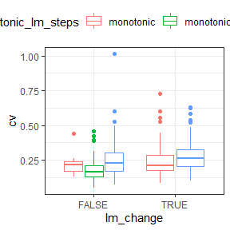

Interpreting breakpoint fits
================

## An idea

Look specifically at the predictions from the best-fitting breakpoint
model. (This model could be: no breakpoints + no slope, no breakpoints +
slope, n breakpoints + no slope, n breakpoints + slopes).

There’s some qualitative behaviors we can extract from the predictions
(that come logically but less elegantly from the parameters, etc).

Two axes:

1.  **Monotonic or squiggly:** Monotonic can encompass all linear
    (no-break) models, *and* any models with breakpoints that do not
    result in changes in direction.
2.  **Net change or net 0:** The ratio of the end:beginning
    *prediction*.

The 2x2:

1.  **Monotonic** and **net change**: This would be some kind of overall
    trend, either steady (probably would show as a 1-segment linear
    model), possibly accelerating or decelerating across the timeseries
    (would show as multiple segments with slopes), or even as a series
    of abrupt changes (would show as multiple segments with *no*
    slopes).
2.  **Monotonic** and **no net change**: This can basically only be
    accomplished as a one-segment linear model with a slope very close
    to 0. (Theoretically you could have many verrrrry gently sloping
    segments, but I doubt we have the statistical power such that
    something like that would emerge as the best fit). I think this is
    either very stable or *so* variable that not even many breakpoints
    can adequately capture the variability.
3.  **Turnpoints** and **net change**: The TS changes direction at least
    once, and ends up somewhere other than where it started. This *must*
    involve breakpoints. At the moment I think I have less confidence in
    such an outcome as evidence of systematic directional change - it
    seems potentially sensitive to, if we stopped surveying 5 years
    earlier, would we have a totally different trend?
4.  **Turnpoints** and **no net change**: Qualitatively different from,
    monotonic and no net change….Again, I am not sure how confident I am
    in this as a signal of any kind of regulation/buffering. But maybe.

### Illustration via a few real datasets

    ## Warning in wilcox.test.default(first_five, last_five): cannot compute exact p-
    ## value with ties
    
    ## Warning in wilcox.test.default(first_five, last_five): cannot compute exact p-
    ## value with ties
    
    ## Warning in wilcox.test.default(first_five, last_five): cannot compute exact p-
    ## value with ties
    
    ## Warning in wilcox.test.default(first_five, last_five): cannot compute exact p-
    ## value with ties
    
    ## Warning in wilcox.test.default(first_five, last_five): cannot compute exact p-
    ## value with ties

### Grouped by turns/no

<!-- --><!-- -->

    ## # A tibble: 6 x 7
    ##   currency monotonic n_mono_or_turns lm_change_descr~ n_lm_change_des~
    ##   <chr>    <lgl>               <int> <chr>                       <int>
    ## 1 abundan~ FALSE                  65 decrease                       24
    ## 2 abundan~ FALSE                  65 increase                       11
    ## 3 abundan~ FALSE                  65 no trend                       30
    ## 4 abundan~ TRUE                   43 decrease                       16
    ## 5 abundan~ TRUE                   43 increase                        7
    ## 6 abundan~ TRUE                   43 no trend                       20
    ## # ... with 2 more variables: lm_change_word <chr>, n_trend_or_no <int>

### Grouped by trend

<!-- --><!-- -->

    ## # A tibble: 6 x 5
    ##   currency  lm_change_description n_trend_type monotonic n_monotonic_trend
    ##   <chr>     <chr>                        <int> <lgl>                 <int>
    ## 1 abundance decrease                        40 FALSE                    24
    ## 2 abundance decrease                        40 TRUE                     16
    ## 3 abundance increase                        18 FALSE                    11
    ## 4 abundance increase                        18 TRUE                      7
    ## 5 abundance no trend                        50 FALSE                    30
    ## 6 abundance no trend                        50 TRUE                     20

<!-- --><!-- --><!-- -->

    ## # A tibble: 6 x 5
    ##   currency  cap_change_description n_trend_type monotonic n_monotonic_trend
    ##   <chr>     <chr>                         <int> <lgl>                 <int>
    ## 1 abundance decrease                         29 FALSE                    17
    ## 2 abundance decrease                         29 TRUE                     12
    ## 3 abundance increase                         15 FALSE                    11
    ## 4 abundance increase                         15 TRUE                      4
    ## 5 abundance no change                        64 FALSE                    37
    ## 6 abundance no change                        64 TRUE                     27

## Distributions of slopes

    ## `stat_bin()` using `bins = 30`. Pick better value with `binwidth`.

<!-- -->

    ## `stat_bin()` using `bins = 30`. Pick better value with `binwidth`.

<!-- --><!-- --><!-- -->

# The actual time series

## Monotonics

### No significant trend

#### Steps

<!-- --><!-- --><!-- --><!-- --><!-- --><!-- --><!-- -->

#### “Static”

<!-- --><!-- --><!-- --><!-- --><!-- --><!-- --><!-- --><!-- --><!-- --><!-- --><!-- --><!-- --><!-- --><!-- --><!-- -->

### Inscreasing

<!-- --><!-- --><!-- --><!-- --><!-- --><!-- --><!-- --><!-- -->

### Decreasing

<!-- --><!-- --><!-- --><!-- --><!-- --><!-- --><!-- --><!-- --><!-- --><!-- --><!-- --><!-- --><!-- --><!-- --><!-- --><!-- --><!-- -->

## Turns

### No significant trend

#### Steps

<!-- --><!-- --><!-- --><!-- --><!-- --><!-- --><!-- --><!-- --><!-- --><!-- --><!-- --><!-- --><!-- --><!-- --><!-- --><!-- --><!-- --><!-- --><!-- --><!-- --><!-- --><!-- --><!-- --><!-- --><!-- --><!-- --><!-- --><!-- --><!-- --><!-- -->

    ## Warning: Removed 1 rows containing non-finite values (stat_boxplot).

    ## Warning: Removed 1 rows containing missing values (geom_point).

<!-- -->

### Increasing

<!-- --><!-- --><!-- --><!-- --><!-- --><!-- --><!-- --><!-- --><!-- --><!-- --><!-- --><!-- -->

### Decreasing

<!-- --><!-- --><!-- --><!-- --><!-- --><!-- --><!-- --><!-- --><!-- --><!-- --><!-- --><!-- --><!-- --><!-- --><!-- --><!-- --><!-- --><!-- --><!-- --><!-- --><!-- --><!-- --><!-- --><!-- --><!-- -->

# Energy

### Grouped by turns/no

<!-- --><!-- -->

    ## # A tibble: 6 x 7
    ##   currency monotonic n_mono_or_turns lm_change_descr~ n_lm_change_des~
    ##   <chr>    <lgl>               <int> <chr>                       <int>
    ## 1 energy   FALSE                  61 decrease                       15
    ## 2 energy   FALSE                  61 increase                       11
    ## 3 energy   FALSE                  61 no trend                       35
    ## 4 energy   TRUE                   47 decrease                       10
    ## 5 energy   TRUE                   47 increase                       13
    ## 6 energy   TRUE                   47 no trend                       24
    ## # ... with 2 more variables: lm_change_word <chr>, n_trend_or_no <int>

### Grouped by trend

<!-- --><!-- -->

    ## # A tibble: 6 x 5
    ##   currency lm_change_description n_trend_type monotonic n_monotonic_trend
    ##   <chr>    <chr>                        <int> <lgl>                 <int>
    ## 1 energy   decrease                        25 FALSE                    15
    ## 2 energy   decrease                        25 TRUE                     10
    ## 3 energy   increase                        24 FALSE                    11
    ## 4 energy   increase                        24 TRUE                     13
    ## 5 energy   no trend                        59 FALSE                    35
    ## 6 energy   no trend                        59 TRUE                     24

<!-- --><!-- --><!-- -->

    ## # A tibble: 6 x 5
    ##   currency cap_change_description n_trend_type monotonic n_monotonic_trend
    ##   <chr>    <chr>                         <int> <lgl>                 <int>
    ## 1 energy   decrease                         17 FALSE                     9
    ## 2 energy   decrease                         17 TRUE                      8
    ## 3 energy   increase                         11 FALSE                     4
    ## 4 energy   increase                         11 TRUE                      7
    ## 5 energy   no change                        80 FALSE                    48
    ## 6 energy   no change                        80 TRUE                     32

## Distributions of slopes

    ## `stat_bin()` using `bins = 30`. Pick better value with `binwidth`.

<!-- -->

    ## `stat_bin()` using `bins = 30`. Pick better value with `binwidth`.

<!-- --><!-- --><!-- -->

# The actual time series

## Monotonics

### No significant trend

#### Steps

<!-- --><!-- --><!-- -->

#### “Static”

<!-- --><!-- --><!-- --><!-- --><!-- --><!-- --><!-- --><!-- --><!-- --><!-- --><!-- --><!-- --><!-- --><!-- --><!-- --><!-- --><!-- --><!-- --><!-- --><!-- --><!-- --><!-- --><!-- -->

### Inscreasing

<!-- --><!-- --><!-- --><!-- --><!-- --><!-- --><!-- --><!-- --><!-- --><!-- --><!-- --><!-- --><!-- --><!-- -->

### Decreasing

<!-- --><!-- --><!-- --><!-- --><!-- --><!-- --><!-- --><!-- --><!-- --><!-- --><!-- -->

## Turns

### No significant trend

#### Steps

<!-- --><!-- --><!-- --><!-- --><!-- --><!-- --><!-- --><!-- --><!-- --><!-- --><!-- --><!-- --><!-- --><!-- --><!-- --><!-- --><!-- --><!-- --><!-- --><!-- --><!-- --><!-- --><!-- --><!-- --><!-- --><!-- --><!-- --><!-- --><!-- --><!-- --><!-- --><!-- --><!-- --><!-- --><!-- --><!-- -->

### Increasing

<!-- --><!-- --><!-- --><!-- --><!-- --><!-- --><!-- --><!-- --><!-- --><!-- --><!-- --><!-- -->

### Decreasing

<!-- --><!-- --><!-- --><!-- --><!-- --><!-- --><!-- --><!-- --><!-- --><!-- --><!-- --><!-- --><!-- --><!-- --><!-- --><!-- -->

# E in comparison to N

    ##  [1] "site_name"              "currency"               "nbp"                   
    ##  [4] "has_slope"              "net_change"             "monotonic"             
    ##  [7] "cap_ratio"              "cap_p_wilcox"           "lm_ratio"              
    ## [10] "lm_p_ratio"             "cv"                     "site_curr"             
    ## [13] "cap_change"             "lm_change"              "monotonic_word"        
    ## [16] "monotonic_lm_steps"     "monotonic_cap_steps"    "cap_increase"          
    ## [19] "cap_decrease"           "lm_increase"            "lm_decrease"           
    ## [22] "lm_change_word"         "lm_change_description"  "cap_change_word"       
    ## [25] "cap_change_description" "cap_lm_agree"

<!-- --><!-- -->
