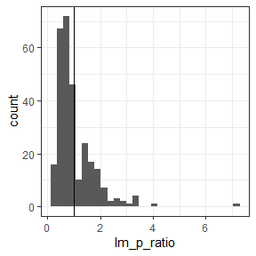
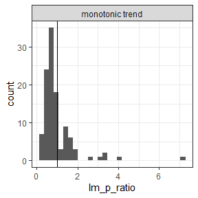
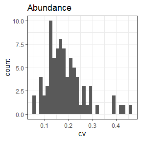

Interpreting breakpoint fits
================

## An idea

Look specifically at the predictions from the best-fitting breakpoint
model. (This model could be: no breakpoints + no slope, no breakpoints +
slope, n breakpoints + no slope, n breakpoints + slopes).

There’s some qualitative behaviors we can extract from the predictions
(that come logically but less elegantly from the parameters, etc).

Two axes:

1.  **Monotonic or squiggly:** Monotonic can encompass all linear
    (no-break) models, *and* any models with breakpoints that do not
    result in changes in direction.
2.  **Net change or net 0:** The ratio of the end:beginning
    *prediction*.

The 2x2:

1.  **Monotonic** and **net change**: This would be some kind of overall
    trend, either steady (probably would show as a 1-segment linear
    model), possibly accelerating or decelerating across the timeseries
    (would show as multiple segments with slopes), or even as a series
    of abrupt changes (would show as multiple segments with *no*
    slopes).
2.  **Monotonic** and **no net change**: This can basically only be
    accomplished as a one-segment linear model with a slope very close
    to 0. (Theoretically you could have many verrrrry gently sloping
    segments, but I doubt we have the statistical power such that
    something like that would emerge as the best fit). I think this is
    either very stable or *so* variable that not even many breakpoints
    can adequately capture the variability.
3.  **Turnpoints** and **net change**: The TS changes direction at least
    once, and ends up somewhere other than where it started. This *must*
    involve breakpoints. At the moment I think I have less confidence in
    such an outcome as evidence of systematic directional change - it
    seems potentially sensitive to, if we stopped surveying 5 years
    earlier, would we have a totally different trend?
4.  **Turnpoints** and **no net change**: Qualitatively different from,
    monotonic and no net change….Again, I am not sure how confident I am
    in this as a signal of any kind of regulation/buffering. But maybe.

### Illustration via a few real datasets

    ## Warning in wilcox.test.default(first_five, last_five): cannot compute exact p-
    ## value with ties
    
    ## Warning in wilcox.test.default(first_five, last_five): cannot compute exact p-
    ## value with ties
    
    ## Warning in wilcox.test.default(first_five, last_five): cannot compute exact p-
    ## value with ties
    
    ## Warning in wilcox.test.default(first_five, last_five): cannot compute exact p-
    ## value with ties
    
    ## Warning in wilcox.test.default(first_five, last_five): cannot compute exact p-
    ## value with ties
    
    ## Warning in wilcox.test.default(first_five, last_five): cannot compute exact p-
    ## value with ties
    
    ## Warning in wilcox.test.default(first_five, last_five): cannot compute exact p-
    ## value with ties
    
    ## Warning in wilcox.test.default(first_five, last_five): cannot compute exact p-
    ## value with ties
    
    ## Warning in wilcox.test.default(first_five, last_five): cannot compute exact p-
    ## value with ties
    
    ## Warning in wilcox.test.default(first_five, last_five): cannot compute exact p-
    ## value with ties
    
    ## Warning in wilcox.test.default(first_five, last_five): cannot compute exact p-
    ## value with ties
    
    ## Warning in wilcox.test.default(first_five, last_five): cannot compute exact p-
    ## value with ties
    
    ## Warning in wilcox.test.default(first_five, last_five): cannot compute exact p-
    ## value with ties
    
    ## Warning in wilcox.test.default(first_five, last_five): cannot compute exact p-
    ## value with ties
    
    ## Warning in wilcox.test.default(first_five, last_five): cannot compute exact p-
    ## value with ties
    
    ## Warning in wilcox.test.default(first_five, last_five): cannot compute exact p-
    ## value with ties
    
    ## Warning in wilcox.test.default(first_five, last_five): cannot compute exact p-
    ## value with ties
    
    ## Warning in wilcox.test.default(first_five, last_five): cannot compute exact p-
    ## value with ties
    
    ## Warning in wilcox.test.default(first_five, last_five): cannot compute exact p-
    ## value with ties
    
    ## Warning in wilcox.test.default(first_five, last_five): cannot compute exact p-
    ## value with ties
    
    ## Warning in wilcox.test.default(first_five, last_five): cannot compute exact p-
    ## value with ties
    
    ## Warning in wilcox.test.default(first_five, last_five): cannot compute exact p-
    ## value with ties
    
    ## Warning in wilcox.test.default(first_five, last_five): cannot compute exact p-
    ## value with ties
    
    ## Warning in wilcox.test.default(first_five, last_five): cannot compute exact p-
    ## value with ties
    
    ## Warning in wilcox.test.default(first_five, last_five): cannot compute exact p-
    ## value with ties
    
    ## Warning in wilcox.test.default(first_five, last_five): cannot compute exact p-
    ## value with ties
    
    ## Warning in wilcox.test.default(first_five, last_five): cannot compute exact p-
    ## value with ties
    
    ## Warning in wilcox.test.default(first_five, last_five): cannot compute exact p-
    ## value with ties
    
    ## Warning in wilcox.test.default(first_five, last_five): cannot compute exact p-
    ## value with ties
    
    ## Warning in wilcox.test.default(first_five, last_five): cannot compute exact p-
    ## value with ties
    
    ## Warning in wilcox.test.default(first_five, last_five): cannot compute exact p-
    ## value with ties
    
    ## Warning in wilcox.test.default(first_five, last_five): cannot compute exact p-
    ## value with ties
    
    ## Warning in wilcox.test.default(first_five, last_five): cannot compute exact p-
    ## value with ties
    
    ## Warning in wilcox.test.default(first_five, last_five): cannot compute exact p-
    ## value with ties
    
    ## Warning in wilcox.test.default(first_five, last_five): cannot compute exact p-
    ## value with ties
    
    ## Warning in wilcox.test.default(first_five, last_five): cannot compute exact p-
    ## value with ties
    
    ## Warning in wilcox.test.default(first_five, last_five): cannot compute exact p-
    ## value with ties
    
    ## Warning in wilcox.test.default(first_five, last_five): cannot compute exact p-
    ## value with ties
    
    ## Warning in wilcox.test.default(first_five, last_five): cannot compute exact p-
    ## value with ties
    
    ## Warning in wilcox.test.default(first_five, last_five): cannot compute exact p-
    ## value with ties
    
    ## Warning in wilcox.test.default(first_five, last_five): cannot compute exact p-
    ## value with ties

### Grouped by turns/no

<!-- --><!-- -->

    ## # A tibble: 6 x 7
    ##   currency monotonic n_mono_or_turns lm_change_descr~ n_lm_change_des~
    ##   <chr>    <lgl>               <int> <chr>                       <int>
    ## 1 abundan~ FALSE                 307 decrease                      109
    ## 2 abundan~ FALSE                 307 increase                       67
    ## 3 abundan~ FALSE                 307 no trend                      131
    ## 4 abundan~ TRUE                  193 decrease                       78
    ## 5 abundan~ TRUE                  193 increase                       33
    ## 6 abundan~ TRUE                  193 no trend                       82
    ## # ... with 2 more variables: lm_change_word <chr>, n_trend_or_no <int>

### Grouped by trend

<!-- --><!-- -->

    ## # A tibble: 6 x 5
    ##   currency  lm_change_description n_trend_type monotonic n_monotonic_trend
    ##   <chr>     <chr>                        <int> <lgl>                 <int>
    ## 1 abundance decrease                       187 FALSE                   109
    ## 2 abundance decrease                       187 TRUE                     78
    ## 3 abundance increase                       100 FALSE                    67
    ## 4 abundance increase                       100 TRUE                     33
    ## 5 abundance no trend                       213 FALSE                   131
    ## 6 abundance no trend                       213 TRUE                     82

<!-- --><!-- --><!-- -->

    ## # A tibble: 6 x 5
    ##   currency  cap_change_description n_trend_type monotonic n_monotonic_trend
    ##   <chr>     <chr>                         <int> <lgl>                 <int>
    ## 1 abundance decrease                        118 FALSE                    69
    ## 2 abundance decrease                        118 TRUE                     49
    ## 3 abundance increase                         69 FALSE                    48
    ## 4 abundance increase                         69 TRUE                     21
    ## 5 abundance no change                       313 FALSE                   190
    ## 6 abundance no change                       313 TRUE                    123

## Distributions of slopes

    ## `stat_bin()` using `bins = 30`. Pick better value with `binwidth`.

<!-- -->

    ## `stat_bin()` using `bins = 30`. Pick better value with `binwidth`.

<!-- -->

    ## `stat_bin()` using `bins = 30`. Pick better value with `binwidth`.

<!-- -->

# The actual time series

## Monotonics

### No significant trend

#### Steps

#### “Static”

### Inscreasing

### Decreasing

## Turns

### No significant trend

#### Steps

### Increasing

### Decreasing

# Energy

### Grouped by turns/no

<!-- --><!-- -->

    ## # A tibble: 6 x 7
    ##   currency monotonic n_mono_or_turns lm_change_descr~ n_lm_change_des~
    ##   <chr>    <lgl>               <int> <chr>                       <int>
    ## 1 energy   FALSE                 262 decrease                       75
    ## 2 energy   FALSE                 262 increase                       60
    ## 3 energy   FALSE                 262 no trend                      127
    ## 4 energy   TRUE                  238 decrease                       76
    ## 5 energy   TRUE                  238 increase                       55
    ## 6 energy   TRUE                  238 no trend                      107
    ## # ... with 2 more variables: lm_change_word <chr>, n_trend_or_no <int>

### Grouped by trend

<!-- --><!-- -->

    ## # A tibble: 6 x 5
    ##   currency lm_change_description n_trend_type monotonic n_monotonic_trend
    ##   <chr>    <chr>                        <int> <lgl>                 <int>
    ## 1 energy   decrease                       151 FALSE                    75
    ## 2 energy   decrease                       151 TRUE                     76
    ## 3 energy   increase                       115 FALSE                    60
    ## 4 energy   increase                       115 TRUE                     55
    ## 5 energy   no trend                       234 FALSE                   127
    ## 6 energy   no trend                       234 TRUE                    107

<!-- --><!-- --><!-- -->

    ## # A tibble: 6 x 5
    ##   currency cap_change_description n_trend_type monotonic n_monotonic_trend
    ##   <chr>    <chr>                         <int> <lgl>                 <int>
    ## 1 energy   decrease                         93 FALSE                    49
    ## 2 energy   decrease                         93 TRUE                     44
    ## 3 energy   increase                         71 FALSE                    33
    ## 4 energy   increase                         71 TRUE                     38
    ## 5 energy   no change                       336 FALSE                   180
    ## 6 energy   no change                       336 TRUE                    156

## Distributions of slopes

    ## `stat_bin()` using `bins = 30`. Pick better value with `binwidth`.

<!-- -->

    ## `stat_bin()` using `bins = 30`. Pick better value with `binwidth`.

<!-- --><!-- -->

    ## `stat_bin()` using `bins = 30`. Pick better value with `binwidth`.

<!-- -->

# The actual time series

## Monotonics

### No significant trend

#### Steps

#### “Static”

### Inscreasing

### Decreasing

## Turns

### No significant trend

#### Steps

### Increasing

### Decreasing

# E in comparison to N

    ##  [1] "site_name"              "currency"               "nbp"                   
    ##  [4] "has_slope"              "net_change"             "monotonic"             
    ##  [7] "cap_ratio"              "cap_p_wilcox"           "lm_ratio"              
    ## [10] "lm_p_ratio"             "cv"                     "site_curr"             
    ## [13] "cap_change"             "lm_change"              "monotonic_word"        
    ## [16] "monotonic_lm_steps"     "monotonic_cap_steps"    "cap_increase"          
    ## [19] "cap_decrease"           "lm_increase"            "lm_decrease"           
    ## [22] "lm_change_word"         "lm_change_description"  "cap_change_word"       
    ## [25] "cap_change_description" "cap_lm_agree"

<!-- --><!-- -->

    ## `summarise()` regrouping output by 'monotonic_word_abundance' (override with `.groups` argument)

| monotonic\_word\_abundance | monotonic\_word\_energy |   n |
| :------------------------- | :---------------------- | --: |
| monotonic                  | monotonic               | 152 |
| monotonic                  | turns                   |  41 |
| turns                      | monotonic               |  86 |
| turns                      | turns                   | 221 |

For 30 communities, both TS are monotonic.

For another 30, one is monotonic and one turns. Which is which is an
even split.

For the remaining 48, both have turns.

Of those where both are monotonic:

    ## `summarise()` regrouping output by 'lm_change_description_abundance' (override with `.groups` argument)

| lm\_change\_description\_abundance | lm\_change\_description\_energy |  n |   percent |
| :--------------------------------- | :------------------------------ | -: | --------: |
| decrease                           | decrease                        | 43 | 0.2828947 |
| decrease                           | no trend                        | 18 | 0.1184211 |
| increase                           | increase                        | 17 | 0.1118421 |
| increase                           | no trend                        |  5 | 0.0328947 |
| no trend                           | decrease                        |  8 | 0.0526316 |
| no trend                           | increase                        | 13 | 0.0855263 |
| no trend                           | no trend                        | 48 | 0.3157895 |

The two TS match for 22 of the 30 TS. That is 6 decreases, 5 increases,
and 11 no changes.

3 times, abundance decreases and E does not change.

1 time, abundance does not change but E decreases.

4 times, abundance does not change but E increases.

Abundance never increases without E increasing.

    ## `summarise()` regrouping output by 'lm_change_description_abundance' (override with `.groups` argument)

| lm\_change\_description\_abundance | lm\_change\_description\_energy |   n | percent |
| :--------------------------------- | :------------------------------ | --: | ------: |
| decrease                           | decrease                        | 135 |   0.270 |
| decrease                           | increase                        |   2 |   0.004 |
| decrease                           | no trend                        |  50 |   0.100 |
| increase                           | increase                        |  76 |   0.152 |
| increase                           | no trend                        |  24 |   0.048 |
| no trend                           | decrease                        |  16 |   0.032 |
| no trend                           | increase                        |  37 |   0.074 |
| no trend                           | no trend                        | 160 |   0.320 |

Including turning ones:

71 times they match. That is 21 decreases, 13 increases, and 37 no
trends.

2 times N decreases but E increases. 17 times N decreases and E does not
change.

4 times N does not change but E decreases. 9 times N does not change but
E increases.

5 times N increases and E does not change.

    ## Joining, by = c("lm_change_description_abundance", "lm_change_description_energy")

| lm\_change\_description\_abundance | lm\_change\_description\_energy |   n | percent | n\_mono | percent\_mono |
| :--------------------------------- | :------------------------------ | --: | ------: | ------: | ------------: |
| decrease                           | increase                        |   2 |   0.004 |      NA |            NA |
| no trend                           | decrease                        |  16 |   0.032 |       8 |     0.0526316 |
| increase                           | no trend                        |  24 |   0.048 |       5 |     0.0328947 |
| no trend                           | increase                        |  37 |   0.074 |      13 |     0.0855263 |
| decrease                           | no trend                        |  50 |   0.100 |      18 |     0.1184211 |
| increase                           | increase                        |  76 |   0.152 |      17 |     0.1118421 |
| decrease                           | decrease                        | 135 |   0.270 |      43 |     0.2828947 |
| no trend                           | no trend                        | 160 |   0.320 |      48 |     0.3157895 |

The above is really hard to interpret.

    ## `summarise()` regrouping output by 'currency', 'monotonic_word', 'lm_change_description' (override with `.groups` argument)

<!-- -->

    ## `summarise()` regrouping output by 'currency', 'monotonic_word' (override with `.groups` argument)

| currency  | monotonic\_word | prop\_this\_turn |
| :-------- | :-------------- | ---------------: |
| abundance | monotonic       |            0.386 |
| abundance | turns           |            0.614 |
| energy    | monotonic       |            0.476 |
| energy    | turns           |            0.524 |

