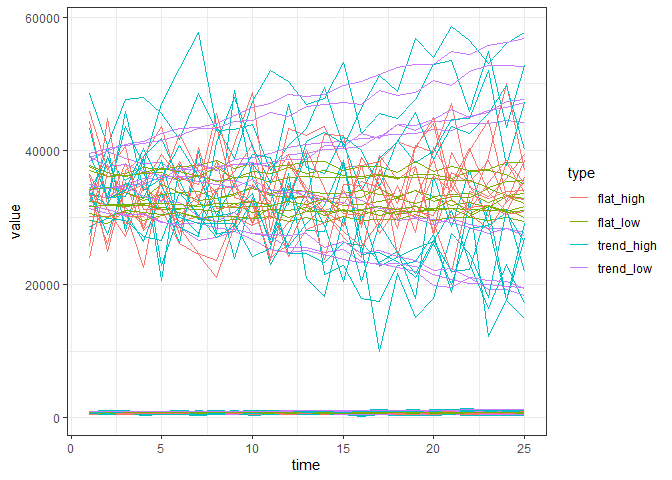
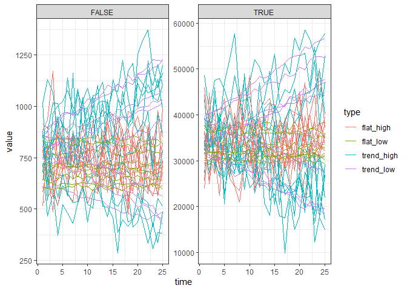
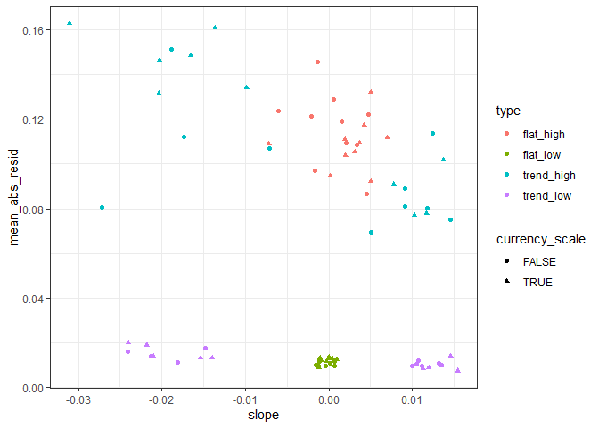
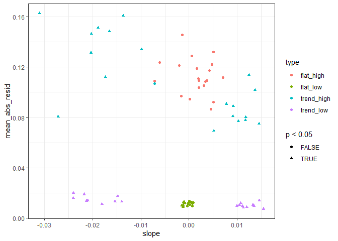

Second draft scaling residual variation
================

``` r
simulate_data <- function(ntimesteps, intercept, slope_ratio, sd_ratio) {
  
  slope <- slope_ratio * intercept
  
  sd_error = sd_ratio * mean(intercept, (intercept + (ntimesteps * slope)))
  
  vals <- intercept + ((1:ntimesteps) * slope) + rnorm(ntimesteps, sd = sd_error)
  
  if(any(vals <= 0)) {
    vals [ which(vals <= 0)] <- 1
  }
  
  return(data.frame(
    time = 1:ntimesteps,
    value = vals,
    true_slope = slope,
    true_slope_ratio = slope_ratio,
    true_error_ratio = sd_ratio,
    true_error = sd_error,
    true_intercept = intercept
  ))
  
}

set.seed(1977)
#one_sim <- simulate_data(25, runif(1, 600, 900), runif(1, -.0007, .0007), sd_ratio = .015)
one_sim <- simulate_data(25,600, -.03, sd_ratio = .25)
ggplot(one_sim, aes(time, value)) + 
  geom_point() +
  theme_bw() +
  scale_y_continuous(limits = c(0, NA))
```

<!-- -->

## Explaining the analysis

For a given response vector (in this case, a timeseries \~ year)

1.  Divide all values by the mean
2.  Fit a lm
3.  Take the mean of the absolute value of the residuals
4.  Extract the slope

<!-- end list -->

``` r
one_sim$adj_value = one_sim$value / mean(one_sim$value)

one_lm <- lm(adj_value ~ time, data = one_sim)

one_sim$est <- predict(one_lm)
one_sim$abs_resid <- abs(resid(one_lm))

ggplot(one_sim, aes(time, adj_value)) +
  geom_line() +
  geom_line(aes(time, est), color = "pink") +
  theme_bw() +
  scale_y_continuous(limits = c(0, NA)) +
  geom_point(aes(time, abs_resid), color = "red")
```

<!-- -->

``` r
mean(one_sim$abs_resid)
```

    ## [1] 0.3195092

``` r
coefficients(one_lm)
```

    ## (Intercept)        time 
    ##  1.72565124 -0.05581933

# Exploring how it behaves

### Non trending and low error

``` r
flat_low <- replicate(n = 10, expr = simulate_data(25, runif(1, 600, 900), runif(1, -.0007, .0007), sd_ratio = .015), simplify = F)

flat_low <- bind_rows(flat_low, .id = "rep") %>%
  mutate(type = "flat_low",
         rep = as.numeric(rep))


flat_low2 <- replicate(n = 10, expr = simulate_data(25, runif(1, 30000, 40000), runif(1, -.0007, .0007), sd_ratio = .015), simplify = F)

flat_low2 <- bind_rows(flat_low2, .id = "rep") %>%
  mutate(type = "flat_low",
         rep = as.numeric(rep) + 10)

flat_low <- bind_rows(flat_low, flat_low2)

ggplot(flat_low, aes(time, value, group = rep)) +
  geom_line() + theme_bw()
```

<!-- -->

### Trending and low error

``` r
trend_low <- replicate(n = 10, expr = simulate_data(25, runif(1, 600, 900), sample(c(-1, 1), size = 1) * runif(1, .01, .02), sd_ratio = .015), simplify = F)

trend_low <- bind_rows(trend_low, .id = "rep") %>%
  mutate(type = "trend_low",
         rep = as.numeric(rep))


trend_low2 <- replicate(n = 10, expr = simulate_data(25, runif(1, 30000, 40000), sample(c(-1, 1), size = 1) * runif(1, .01, .02), sd_ratio = .015), simplify = F)

trend_low2 <- bind_rows(trend_low2, .id = "rep") %>%
  mutate(type = "trend_low",
         rep = as.numeric(rep) + 10)

trend_low <- bind_rows(trend_low, trend_low2)

ggplot(trend_low, aes(time, value, group = rep)) +
  geom_line() + theme_bw()
```

<!-- -->

### Non trending and high error

``` r
flat_high <- replicate(n = 10, expr = simulate_data(25, runif(1, 600, 900), runif(1, -.0007, .0007), sd_ratio = .15), simplify = F)

flat_high <- bind_rows(flat_high, .id = "rep") %>%
  mutate(type = "flat_high",
         rep = as.numeric(rep))


flat_high2 <- replicate(n = 10, expr = simulate_data(25, runif(1, 30000, 40000), runif(1, -.0007, .0007), sd_ratio = .15), simplify = F)

flat_high2 <- bind_rows(flat_high2, .id = "rep") %>%
  mutate(type = "flat_high",
         rep = as.numeric(rep) + 10)

flat_high <- bind_rows(flat_high, flat_high2)


ggplot(flat_high, aes(time, value, group = rep)) +
  geom_line() + theme_bw()
```

<!-- -->

### Trending and high error

``` r
trend_high <- replicate(n = 10, expr = simulate_data(25, runif(1, 600, 900), sample(c(-1, 1), size = 1) * runif(1, .01, .02), sd_ratio = .15), simplify = F)

trend_high <- bind_rows(trend_high, .id = "rep") %>%
  mutate(type = "trend_high",
         rep = as.numeric(rep))

trend_high2 <- replicate(n = 10, expr = simulate_data(25, runif(1, 30000, 40000), sample(c(-1, 1), size = 1) * runif(1, .01, .02), sd_ratio = .15), simplify = F)

trend_high2 <- bind_rows(trend_high2, .id = "rep") %>%
  mutate(type = "trend_high",
         rep = as.numeric(rep) + 10)

trend_high <- bind_rows(trend_high, trend_high2)


ggplot(trend_high, aes(time, value, group = rep)) +
  geom_line() + theme_bw()
```

<!-- -->

### All

``` r
all_sims <- bind_rows(flat_low, flat_high, trend_low, trend_high)

all_sims <- mutate(all_sims, rep_trend = paste0(rep, type),
                   currency_scale = rep > 10) 


ggplot(all_sims, aes(time, value, group = rep_trend, color = type)) +
  geom_line() + theme_bw()
```

<!-- -->

``` r
ggplot(all_sims, aes(time, value, group = rep_trend, color = type)) +
  geom_line() + theme_bw() + facet_wrap(vars(currency_scale), scales = "free_y")
```

<!-- -->

``` r
lm_fuzz <- function(a_vector) {
  
  this_ts <- data.frame(time = 1:length(a_vector), value = a_vector / mean(a_vector))
  
  this_lm <- lm(value ~ time, this_ts) 
  
  this_slope <- coefficients(this_lm)[["time"]]
  
  this_p <- anova(this_lm)[1,5]
  
  this_r2 <- summary(this_lm)$r.squared
  
  this_est <- predict(this_lm)
  
  scaled_ests <- this_est / a_vector
  
  this_resid <- resid(this_lm)
  
  abs_resid <- abs(this_resid)
  
  mean_abs_resid = mean(abs_resid)
  
  
  return(data.frame(
    slope = this_slope,
    p = this_p,
    r2 = this_r2,
    cv = sd(a_vector) / mean(a_vector),
    mean_abs_resid = mean_abs_resid
  ))
  
}


lm_summaries <- list()

for(i in 1:length(unique(all_sims$rep_trend))) {
  
  this_df <- filter(all_sims, rep_trend == unique(all_sims$rep_trend)[i])
  
  lm_summaries[[i]] <- lm_fuzz(this_df$value)
  
  lm_summaries[[i]]$rep_trend = this_df$rep_trend[1]
  lm_summaries[[i]]$type = this_df$type[1]
  lm_summaries[[i]]$currency_scale = this_df$currency_scale[1]
  
}

lm_summaries <- bind_rows(lm_summaries) 
```

``` r
ggplot(lm_summaries, aes(slope, mean_abs_resid, color = type, shape = currency_scale)) +
  geom_point() +
  theme_bw()
```

<!-- -->

``` r
ggplot(lm_summaries, aes(slope, mean_abs_resid, color = type, shape = p < .05)) +
  geom_point() +
  theme_bw()
```

<!-- -->

### Trying on a few real datasets

``` r
datasets <- data.frame(
  dataset_name = c("rockies",
                   "hartland",
                   "alberta",
                   "cochise_birds",
                   "salamonie",
                   "tilden",
                   "gainesville",
                   "gainesville_nooutlier",
                   "portal_rats"),
  rtrg_code = c("rtrg_304_17",
                "rtrg_102_18",
                "rtrg_105_4",
                "rtrg_133_6",
                "rtrg_19_35",
                "rtrg_172_14",
                "rtrg_113_25",
                                "rtrg_113_25",

                NA)
)

all_datasets <- list()

for(i in 1:nrow(datasets)) {
  
  if(datasets$dataset_name[i] != "portal_rats") {
    
    ibd <- readRDS(paste0("C:\\Users\\diaz.renata\\Documents\\GitHub\\BBSsize\\analysis\\isd_data\\ibd_isd_bbs_", datasets$rtrg_code[i], ".Rds"))
    
    sv <- ibd %>%
      group_by(year) %>%
      summarize(richness = length(unique(id)),
                abundance = dplyr::n(),
                biomass = sum(ind_size),
                energy = sum(ind_b)) %>%
      ungroup() %>%
      mutate(mean_energy = energy / abundance,
             mean_mass = biomass/abundance,
             site_name = datasets$dataset_name[i])
    
    if(datasets$dataset_name[i] == "gainesville_nooutlier") {
      sv <- filter(sv, abundance < 3000)
    }
  } else {
    
    individual_rats <- portalr::summarise_individual_rodents(clean = TRUE, type = "Granivores", time = "date", length = "Longterm")
    
    ibd <- individual_rats %>%
      filter(year %in% c(1978:2002), !is.na(wgt), treatment == "control") %>%
      mutate(six_mo = ifelse(month > 6, .5, 0)) %>%
      mutate(year_six_mo = (year + six_mo)) %>%
      mutate(bmr = 5.69 * (wgt ^ .75)) %>%
      select(year_six_mo, species, wgt, bmr) %>%
      rename(year= year_six_mo,
             id = species,
             ind_size = wgt,
             ind_b = bmr) %>%
      mutate(id = as.character(id))
    
    
    sv <- ibd %>%
      group_by(year) %>%
      summarize(richness = length(unique(id)),
                abundance = dplyr::n(),
                biomass = sum(ind_size),
                energy = sum(ind_b)) %>%
      ungroup() %>%
      mutate(mean_energy = energy / abundance,
             mean_mass = biomass/abundance,
             site_name = datasets$dataset_name[i]) %>%
      mutate(time = row_number())
    
  }
  
  all_datasets[[i]] <- sv
  
}
```

    ## Loading in data version 2.18.0

``` r
all_datasets <- bind_rows(all_datasets)

gridExtra::grid.arrange(grobs = list(
  ggplot(all_datasets, aes(year, abundance, color = site_name)) +
  geom_line() +
  theme_bw() +
  facet_wrap(vars(site_name), scales = "free", ncol = 1) + 
    ggtitle("Abundance"
    ) +
   theme(legend.position = "top"),
  ggplot(all_datasets, aes(year, energy, color = site_name)) + 
 geom_line() +
  theme_bw() +
  facet_wrap(vars(site_name), scales = "free", ncol = 1) +
   ggtitle("Energy") +
   theme(legend.position = "top")),
 ncol = 2
)
```

<!-- -->

``` r
fuzzes <- list()

for(i in 1:nrow(datasets)) {
  
  sv <- filter(all_datasets, site_name == datasets$dataset_name[i])
sv_fuzz <- list(
  abundance = lm_fuzz(sv$abundance),
  energy = lm_fuzz(sv$energy)
)

sv_fuzz <- bind_rows(sv_fuzz, .id = "currency")

sv_fuzz <- mutate(sv_fuzz, site_name = datasets$dataset_name[i])  

fuzzes[[i]] <- sv_fuzz
}

fuzzes <- bind_rows(fuzzes)
```

``` r
ggplot(lm_summaries, aes(slope, mean_abs_resid, alpha = p < 0.05)) +
  geom_point() +
  theme_bw() +
  geom_point(data = fuzzes, aes(slope, mean_abs_resid, shape = currency, color = site_name, alpha = p < 0.05), size = 5) +
  scale_alpha_discrete(range = c(.3, 1))
```

    ## Warning: Using alpha for a discrete variable is not advised.

<!-- -->

``` r
portal_adj <- filter(all_datasets, site_name == "portal_rats") %>%
  mutate(adj_n = abundance / mean(abundance),
         adj_e = energy / mean(energy)) %>%
  mutate(time = row_number())

portaln_lm <- lm(adj_n ~ time, portal_adj)

plot(predict(portaln_lm))
```

<!-- -->

``` r
max(predict(portaln_lm)) / min(predict(portaln_lm))
```

    ## [1] 1.865429

``` r
portale_lm <- lm(adj_e ~ time, portal_adj)

plot(predict(portale_lm))
```

<!-- -->

``` r
max(predict(portale_lm)) / min(predict(portale_lm))
```

    ## [1] 1.113866
