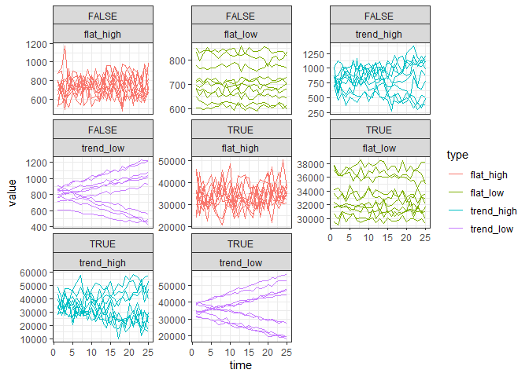
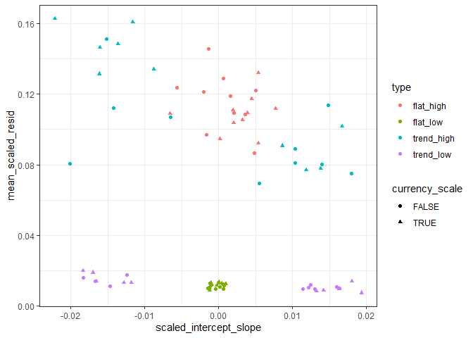

Second draft scaling residual variation
================

``` r
simulate_data <- function(ntimesteps, intercept, slope_ratio, sd_ratio) {
  
  slope <- slope_ratio * intercept
  
  sd_error = sd_ratio * mean(intercept, (intercept + (ntimesteps * slope)))
  
  vals <- intercept + ((1:ntimesteps) * slope) + rnorm(ntimesteps, sd = sd_error)
  
  return(data.frame(
    time = 1:ntimesteps,
    value = vals,
    true_slope = slope,
    true_slope_ratio = slope_ratio,
    true_error_ratio = sd_ratio,
    true_error = sd_error,
    true_intercept = intercept
  ))
  
}

set.seed(1977)
#one_sim <- simulate_data(25, runif(1, 600, 900), runif(1, -.0007, .0007), sd_ratio = .015)
one_sim <- simulate_data(25,400, .03, sd_ratio = .3)
ggplot(one_sim, aes(time, value)) + 
  geom_point() +
  theme_bw() +
  scale_y_continuous(limits = c(0, NA))
```

<!-- -->

## Explaining the analysis

For a given response vector (in this case, a timeseries \~ year)

1.  Make a least squares estimate
2.  Divide the actual values by the estimate
3.  I think the mean of this vector is 1, but that its standard
    deviation is a scaled measure of variation around the trend line.

<!-- end list -->

``` r
one_lm <- lm(value ~ time, data = one_sim)

one_sim$est <- predict(one_lm)
one_sim$resid <- resid(one_lm)

ggplot(one_sim, aes(time, value)) +
  geom_point() +
  geom_line(aes(time, est), color = "pink") +
  theme_bw() +
  scale_y_continuous(limits = c(0, NA))
```

<!-- -->

``` r
one_sim$est_scale <- one_sim$est / one_sim$value
one_sim$resid_scale <- abs(one_sim$resid) / one_sim$est

ggplot(one_sim, aes(time, est_scale)) +
  geom_point() +
  theme_bw()
```

<!-- -->

``` r
mean(one_sim$est_scale)
```

    ## [1] 1.058843

``` r
sd(one_sim$est_scale)
```

    ## [1] 0.2851556

``` r
ggplot(one_sim, aes(time, resid_scale)) +
  geom_point() +
  theme_bw()
```

<!-- -->

``` r
mean(one_sim$resid_scale)
```

    ## [1] 0.1732482

``` r
sd(one_sim$resid_scale)
```

    ## [1] 0.140431

# Exploring how it behaves

### Non trending and low error

``` r
flat_low <- replicate(n = 10, expr = simulate_data(25, runif(1, 600, 900), runif(1, -.0007, .0007), sd_ratio = .015), simplify = F)

flat_low <- bind_rows(flat_low, .id = "rep") %>%
  mutate(type = "flat_low",
         rep = as.numeric(rep))


flat_low2 <- replicate(n = 10, expr = simulate_data(25, runif(1, 30000, 40000), runif(1, -.0007, .0007), sd_ratio = .015), simplify = F)

flat_low2 <- bind_rows(flat_low2, .id = "rep") %>%
  mutate(type = "flat_low",
         rep = as.numeric(rep) + 10)

flat_low <- bind_rows(flat_low, flat_low2)

ggplot(flat_low, aes(time, value, group = rep)) +
  geom_line() + theme_bw()
```

<!-- -->

### Trending and low error

``` r
trend_low <- replicate(n = 10, expr = simulate_data(25, runif(1, 600, 900), sample(c(-1, 1), size = 1) * runif(1, .01, .02), sd_ratio = .015), simplify = F)

trend_low <- bind_rows(trend_low, .id = "rep") %>%
  mutate(type = "trend_low",
         rep = as.numeric(rep))


trend_low2 <- replicate(n = 10, expr = simulate_data(25, runif(1, 30000, 40000), sample(c(-1, 1), size = 1) * runif(1, .01, .02), sd_ratio = .015), simplify = F)

trend_low2 <- bind_rows(trend_low2, .id = "rep") %>%
  mutate(type = "trend_low",
         rep = as.numeric(rep) + 10)

trend_low <- bind_rows(trend_low, trend_low2)

ggplot(trend_low, aes(time, value, group = rep)) +
  geom_line() + theme_bw()
```

<!-- -->

### Non trending and high error

``` r
flat_high <- replicate(n = 10, expr = simulate_data(25, runif(1, 600, 900), runif(1, -.0007, .0007), sd_ratio = .15), simplify = F)

flat_high <- bind_rows(flat_high, .id = "rep") %>%
  mutate(type = "flat_high",
         rep = as.numeric(rep))


flat_high2 <- replicate(n = 10, expr = simulate_data(25, runif(1, 30000, 40000), runif(1, -.0007, .0007), sd_ratio = .15), simplify = F)

flat_high2 <- bind_rows(flat_high2, .id = "rep") %>%
  mutate(type = "flat_high",
         rep = as.numeric(rep) + 10)

flat_high <- bind_rows(flat_high, flat_high2)


ggplot(flat_high, aes(time, value, group = rep)) +
  geom_line() + theme_bw()
```

<!-- -->

### Trending and high error

``` r
trend_high <- replicate(n = 10, expr = simulate_data(25, runif(1, 600, 900), sample(c(-1, 1), size = 1) * runif(1, .01, .02), sd_ratio = .15), simplify = F)

trend_high <- bind_rows(trend_high, .id = "rep") %>%
  mutate(type = "trend_high",
         rep = as.numeric(rep))

trend_high2 <- replicate(n = 10, expr = simulate_data(25, runif(1, 30000, 40000), sample(c(-1, 1), size = 1) * runif(1, .01, .02), sd_ratio = .15), simplify = F)

trend_high2 <- bind_rows(trend_high2, .id = "rep") %>%
  mutate(type = "trend_high",
         rep = as.numeric(rep) + 10)

trend_high <- bind_rows(trend_high, trend_high2)


ggplot(trend_high, aes(time, value, group = rep)) +
  geom_line() + theme_bw()
```

<!-- -->

### All

``` r
all_sims <- bind_rows(flat_low, flat_high, trend_low, trend_high)

all_sims <- mutate(all_sims, rep_trend = paste0(rep, type),
                   currency_scale = rep > 10) 


ggplot(all_sims, aes(time, value, group = rep_trend, color = type)) +
  geom_line() + theme_bw()
```

<!-- -->

``` r
ggplot(all_sims, aes(time, value, group = rep_trend, color = type)) +
  geom_line() + theme_bw() + facet_wrap(vars(currency_scale), scales = "free_y")
```

<!-- -->

``` r
lm_fuzz <- function(a_vector) {
  
  this_ts <- data.frame(time = 1:length(a_vector), value = a_vector)
  
  this_lm <- lm(value ~ time, this_ts) 
  
  this_slope <- coefficients(this_lm)[["time"]]
  
  this_p <- anova(this_lm)[1,5]
  
  this_r2 <- summary(this_lm)$r.squared
  
  this_est <- predict(this_lm)
  
  scaled_ests <- this_est / a_vector
  
  this_resid <- resid(this_lm)
  
  scaled_resid <- abs(this_resid) / this_est
  
  mean_scaled_resid = mean(scaled_resid)
  
  sd_scaled_ests = sd(scaled_ests)
  mean_scaled_ests = mean(scaled_ests)
  
  scaled_slope = this_slope / mean(this_est)
  
  scaled_intercept_slope = this_slope / coefficients(this_lm)[["(Intercept)"]]
  
  return(data.frame(
    slope = this_slope,
    p = this_p,
    r2 = this_r2,
    sd_scaled_ests = sd_scaled_ests,
    mean_scaled_ests = mean_scaled_ests,
    cv = sd(a_vector) / mean(a_vector),
    scaled_slope = scaled_slope,
    scaled_intercept_slope = scaled_intercept_slope,
    mean_scaled_resid = mean_scaled_resid
  ))
  
}


lm_summaries <- list()

for(i in 1:length(unique(all_sims$rep_trend))) {
  
  this_df <- filter(all_sims, rep_trend == unique(all_sims$rep_trend)[i])
  
  lm_summaries[[i]] <- lm_fuzz(this_df$value)
  
  lm_summaries[[i]]$rep_trend = this_df$rep_trend[1]
  lm_summaries[[i]]$type = this_df$type[1]
  lm_summaries[[i]]$currency_scale = this_df$currency_scale[1]
  
}

lm_summaries <- bind_rows(lm_summaries) 
```

``` r
head(lm_summaries)
```

    ##          slope          p           r2 sd_scaled_ests mean_scaled_ests
    ## 1  0.002199692 0.99473723 1.933148e-06     0.01717650         1.000284
    ## 2  0.489327086 0.10243006 1.117404e-01     0.01450900         1.000200
    ## 3 -0.306088659 0.30529421 4.561890e-02     0.01228082         1.000145
    ## 4  0.115726813 0.68720105 7.178113e-03     0.01297131         1.000161
    ## 5  0.469848728 0.05888382 1.465911e-01     0.01165679         1.000130
    ## 6  0.349267379 0.21659921 6.558144e-02     0.01598670         1.000245
    ##           cv  scaled_slope scaled_intercept_slope mean_scaled_resid rep_trend
    ## 1 0.01723157  3.255303e-06           3.255441e-06       0.013195174 1flat_low
    ## 2 0.01526148  6.931633e-04           6.994663e-04       0.011378396 2flat_low
    ## 3 0.01255890 -3.644669e-04          -3.627482e-04       0.009383006 3flat_low
    ## 4 0.01300023  1.496547e-04           1.499464e-04       0.010544349 4flat_low
    ## 5 0.01254500  6.526170e-04           6.582012e-04       0.009376795 5flat_low
    ## 6 0.01654299  5.756232e-04           5.799631e-04       0.012184239 6flat_low
    ##       type currency_scale
    ## 1 flat_low          FALSE
    ## 2 flat_low          FALSE
    ## 3 flat_low          FALSE
    ## 4 flat_low          FALSE
    ## 5 flat_low          FALSE
    ## 6 flat_low          FALSE

``` r
ggplot(lm_summaries, aes(slope, mean_scaled_resid, color = type)) +
  geom_point() +
  theme_bw()
```

<!-- -->

``` r
ggplot(lm_summaries, aes(scaled_intercept_slope, mean_scaled_resid, color = type, shape = currency_scale)) +
  geom_point() +
  theme_bw()
```

<!-- -->

``` r
ggplot(lm_summaries, aes(scaled_intercept_slope, mean_scaled_resid, color = type, shape = p < .05)) +
  geom_point() +
  theme_bw()
```

<!-- -->

``` r
all_sims <- left_join(all_sims, lm_summaries)
```

    ## Joining, by = c("type", "rep_trend", "currency_scale")

``` r
ggplot(all_sims, aes(x = time, y = value, color = mean_scaled_resid, group = rep_trend)) +
  geom_line() +
  theme_bw() +
  facet_wrap(vars(type, currency_scale), scales = "free_y") +
  scale_color_viridis_c()
```

<!-- -->

``` r
ggplot(all_sims, aes(x = time, y = value, color = scaled_intercept_slope, group = rep_trend)) +
  geom_line() +
  theme_bw() +
  facet_wrap(vars(type, currency_scale), scales = "free_y")
```

<!-- -->

``` r
colnames(all_sims)
```

    ##  [1] "rep"                    "time"                   "value"                 
    ##  [4] "true_slope"             "true_slope_ratio"       "true_error_ratio"      
    ##  [7] "true_error"             "true_intercept"         "type"                  
    ## [10] "rep_trend"              "currency_scale"         "slope"                 
    ## [13] "p"                      "r2"                     "sd_scaled_ests"        
    ## [16] "mean_scaled_ests"       "cv"                     "scaled_slope"          
    ## [19] "scaled_intercept_slope" "mean_scaled_resid"

``` r
ggplot(all_sims, aes(true_slope_ratio, scaled_intercept_slope, color =  type)) + 
  geom_point() +
  geom_abline(intercept = 0, slope = 1)
```

<!-- -->

### Trying on a few real datasets

``` r
datasets <- data.frame(
  dataset_name = c("rockies",
                   "hartland",
                   "alberta",
                   "cochise_birds",
                   "salamonie",
                   "tilden",
              #     "gainesville",
                   "portal_rats"),
  rtrg_code = c("rtrg_304_17",
                "rtrg_102_18",
                "rtrg_105_4",
                "rtrg_133_6",
                "rtrg_19_35",
                "rtrg_172_14",
           #     "rtrg_113_25",
                NA)
)

all_datasets <- list()

for(i in 1:nrow(datasets)) {
  
  if(datasets$dataset_name[i] != "portal_rats") {
    
    ibd <- readRDS(paste0("C:\\Users\\diaz.renata\\Documents\\GitHub\\BBSsize\\analysis\\isd_data\\ibd_isd_bbs_", datasets$rtrg_code[i], ".Rds"))
    
    sv <- ibd %>%
      group_by(year) %>%
      summarize(richness = length(unique(id)),
                abundance = dplyr::n(),
                biomass = sum(ind_size),
                energy = sum(ind_b)) %>%
      ungroup() %>%
      mutate(mean_energy = energy / abundance,
             mean_mass = biomass/abundance,
             site_name = datasets$dataset_name[i])
  } else {
    
    individual_rats <- portalr::summarise_individual_rodents(clean = TRUE, type = "Granivores", time = "date", length = "Longterm")
    
    ibd <- individual_rats %>%
      filter(year %in% c(1978:2002), !is.na(wgt), treatment == "control") %>%
      mutate(six_mo = ifelse(month > 6, .5, 0)) %>%
      mutate(year_six_mo = (year + six_mo)) %>%
      mutate(bmr = 5.69 * (wgt ^ .75)) %>%
      select(year_six_mo, species, wgt, bmr) %>%
      rename(year= year_six_mo,
             id = species,
             ind_size = wgt,
             ind_b = bmr) %>%
      mutate(id = as.character(id))
    
    
    sv <- ibd %>%
      group_by(year) %>%
      summarize(richness = length(unique(id)),
                abundance = dplyr::n(),
                biomass = sum(ind_size),
                energy = sum(ind_b)) %>%
      ungroup() %>%
      mutate(mean_energy = energy / abundance,
             mean_mass = biomass/abundance,
             site_name = datasets$dataset_name[i]) %>%
      mutate(time = row_number())
    
  }
  
  all_datasets[[i]] <- sv
  
}
```

    ## Loading in data version 2.18.0

``` r
all_datasets <- bind_rows(all_datasets)

gridExtra::grid.arrange(grobs = list(
  ggplot(all_datasets, aes(year, abundance, color = site_name)) +
  geom_line() +
  theme_bw() +
  facet_wrap(vars(site_name), scales = "free", ncol = 1) + 
    ggtitle("Abundance"
    ) +
   theme(legend.position = "top"),
  ggplot(all_datasets, aes(year, energy, color = site_name)) + 
 geom_line() +
  theme_bw() +
  facet_wrap(vars(site_name), scales = "free", ncol = 1) +
   ggtitle("Energy") +
   theme(legend.position = "top")),
 ncol = 2
)
```

<!-- -->

``` r
fuzzes <- list()

for(i in 1:nrow(datasets)) {
  
  sv <- filter(all_datasets, site_name == datasets$dataset_name[i])
sv_fuzz <- list(
  abundance = lm_fuzz(sv$abundance),
  energy = lm_fuzz(sv$energy)
)

sv_fuzz <- bind_rows(sv_fuzz, .id = "currency")

sv_fuzz <- mutate(sv_fuzz, site_name = datasets$dataset_name[i])  

fuzzes[[i]] <- sv_fuzz
}

fuzzes <- bind_rows(fuzzes)
```

``` r
ggplot(lm_summaries, aes(scaled_intercept_slope, mean_scaled_resid, alpha = p < 0.05)) +
  geom_point() +
  theme_bw() +
  geom_point(data = fuzzes, aes(scaled_intercept_slope, mean_scaled_resid, shape = currency, color = site_name, alpha = p < 0.05), size = 5) +
  scale_alpha_discrete(range = c(.3, 1))
```

    ## Warning: Using alpha for a discrete variable is not advised.

<!-- -->

``` r
all_datasets[ which(all_datasets$site_name == "portal_rats"), "year"] <- as.numeric(substr(as.character(all_datasets[ which(all_datasets$site_name == "portal_rats"), "year"]), 1, 4)) + (.5 * (all_datasets[ which(all_datasets$site_name == "portal_rats"), "year"] - 1))
```

    ## Warning: NAs introduced by coercion

``` r
gridExtra::grid.arrange(grobs = list(
  ggplot(all_datasets, aes(year, abundance, color = site_name)) +
  geom_line() +
  theme_bw() +
  #facet_wrap(vars(site_name), scales = "free", ncol = 1) + 
    ggtitle("Abundance"
    ) +
   theme(legend.position = "top"),
  ggplot(all_datasets, aes(year, energy, color = site_name)) + 
 geom_line() +
  theme_bw() +
 # facet_wrap(vars(site_name), scales = "free", ncol = 1) +
   ggtitle("Energy") +
   theme(legend.position = "top")),
 ncol = 2
)
```

    ## Warning: Removed 50 row(s) containing missing values (geom_path).

    ## Warning: Removed 50 row(s) containing missing values (geom_path).

<!-- -->

``` r
start = 1000
```

\`\`\`
