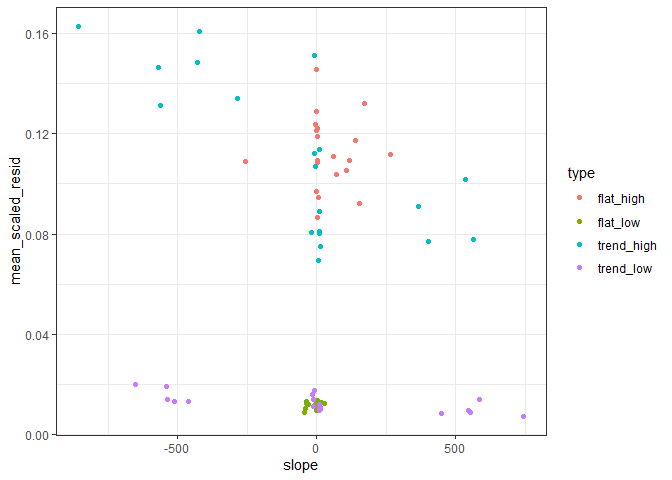

Second draft scaling residual variation
================

``` r
simulate_data <- function(ntimesteps, intercept, slope_ratio, sd_ratio) {
  
  slope <- slope_ratio * intercept
  
  sd_error = sd_ratio * mean(intercept, (intercept + (ntimesteps * slope)))
  
  vals <- intercept + ((1:ntimesteps) * slope) + rnorm(ntimesteps, sd = sd_error)
  
  return(data.frame(
    time = 1:ntimesteps,
    value = vals,
    true_slope = slope,
    true_slope_ratio = slope_ratio,
    true_error_ratio = sd_ratio,
    true_error = sd_error,
    true_intercept = intercept
  ))
  
}

set.seed(1977)
one_sim <- simulate_data(25, runif(1, 600, 900), runif(1, -.0007, .0007), sd_ratio = .015)

ggplot(one_sim, aes(time, value)) + 
  geom_point() +
  theme_bw() +
  scale_y_continuous(limits = c(0, NA))
```

<!-- -->

## Explaining the analysis

For a given response vector (in this case, a timeseries \~ year)

1.  Make a least squares estimate
2.  Divide the actual values by the estimate
3.  I think the mean of this vector is 1, but that its standard
    deviation is a scaled measure of variation around the trend line.

<!-- end list -->

``` r
one_lm <- lm(value ~ time, data = one_sim)

one_sim$est <- predict(one_lm)

ggplot(one_sim, aes(time, value)) +
  geom_point() +
  geom_line(aes(time, est), color = "pink") +
  theme_bw() +
  scale_y_continuous(limits = c(0, NA))
```

<!-- -->

``` r
one_sim$est_scale <- one_sim$value / one_sim$est

ggplot(one_sim, aes(time, est_scale)) +
  geom_point() +
  theme_bw()
```

<!-- -->

``` r
mean(one_sim$est_scale)
```

    ## [1] 1

``` r
sd(one_sim$est_scale)
```

    ## [1] 0.01547536

# Exploring how it behaves

### Non trending and low error

``` r
flat_low <- replicate(n = 10, expr = simulate_data(25, runif(1, 600, 900), runif(1, -.0007, .0007), sd_ratio = .015), simplify = F)

flat_low <- bind_rows(flat_low, .id = "rep") %>%
  mutate(type = "flat_low",
         rep = as.numeric(rep))


flat_low2 <- replicate(n = 10, expr = simulate_data(25, runif(1, 30000, 40000), runif(1, -.0007, .0007), sd_ratio = .015), simplify = F)

flat_low2 <- bind_rows(flat_low2, .id = "rep") %>%
  mutate(type = "flat_low",
         rep = as.numeric(rep) + 10)

flat_low <- bind_rows(flat_low, flat_low2)

ggplot(flat_low, aes(time, value, group = rep)) +
  geom_line() + theme_bw()
```

<!-- -->

### Trending and low error

``` r
trend_low <- replicate(n = 10, expr = simulate_data(25, runif(1, 600, 900), sample(c(-1, 1), size = 1) * runif(1, .01, .02), sd_ratio = .015), simplify = F)

trend_low <- bind_rows(trend_low, .id = "rep") %>%
  mutate(type = "trend_low",
         rep = as.numeric(rep))


trend_low2 <- replicate(n = 10, expr = simulate_data(25, runif(1, 30000, 40000), sample(c(-1, 1), size = 1) * runif(1, .01, .02), sd_ratio = .015), simplify = F)

trend_low2 <- bind_rows(trend_low2, .id = "rep") %>%
  mutate(type = "trend_low",
         rep = as.numeric(rep) + 10)

trend_low <- bind_rows(trend_low, trend_low2)

ggplot(trend_low, aes(time, value, group = rep)) +
  geom_line() + theme_bw()
```

<!-- -->

### Non trending and high error

``` r
flat_high <- replicate(n = 10, expr = simulate_data(25, runif(1, 600, 900), runif(1, -.0007, .0007), sd_ratio = .07), simplify = F)

flat_high <- bind_rows(flat_high, .id = "rep") %>%
  mutate(type = "flat_high",
         rep = as.numeric(rep))


flat_high2 <- replicate(n = 10, expr = simulate_data(25, runif(1, 30000, 40000), runif(1, -.0007, .0007), sd_ratio = .07), simplify = F)

flat_high2 <- bind_rows(flat_high2, .id = "rep") %>%
  mutate(type = "flat_high",
         rep = as.numeric(rep) + 10)

flat_high <- bind_rows(flat_high, flat_high2)


ggplot(flat_high, aes(time, value, group = rep)) +
  geom_line() + theme_bw()
```

<!-- -->

### Trending and high error

``` r
trend_high <- replicate(n = 10, expr = simulate_data(25, runif(1, 600, 900), sample(c(-1, 1), size = 1) * runif(1, .01, .02), sd_ratio = .07), simplify = F)

trend_high <- bind_rows(trend_high, .id = "rep") %>%
  mutate(type = "trend_high",
         rep = as.numeric(rep))

trend_high2 <- replicate(n = 10, expr = simulate_data(25, runif(1, 30000, 40000), sample(c(-1, 1), size = 1) * runif(1, .01, .02), sd_ratio = .07), simplify = F)

trend_high2 <- bind_rows(trend_high2, .id = "rep") %>%
  mutate(type = "trend_high",
         rep = as.numeric(rep) + 10)

trend_high <- bind_rows(trend_high, trend_high2)


ggplot(trend_high, aes(time, value, group = rep)) +
  geom_line() + theme_bw()
```

<!-- -->

### All

``` r
all_sims <- bind_rows(flat_low, flat_high, trend_low, trend_high)

all_sims <- mutate(all_sims, rep_trend = paste0(rep, type),
                   currency_scale = rep > 10) 


ggplot(all_sims, aes(time, value, group = rep_trend, color = type)) +
  geom_line() + theme_bw()
```

<!-- -->

``` r
ggplot(all_sims, aes(time, value, group = rep_trend, color = type)) +
  geom_line() + theme_bw() + facet_wrap(vars(currency_scale), scales = "free_y")
```

<!-- -->

``` r
lm_fuzz <- function(a_vector) {
  
  this_ts <- data.frame(time = 1:length(a_vector), value = a_vector)
  
  this_lm <- lm(value ~ time, this_ts) 
  
  this_slope <- coefficients(this_lm)[["time"]]
  
  this_p <- anova(this_lm)[1,5]
  
  this_r2 <- summary(this_lm)$r.squared
  
  this_est <- predict(this_lm)
  
  scaled_ests <- this_est / a_vector
  
  sd_scaled_ests = sd(scaled_ests)
  mean_scaled_ests = mean(scaled_ests)
  
  scaled_slope = this_slope / mean(this_est)
  
  scaled_intercept_slope = this_slope / coefficients(this_lm)[["(Intercept)"]]
  
  return(data.frame(
    slope = this_slope,
    p = this_p,
    r2 = this_r2,
    sd_scaled_ests = sd_scaled_ests,
    mean_scaled_ests = mean_scaled_ests,
    cv = sd(a_vector) / mean(a_vector),
    scaled_slope = scaled_slope,
    scaled_intercept_slope = scaled_intercept_slope
  ))
  
}


lm_summaries <- list()

for(i in 1:length(unique(all_sims$rep_trend))) {
  
  this_df <- filter(all_sims, rep_trend == unique(all_sims$rep_trend)[i])
  
  lm_summaries[[i]] <- lm_fuzz(this_df$value)

  lm_summaries[[i]]$rep_trend = this_df$rep_trend[1]
  lm_summaries[[i]]$type = this_df$type[1]
  lm_summaries[[i]]$currency_scale = this_df$currency_scale[1]
    
}

lm_summaries <- bind_rows(lm_summaries) 
```

``` r
head(lm_summaries)
```

    ##        slope          p           r2 sd_scaled_ests mean_scaled_ests         cv
    ## 1 0.28247522 0.35653235 0.0370646120     0.01722737         1.000286 0.01762133
    ## 2 0.02611031 0.93949056 0.0002560086     0.01458237         1.000202 0.01444191
    ## 3 0.11820168 0.69712648 0.0067080319     0.01242678         1.000148 0.01245018
    ## 4 0.16226304 0.53091927 0.0172941443     0.01294987         1.000161 0.01306286
    ## 5 0.40679894 0.05379678 0.1522736649     0.01165381         1.000130 0.01258316
    ## 6 0.12682472 0.72513176 0.0054781362     0.01610331         1.000249 0.01615086
    ##   scaled_slope scaled_intercept_slope rep_trend     type currency_scale
    ## 1 4.609485e-04           4.637273e-04 1flat_low flat_low          FALSE
    ## 2 3.139684e-05           3.140966e-05 2flat_low flat_low          FALSE
    ## 3 1.385502e-04           1.388002e-04 3flat_low flat_low          FALSE
    ## 4 2.334113e-04           2.341217e-04 4flat_low flat_low          FALSE
    ## 5 6.671692e-04           6.730063e-04 5flat_low flat_low          FALSE
    ## 6 1.624224e-04           1.627661e-04 6flat_low flat_low          FALSE

``` r
ggplot(lm_summaries, aes(slope, sd_scaled_ests, color = type)) +
  geom_point() +
  theme_bw()
```

<!-- -->

``` r
ggplot(lm_summaries, aes(scaled_intercept_slope, sd_scaled_ests, color = type, shape = currency_scale)) +
  geom_point() +
  theme_bw()
```

<!-- -->

``` r
all_sims <- left_join(all_sims, lm_summaries)
```

    ## Joining, by = c("type", "rep_trend", "currency_scale")

``` r
ggplot(all_sims, aes(x = time, y = value, color = sd_scaled_ests, group = rep_trend)) +
  geom_line() +
  theme_bw() +
  facet_wrap(vars(type, currency_scale), scales = "free_y") +
  scale_color_viridis_c()
```

<!-- -->

``` r
ggplot(all_sims, aes(x = time, y = value, color = scaled_intercept_slope, group = rep_trend)) +
  geom_line() +
  theme_bw() +
  facet_wrap(vars(type, currency_scale), scales = "free_y")
```

<!-- -->

``` r
colnames(all_sims)
```

    ##  [1] "rep"                    "time"                   "value"                 
    ##  [4] "true_slope"             "true_slope_ratio"       "true_error_ratio"      
    ##  [7] "true_error"             "true_intercept"         "type"                  
    ## [10] "rep_trend"              "currency_scale"         "slope"                 
    ## [13] "p"                      "r2"                     "sd_scaled_ests"        
    ## [16] "mean_scaled_ests"       "cv"                     "scaled_slope"          
    ## [19] "scaled_intercept_slope"

``` r
ggplot(all_sims, aes(true_slope_ratio, scaled_intercept_slope, color =  type)) + 
  geom_point() +
  geom_abline(intercept = 0, slope = 1)
```

<!-- -->
