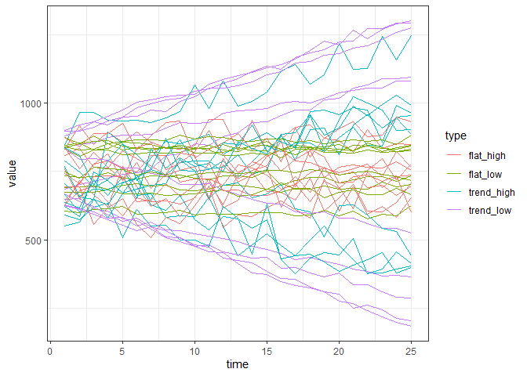

Simulating fuzzy data
================

``` r
simulate_data <- function(ntimesteps, intercept, slope, sd_error) {
  
  vals <- intercept + ((1:ntimesteps) * slope) + rnorm(ntimesteps, sd = sd_error)
  
  return(data.frame(
    time = 1:ntimesteps,
    value = vals,
    true_slope = slope,
    true_error = sd_error,
    true_intercept = intercept
  ))
  
}
```

### Non trending and low error

``` r
flat_low <- replicate(n = 10, expr = simulate_data(25, runif(1, 600, 900), runif(1, -.5, .5), sd_error = 10), simplify = F)

flat_low <- bind_rows(flat_low, .id = "rep") %>%
  mutate(type = "flat_low")

ggplot(flat_low, aes(time, value, group = rep)) +
  geom_line() + theme_bw()
```

<!-- -->

### Trending and low error

``` r
trend_low <- replicate(n = 10, expr = simulate_data(25, runif(1, 600, 900), sample(c(-1, 1), size = 1) * runif(1, 10, 20), sd_error = 10), simplify = F)

trend_low <- bind_rows(trend_low, .id = "rep") %>%
  mutate(type = "trend_low")

ggplot(trend_low, aes(time, value, group = rep)) +
  geom_line() + theme_bw()
```

<!-- --> \#\#\# Non
trending and high error

``` r
flat_high <- replicate(n = 10, expr = simulate_data(25, runif(1, 600, 900), runif(1, -.5, .5), sd_error = 50), simplify = F)

flat_high <- bind_rows(flat_high, .id = "rep") %>%
  mutate(type = "flat_high")

ggplot(flat_high, aes(time, value, group = rep)) +
  geom_line() + theme_bw()
```

<!-- --> \#\#\#
Trending and high error

``` r
trend_high <- replicate(n = 10, expr = simulate_data(25, runif(1, 600, 900), sample(c(-1, 1), size = 1) * runif(1, 10, 20), sd_error = 50), simplify = F)

trend_high <- bind_rows(trend_high, .id = "rep") %>%
  mutate(type = "trend_high")

ggplot(trend_high, aes(time, value, group = rep)) +
  geom_line() + theme_bw()
```

<!-- -->

### All

``` r
all_sims <- bind_rows(flat_low, flat_high, trend_low, trend_high)

all_sims <- mutate(all_sims, rep_trend = paste0(rep, type)) 


ggplot(all_sims, aes(time, value, group = rep_trend, color = type)) +
  geom_line() + theme_bw()
```

<!-- -->

``` r
lm_fuzz <- function(a_vector) {
  
  this_ts <- data.frame(time = 1:length(a_vector), value = a_vector)
  
  this_lm <- lm(value ~ time, this_ts) 
  
  this_slope <- coefficients(this_lm)[["time"]]
  
  this_p <- anova(this_lm)[1,5]
  
  this_r2 <- summary(this_lm)$r.squared
  
  this_resid <- resid(this_lm)
  
  this_est <- predict(this_lm)
  
  mean_est <- mean(this_est)
  
  resid_est <- abs(this_resid) / this_est
  
  mean_resid_Est <- mean(resid_est)
  
  
  return(data.frame(
    slope = this_slope,
    p = this_p,
    r2 = this_r2,
    mean_est = mean_est,
    mean_resid_est = mean_resid_Est,
    cv = sd(a_vector) / mean(a_vector)
  ))
  
}


lm_summaries <- list()

for(i in 1:length(unique(all_sims$rep_trend))) {
  
  this_df <- filter(all_sims, rep_trend == unique(all_sims$rep_trend)[i])
  
  lm_summaries[[i]] <- lm_fuzz(this_df$value)

  lm_summaries[[i]]$rep_trend = this_df$rep_trend[1]
  lm_summaries[[i]]$type = this_df$type[1]
    
}

lm_summaries <- bind_rows(lm_summaries)


ggplot(lm_summaries, aes(x = abs(slope) / mean_est, y = mean_resid_est, color = type, shape = p < .05)) +
  geom_point() + theme_bw()
```

<!-- -->

``` r
ggplot(lm_summaries, aes(abs(slope), r2, color = type, shape = p < 0.05)) + geom_point() + theme_bw()
```

<!-- -->

``` r
ggplot(lm_summaries, aes(cv, mean_resid_est, color = type)) +
  geom_point()
```

<!-- -->

``` r
ggplot(lm_summaries, aes(cv, abs(slope), color = type)) +
  geom_point()
```

<!-- -->

``` r
lm_summaries <- left_join(lm_summaries, select(all_sims,  true_slope, true_error, true_intercept, rep_trend))
```

    ## Joining, by = "rep_trend"

``` r
ggplot(lm_summaries, aes(x = slope, y = true_slope, color = type)) +
  geom_point()
```

<!-- -->
