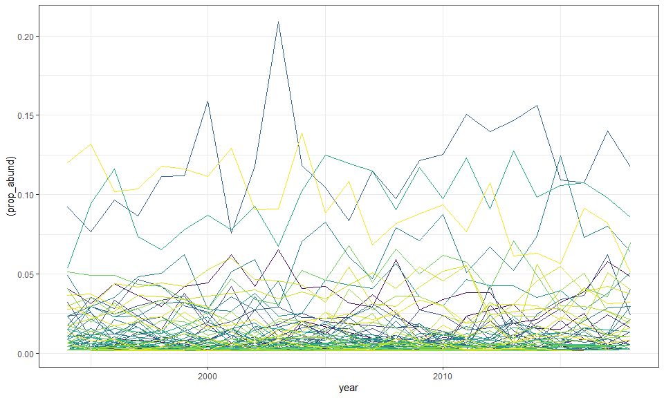

BBS route that goes by Hartland
================

### Load specific route

The New Hartford route goes up and down Riverton Road and was started in
1994. It feels pretty auspicious. It is route 102, region 18.

Here are the species present in this route over the past 25 years:

    ## Joining, by = "id"

| id     | english\_common\_name                          |
| :----- | :--------------------------------------------- |
| sp3160 | Mourning Dove                                  |
| sp3340 | Northern Goshawk                               |
| sp3880 | Black-billed Cuckoo                            |
| sp3930 | Hairy Woodpecker                               |
| sp3940 | Downy Woodpecker                               |
| sp4020 | Yellow-bellied Sapsucker                       |
| sp4123 | (unid. Red/Yellow Shafted) Northern Flicker    |
| sp4230 | Chimney Swift                                  |
| sp4440 | Eastern Kingbird                               |
| sp4520 | Great Crested Flycatcher                       |
| sp4560 | Eastern Phoebe                                 |
| sp4610 | Eastern Wood-Pewee                             |
| sp4660 | Willow Flycatcher                              |
| sp4770 | Blue Jay                                       |
| sp4880 | American Crow                                  |
| sp4930 | European Starling                              |
| sp4950 | Brown-headed Cowbird                           |
| sp4980 | Red-winged Blackbird                           |
| sp5070 | Baltimore Oriole                               |
| sp5110 | Common Grackle                                 |
| sp5140 | Evening Grosbeak                               |
| sp5190 | House Finch                                    |
| sp5290 | American Goldfinch                             |
| sp5600 | Chipping Sparrow                               |
| sp5630 | Field Sparrow                                  |
| sp5810 | Song Sparrow                                   |
| sp5870 | Eastern Towhee                                 |
| sp5930 | Northern Cardinal                              |
| sp5950 | Rose-breasted Grosbeak                         |
| sp5980 | Indigo Bunting                                 |
| sp6080 | Scarlet Tanager                                |
| sp6130 | Barn Swallow                                   |
| sp6140 | Tree Swallow                                   |
| sp6160 | Bank Swallow                                   |
| sp6170 | Northern Rough-winged Swallow                  |
| sp6190 | Cedar Waxwing                                  |
| sp6240 | Red-eyed Vireo                                 |
| sp6270 | Warbling Vireo                                 |
| sp6280 | Yellow-throated Vireo                          |
| sp6290 | Blue-headed Vireo                              |
| sp6360 | Black-and-white Warbler                        |
| sp6410 | Blue-winged Warbler                            |
| sp6520 | Yellow Warbler                                 |
| sp6540 | Black-throated Blue Warbler                    |
| sp6556 | (unid. Myrtle/Audubon’s) Yellow-rumped Warbler |
| sp6590 | Chestnut-sided Warbler                         |
| sp6670 | Black-throated Green Warbler                   |
| sp6710 | Pine Warbler                                   |
| sp6740 | Ovenbird                                       |
| sp6760 | Louisiana Waterthrush                          |
| sp6810 | Common Yellowthroat                            |
| sp6870 | American Redstart                              |
| sp6882 | House Sparrow                                  |
| sp7030 | Northern Mockingbird                           |
| sp7040 | Gray Catbird                                   |
| sp7270 | White-breasted Nuthatch                        |
| sp7310 | Tufted Titmouse                                |
| sp7350 | Black-capped Chickadee                         |
| sp7550 | Wood Thrush                                    |
| sp7560 | Veery                                          |
| sp7590 | Hermit Thrush                                  |
| sp7610 | American Robin                                 |
| sp4090 | Red-bellied Woodpecker                         |
| sp4280 | Ruby-throated Hummingbird                      |
| sp4670 | Least Flycatcher                               |
| sp5580 | White-throated Sparrow                         |
| sp5677 | (unid. race) Dark-eyed Junco                   |
| sp6620 | Blackburnian Warbler                           |
| sp7210 | House Wren                                     |
| sp7260 | Brown Creeper                                  |
| sp7280 | Red-breasted Nuthatch                          |
| sp3000 | Ruffed Grouse                                  |
| sp3100 | Wild Turkey                                    |
| sp3430 | Broad-winged Hawk                              |
| sp3870 | Yellow-billed Cuckoo                           |
| sp4050 | Pileated Woodpecker                            |
| sp4661 | Alder Flycatcher                               |
| sp7510 | Blue-gray Gnatcatcher                          |
| sp3250 | Turkey Vulture                                 |
| sp3390 | Red-shouldered Hawk                            |
| sp6730 | Prairie Warbler                                |
| sp7222 | Winter Wren                                    |
| sp3131 | Rock Pigeon                                    |
| sp5840 | Swamp Sparrow                                  |
| sp6750 | Northern Waterthrush                           |
| sp3330 | Cooper’s Hawk                                  |
| sp5170 | Purple Finch                                   |
| sp4860 | Common Raven                                   |
| sp6390 | Worm-eating Warbler                            |
| sp7180 | Carolina Wren                                  |
| sp7660 | Eastern Bluebird                               |
| sp3370 | Red-tailed Hawk                                |
| sp4900 | Fish Crow                                      |

Here is how species richness, abundance, biomass, and energy have
changed over those years:

<!-- -->

Here is population abundances:

<!-- -->

We can do some (crude) linear model fitting. I’ve generally been finding
that lms are OK, with caveats:

  - you do want to check for autocorrelation
  - the normal q-q plots are often kind of wonky

<!-- end list -->

    ## 
    ## Call:
    ## lm(formula = scaled_value ~ year, data = filter(sv_long, currency == 
    ##     "abundance"))
    ## 
    ## Residuals:
    ##      Min       1Q   Median       3Q      Max 
    ## -1.37520 -0.75770 -0.09668  0.45059  1.82506 
    ## 
    ## Coefficients:
    ##              Estimate Std. Error t value Pr(>|t|)  
    ## (Intercept) 112.11241   51.80293   2.164   0.0411 *
    ## year         -0.05589    0.02582  -2.164   0.0411 *
    ## ---
    ## Signif. codes:  0 '***' 0.001 '**' 0.01 '*' 0.05 '.' 0.1 ' ' 1
    ## 
    ## Residual standard error: 0.9311 on 23 degrees of freedom
    ## Multiple R-squared:  0.1692, Adjusted R-squared:  0.1331 
    ## F-statistic: 4.684 on 1 and 23 DF,  p-value: 0.04107

    ##                  2.5 %        97.5 %
    ## (Intercept)  4.9498911 219.274937839
    ## year        -0.1093092  -0.002467888

    ## 
    ## Call:
    ## lm(formula = scaled_value ~ year, data = filter(sv_long, currency == 
    ##     "energy"))
    ## 
    ## Residuals:
    ##     Min      1Q  Median      3Q     Max 
    ## -1.5848 -0.7822 -0.1643  0.5600  2.1482 
    ## 
    ## Coefficients:
    ##              Estimate Std. Error t value Pr(>|t|)
    ## (Intercept) -33.66483   56.39824  -0.597    0.556
    ## year          0.01678    0.02811   0.597    0.556
    ## 
    ## Residual standard error: 1.014 on 23 degrees of freedom
    ## Multiple R-squared:  0.01526,    Adjusted R-squared:  -0.02756 
    ## F-statistic: 0.3563 on 1 and 23 DF,  p-value: 0.5564

    ##                    2.5 %      97.5 %
    ## (Intercept) -150.3334871 83.00381889
    ## year          -0.0413774  0.07494154

So here the lms are generally aligning with what looks intuitive from
the plots: a gentle decline in individual abundance, but no signal in
energy.

One thing that interests me is, energy looks more *variable* than
abundance.

    ## [1] 0.2759679

    ## [1] 0.1161095

I’m kind of curious about, comparing individual year ISDs to some kind
of overall mean ISD.

<!-- --><!-- -->

    ## Joining, by = "x"

<!-- -->

The intuitive description, to me, of these dynamics is a fairly
believable trend in abundance, but *highly variable* energy that does
not map clearly onto time. I would *not* call this compensation, because
of the poor correspondence between abundance and mean energy use:

<!-- --><!-- -->

I think what I mean is, if energy had a slope of 0 over time in a
*fixed* way, then when abundance is high mean energy should be low. But
I don’t really see support for that. It looks to me a lot more like
energy varies a lot but not systematically with time; it’s not fixed but
free.

    ## 
    ## Call:
    ## lm(formula = scale(energy) ~ scale(abundance), data = sv)
    ## 
    ## Residuals:
    ##     Min      1Q  Median      3Q     Max 
    ## -1.1418 -0.6300 -0.3767  0.6032  1.9007 
    ## 
    ## Coefficients:
    ##                    Estimate Std. Error t value Pr(>|t|)   
    ## (Intercept)      -4.945e-16  1.678e-01   0.000  1.00000   
    ## scale(abundance)  5.702e-01  1.713e-01   3.329  0.00292 **
    ## ---
    ## Signif. codes:  0 '***' 0.001 '**' 0.01 '*' 0.05 '.' 0.1 ' ' 1
    ## 
    ## Residual standard error: 0.8392 on 23 degrees of freedom
    ## Multiple R-squared:  0.3252, Adjusted R-squared:  0.2958 
    ## F-statistic: 11.08 on 1 and 23 DF,  p-value: 0.002919

    ## 
    ## Call:
    ## lm(formula = scale(mean_energy) ~ scale(abundance), data = sv)
    ## 
    ## Residuals:
    ##     Min      1Q  Median      3Q     Max 
    ## -1.2717 -0.6563 -0.4680  0.6210  2.1539 
    ## 
    ## Coefficients:
    ##                    Estimate Std. Error t value Pr(>|t|)
    ## (Intercept)      -7.236e-17  2.018e-01   0.000    1.000
    ## scale(abundance)  1.558e-01  2.060e-01   0.756    0.457
    ## 
    ## Residual standard error: 1.009 on 23 degrees of freedom
    ## Multiple R-squared:  0.02427,    Adjusted R-squared:  -0.01815 
    ## F-statistic: 0.5721 on 1 and 23 DF,  p-value: 0.4571

### Randomizing the ISD

<!-- -->

Here is something I’ve done mostly following intuition. I think it shows
how each year’s observed total energy use scores relative to if it had
tracked an overall single ISD. This is a bootstrapping/simulating
approach intended to get a sense of some of the variation from lowish N,
and start to partition abundance from ISD.

The violins represent the distribution of *total energy values* for 1000
bootstrap sampled ISDs. Each simulated ISD is a draw of the *observed
number of individuals* from the pool of *all individuals observed across
all years*. The pool includes the individuals actually observed that
year. I’ve done it with or without replacement and I don’t see a big
obvious difference, but there are numerous questions in a similar vein
that one could chase down. You could do an ISD as equal weight to each
timestep (regardless of abundance) and then the mean density at each
body size; that would remove some weight from time steps with high
abundances. It also might be preferable to remove the observed year from
the pool.

So one thing I find interesting about this exercise is to ask whether
the position of the observed E shifts systematically over time.

I think, for observations to be consistent with a *single unchanging
ISD* from which we draw N individuals at random every year, you’d expect
the total E to track the violins.

It might be interesting to look at comparisons to the overall ISD, vs a
pool from a local short time period, vs a pool from the same number of
time steps randomly distributed. So, how does E in 1990 compare to a
random draw from a pool of 1988, 1989, 1991, 1992, vs a random draw from
a pool of 2014, 2004, 1992, 2006? If observations are closer to a local
moving average ISD, than to one randomly dispersed in time, you have
some kind of temporal structure in the variability. But if not, there’s
variability but it’s not structured temporally.
