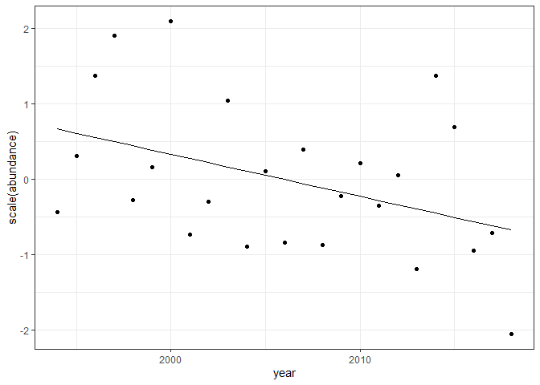
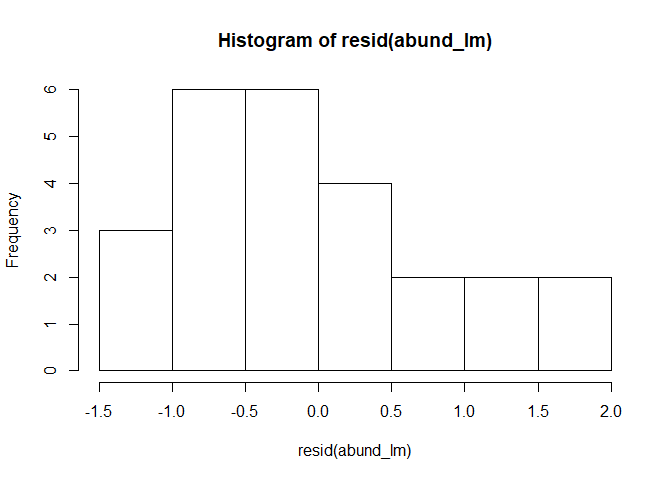
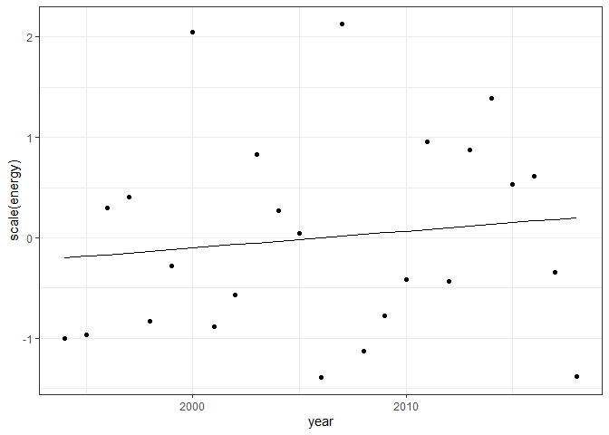
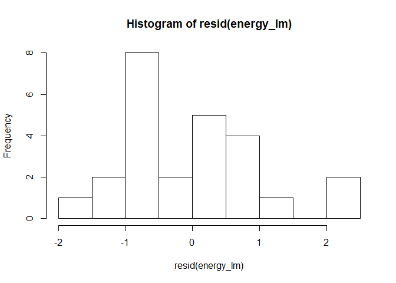

BBS route that goes by Hartland
================

### Load route

The New Hartford route goes up and down Riverton Road and was started in
1994. It is route 102, region 18.

Here are the species present in this route over the past 25 years:

    ## Joining, by = "id"

| id     | mean\_size | english\_common\_name     |
| :----- | ---------: | :------------------------ |
| sp4280 |   3.119282 | Ruby-throated Hummingbird |
| sp7510 |   5.771964 | Blue-gray Gnatcatcher     |
| sp7260 |   8.022228 | Brown Creeper             |
| sp6730 |   8.028863 | Prairie Warbler           |
| sp6410 |   8.176580 | Blue-winged Warbler       |
| sp6870 |   8.191548 | American Redstart         |

    ## [1] "...93 species total"

    ## `stat_bin()` using `bins = 30`. Pick better value with `binwidth`.

<!-- -->

Here is how species richness, abundance, biomass, and energy have
changed over those years:

<!-- -->

### Trends/tradeoffs in E and N

We can do some (crude) linear model fitting. I’ve generally been finding
that lms are OK, with caveats:

  - you do want to check for autocorrelation
  - the normal q-q plots are often kind of wonky

<!-- end list -->

    ## 
    ## Call:
    ## lm(formula = scaled_value ~ year, data = filter(sv_long, currency == 
    ##     "abundance"))
    ## 
    ## Residuals:
    ##      Min       1Q   Median       3Q      Max 
    ## -1.37520 -0.75770 -0.09668  0.45059  1.82506 
    ## 
    ## Coefficients:
    ##              Estimate Std. Error t value Pr(>|t|)  
    ## (Intercept) 112.11241   51.80293   2.164   0.0411 *
    ## year         -0.05589    0.02582  -2.164   0.0411 *
    ## ---
    ## Signif. codes:  0 '***' 0.001 '**' 0.01 '*' 0.05 '.' 0.1 ' ' 1
    ## 
    ## Residual standard error: 0.9311 on 23 degrees of freedom
    ## Multiple R-squared:  0.1692, Adjusted R-squared:  0.1331 
    ## F-statistic: 4.684 on 1 and 23 DF,  p-value: 0.04107

    ##                  2.5 %        97.5 %
    ## (Intercept)  4.9498911 219.274937839
    ## year        -0.1093092  -0.002467888

<!-- --><!-- -->

    ## 
    ## Call:
    ## lm(formula = scaled_value ~ year, data = filter(sv_long, currency == 
    ##     "energy"))
    ## 
    ## Residuals:
    ##     Min      1Q  Median      3Q     Max 
    ## -1.5848 -0.7822 -0.1643  0.5600  2.1482 
    ## 
    ## Coefficients:
    ##              Estimate Std. Error t value Pr(>|t|)
    ## (Intercept) -33.66483   56.39824  -0.597    0.556
    ## year          0.01678    0.02811   0.597    0.556
    ## 
    ## Residual standard error: 1.014 on 23 degrees of freedom
    ## Multiple R-squared:  0.01526,    Adjusted R-squared:  -0.02756 
    ## F-statistic: 0.3563 on 1 and 23 DF,  p-value: 0.5564

    ##                    2.5 %      97.5 %
    ## (Intercept) -150.3334871 83.00381889
    ## year          -0.0413774  0.07494154

<!-- --><!-- -->

Important points:

  - p = .04 for abundance, but .55 (\!) for energy
  - confidence interval for slope for abundance gets close to 0;
    estimate is -.055 (this is on scaled)
  - r2 for abundance is around .13-.15 (adj v nonadj).
  - contrasted to energy, where the slope estimate is right on 0 and the
    r2 is .01 to -.02 (adj v nonadj)\!

I’ve played a bit with autocorrelation and transformations, but trying
not to get hung up on p values. Basically, the lms are generally
aligning with what looks intuitive from the plots: a gentle decline in
individual abundance, but no signal in energy.

Importantly, even though the average slope for energy is pretty close to
0, I would *not* call this compensation in the sense that the size
distribution is shifting such that the same amount of energy gets
divided among varying numbers of individiuals. Under that scenario, we’d
expect per capita energy use to trade off with abundance: when abundance
is low, per capita energy use should be high to compensate. That is not
what we see:

<!-- -->

    ## 
    ## Call:
    ## lm(formula = scale(mean_energy) ~ scale(abundance), data = sv)
    ## 
    ## Residuals:
    ##     Min      1Q  Median      3Q     Max 
    ## -1.2717 -0.6563 -0.4680  0.6210  2.1539 
    ## 
    ## Coefficients:
    ##                    Estimate Std. Error t value Pr(>|t|)
    ## (Intercept)      -7.236e-17  2.018e-01   0.000    1.000
    ## scale(abundance)  1.558e-01  2.060e-01   0.756    0.457
    ## 
    ## Residual standard error: 1.009 on 23 degrees of freedom
    ## Multiple R-squared:  0.02427,    Adjusted R-squared:  -0.01815 
    ## F-statistic: 0.5721 on 1 and 23 DF,  p-value: 0.4571

There’s pretty much no support for the notion that mean energy use
declines with increasing abundance.

It looks to me a lot more like energy varies a lot but not
systematically with time. Energy is also much more variable than
abundance:

    ## [1] "energy sd/mean"

    ## [1] 0.2759679

    ## [1] "abundance sd/mean"

    ## [1] 0.1161095

Another notion is that energy should maybe track abundance? We have
already seen that energy is more variable than abundance and that the
overall trend for energy is not the same as the one for abundance. Here
is the extent to which abundance predicts energy:

<!-- -->

    ## 
    ## Call:
    ## lm(formula = scale(energy) ~ scale(abundance), data = sv)
    ## 
    ## Residuals:
    ##     Min      1Q  Median      3Q     Max 
    ## -1.1418 -0.6300 -0.3767  0.6032  1.9007 
    ## 
    ## Coefficients:
    ##                    Estimate Std. Error t value Pr(>|t|)   
    ## (Intercept)      -4.945e-16  1.678e-01   0.000  1.00000   
    ## scale(abundance)  5.702e-01  1.713e-01   3.329  0.00292 **
    ## ---
    ## Signif. codes:  0 '***' 0.001 '**' 0.01 '*' 0.05 '.' 0.1 ' ' 1
    ## 
    ## Residual standard error: 0.8392 on 23 degrees of freedom
    ## Multiple R-squared:  0.3252, Adjusted R-squared:  0.2958 
    ## F-statistic: 11.08 on 1 and 23 DF,  p-value: 0.002919

<!-- -->

So….decent, but a fair amount of error remaining. It’s difficult to know
how much error is *a lot* of error for an ecological community a priori.
We can say provisionally that this is probably not the reflection of an
extremely high-fidelity, controlled, idealized amplification/dampening
of a fixed energy distribution: there’s clearly play. But then again, we
don’t expect communities to behave in highly controlled, high-fidelity,
idealized ways\! There are all kinds of sources of measurement error
etc, plus stochasticity, plus small N sampling issues.

### Fixed or variable ISDs

One interesting way energy could track abundance would be if there were
essentially one ISD for a community that endured over time, and the ISD
we observe at each time point is just the result of drawing \(N_t\)
individuals from that distribution. In that scenario we would expect
higher \(N_t\) to give us more energy, but there is still room for error
around that relationship.

There are a variety of ways we could construct our ur-ISD:

  - All of the individuals we have ever observed.
      - This is straightforward but will allow us to put more weight
        into time points with higher N.
  - Take a mean of the ISDs from every time step.
      - This can become distorted by sharp distributions from low N.

<!-- end list -->

    ## `stat_bin()` using `bins = 30`. Pick better value with `binwidth`.

<!-- --><!-- --><!-- -->

The plots above are both constructed based on KDEs. There are
assumptions and artefacts in there I’m not quite 100% on: the weighting
of samples from different time steps. I also have a well-worn mental
module that likes to construct ISDs via kdes or GMMs and then get
started comparing them via overlap, etc. I’d like to explore something a
little different at the moment, so I’m going to actually put a pin in
things derived from KDEs and work instead off of pools of individuals.

<!-- -->

This is the distribution of sizes of all the individuals we’ve ever seen
on this route.

One possibility is that we’re equally likely to draw any of these
individuals at any time step, and so we expect the ISD we observe at any
time step to be a random sample of \(N_t\) of all of these individuals.
Alternatively, there could be substantively different underlying ISDs we
are drawing our \(N_t\) individuals from, and the underlying ISDs could
vary systematically over time or orthogonal/not-detectably-parallel-to
time.

These possibilities go fairly deep in their implications. We can start
by thinking about it in terms of energy?

Energy could vary without a systematic trend if the ISD at each time
step is generated via the random draws from an ur-ISD. But that
variation might or might not rise to the magnitude we observe here.

### Energy variability from a randomized isd

    ## Joining, by = "year"

<!-- --><!-- -->

    ## `stat_bin()` using `bins = 30`. Pick better value with `binwidth`.

<!-- -->

The cloud of lines represent the distribution of *total energy values*
for 1000 bootstrap sampled ISDs. The histogram is the coefficient of
variation (sd/mean) for E over every simulation; the red line is the
observed. The observed E time series is way more variable than any of
the ones that we generated by resampling from a stable ISD.

Similarly, the cloud of dots visualizes the variation in
energy-abundance relation obtained via sampling. Compared to the red
dots, which are observed.
