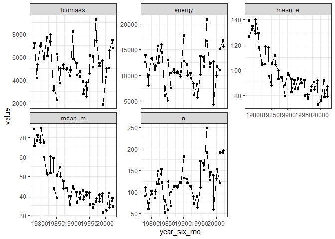
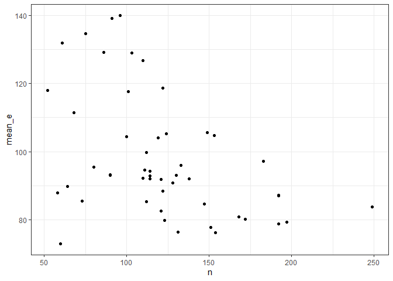

Rough replotting of White 2004 data
================

``` r
library(ggplot2)
library(dplyr)
```

    ## 
    ## Attaching package: 'dplyr'

    ## The following objects are masked from 'package:stats':
    ## 
    ##     filter, lag

    ## The following objects are masked from 'package:base':
    ## 
    ##     intersect, setdiff, setequal, union

``` r
individual_rats <- portalr::summarise_individual_rodents(clean = TRUE, type = "Granivores", time = "date", length = "Longterm")
```

    ## Loading in data version 2.18.0

``` r
head(individual_rats)
```

    ##   censusdate month day year treatment plot stake species  sex hfl wgt tag ltag
    ## 1 1977-07-16     7  16 1977   control    3    26      DM    M  35  NA   0    0
    ## 2 1977-07-16     7  16 1977   control    3    55      DM    M  35  NA   0    0
    ## 3 1977-07-16     7  16 1977   control    3    72      DS    F  48  NA   0    0
    ## 4 1977-07-16     7  16 1977   control    4    66      DM    F  36  NA   0    0
    ## 5 1977-07-16     7  16 1977   control    4    76      PF <NA>  NA  NA   0    0
    ## 6 1977-07-16     7  17 1977   control   10    54      DS    F  52  NA   0    0

``` r
individual_rats <- individual_rats %>%
  filter(year %in% c(1978:2002), !is.na(wgt), treatment == "control") %>%
  mutate(six_mo = ifelse(month > 6, 2, 1)) %>%
  mutate(year_six_mo = (year * 10) + six_mo) %>%
  mutate(bmr = 5.69 * (wgt ^ .75)) %>%
  group_by(year_six_mo) %>%
  summarize(n = dplyr::n(),
            biomass = sum(wgt),
            energy = sum(bmr)) %>%
  ungroup() %>%
  mutate(mean_m = biomass/n,
         mean_e = energy/n) %>%
  tidyr::pivot_longer(-year_six_mo, names_to = "currency")


ggplot(individual_rats, aes(year_six_mo, value)) +
  geom_point() +
  geom_line() +
  theme_bw() +
  facet_wrap(vars(currency), scales = "free_y")
```

<!-- -->

``` r
wide_rats <- individual_rats %>%
  tidyr::pivot_wider(id_cols = year_six_mo, names_from = currency, values_from = value)

ggplot(wide_rats, aes(n, mean_e)) +
  geom_point() +
  theme_bw()
```

<!-- -->

``` r
summary(lm(data =wide_rats, scale(mean_e) ~ scale(n)))
```

    ## 
    ## Call:
    ## lm(formula = scale(mean_e) ~ scale(n), data = wide_rats)
    ## 
    ## Residuals:
    ##     Min      1Q  Median      3Q     Max 
    ## -2.0335 -0.5554 -0.2521  0.5369  2.0817 
    ## 
    ## Coefficients:
    ##               Estimate Std. Error t value Pr(>|t|)   
    ## (Intercept)  1.884e-16  1.281e-01   0.000  1.00000   
    ## scale(n)    -4.428e-01  1.294e-01  -3.422  0.00128 **
    ## ---
    ## Signif. codes:  0 '***' 0.001 '**' 0.01 '*' 0.05 '.' 0.1 ' ' 1
    ## 
    ## Residual standard error: 0.9059 on 48 degrees of freedom
    ## Multiple R-squared:  0.1961, Adjusted R-squared:  0.1793 
    ## F-statistic: 11.71 on 1 and 48 DF,  p-value: 0.001281

``` r
summary(lm(scale(energy) ~ year_six_mo, wide_rats))
```

    ## 
    ## Call:
    ## lm(formula = scale(energy) ~ year_six_mo, data = wide_rats)
    ## 
    ## Residuals:
    ##      Min       1Q   Median       3Q      Max 
    ## -2.26234 -0.49120 -0.07352  0.57981  2.67250 
    ## 
    ## Coefficients:
    ##               Estimate Std. Error t value Pr(>|t|)
    ## (Intercept) -30.293809  39.190658  -0.773    0.443
    ## year_six_mo   0.001522   0.001969   0.773    0.443
    ## 
    ## Residual standard error: 1.004 on 48 degrees of freedom
    ## Multiple R-squared:  0.0123, Adjusted R-squared:  -0.008282 
    ## F-statistic: 0.5975 on 1 and 48 DF,  p-value: 0.4433

``` r
summary(lm(scale(n) ~ year_six_mo, wide_rats))
```

    ## 
    ## Call:
    ## lm(formula = scale(n) ~ year_six_mo, data = wide_rats)
    ## 
    ## Residuals:
    ##      Min       1Q   Median       3Q      Max 
    ## -2.10677 -0.45642  0.04213  0.49320  2.56007 
    ## 
    ## Coefficients:
    ##               Estimate Std. Error t value Pr(>|t|)    
    ## (Intercept) -1.421e+02  3.368e+01  -4.218 0.000109 ***
    ## year_six_mo  7.139e-03  1.692e-03   4.218 0.000109 ***
    ## ---
    ## Signif. codes:  0 '***' 0.001 '**' 0.01 '*' 0.05 '.' 0.1 ' ' 1
    ## 
    ## Residual standard error: 0.863 on 48 degrees of freedom
    ## Multiple R-squared:  0.2704, Adjusted R-squared:  0.2552 
    ## F-statistic: 17.79 on 1 and 48 DF,  p-value: 0.0001086

``` r
summary(lm(scale(biomass) ~ year_six_mo, wide_rats))
```

    ## 
    ## Call:
    ## lm(formula = scale(biomass) ~ year_six_mo, data = wide_rats)
    ## 
    ## Residuals:
    ##      Min       1Q   Median       3Q      Max 
    ## -2.06138 -0.58429 -0.07385  0.63731  2.50772 
    ## 
    ## Coefficients:
    ##              Estimate Std. Error t value Pr(>|t|)
    ## (Intercept) 28.536101  39.218134   0.728     0.47
    ## year_six_mo -0.001434   0.001971  -0.728     0.47
    ## 
    ## Residual standard error: 1.005 on 48 degrees of freedom
    ## Multiple R-squared:  0.01091,    Adjusted R-squared:  -0.009696 
    ## F-statistic: 0.5294 on 1 and 48 DF,  p-value: 0.4704

``` r
summary(lm(scale(mean_e) ~ year_six_mo, wide_rats))
```

    ## 
    ## Call:
    ## lm(formula = scale(mean_e) ~ year_six_mo, data = wide_rats)
    ## 
    ## Residuals:
    ##     Min      1Q  Median      3Q     Max 
    ## -1.1427 -0.4176 -0.0405  0.3364  1.1905 
    ## 
    ## Coefficients:
    ##               Estimate Std. Error t value Pr(>|t|)    
    ## (Intercept) 231.422086  20.958497   11.04 8.94e-15 ***
    ## year_six_mo  -0.011628   0.001053  -11.04 8.94e-15 ***
    ## ---
    ## Signif. codes:  0 '***' 0.001 '**' 0.01 '*' 0.05 '.' 0.1 ' ' 1
    ## 
    ## Residual standard error: 0.537 on 48 degrees of freedom
    ## Multiple R-squared:  0.7175, Adjusted R-squared:  0.7116 
    ## F-statistic: 121.9 on 1 and 48 DF,  p-value: 8.94e-15
