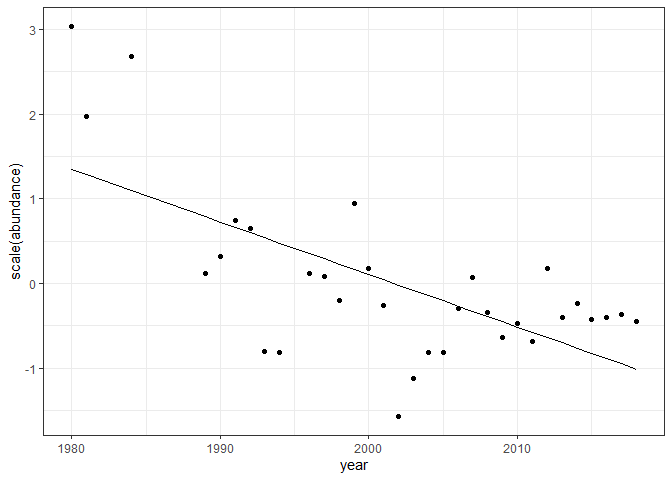
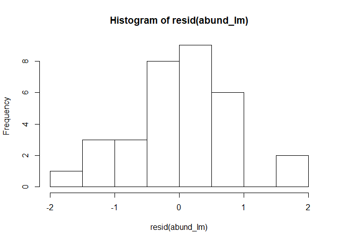
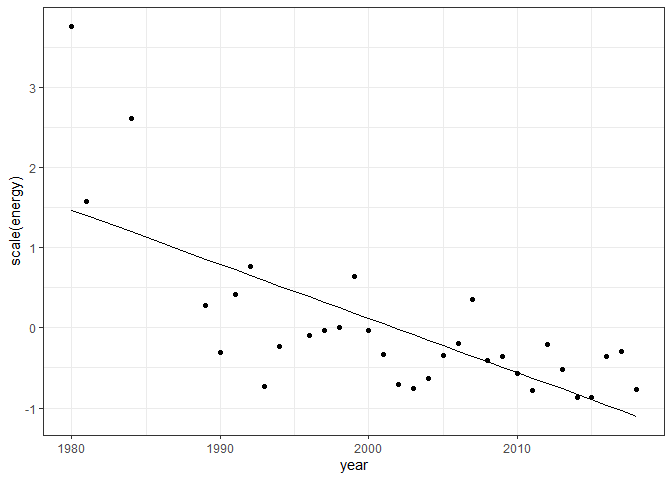
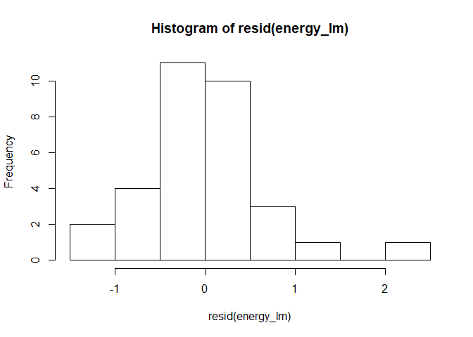

Another route
================

### Load route

Another route

Here are the species present in this route over the past 25 years:

    ## Joining, by = "id"

| id     | mean\_size | english\_common\_name  |
| :----- | ---------: | :--------------------- |
| sp4330 |   3.000898 | Rufous Hummingbird     |
| sp7490 |   6.199900 | Ruby-crowned Kinglet   |
| sp7480 |   6.200754 | Golden-crowned Kinglet |
| sp6850 |   6.702934 | Wilson’s Warbler       |
| sp6870 |   8.071829 | American Redstart      |
| sp7260 |   8.297924 | Brown Creeper          |

    ## [1] "...104 species total"

    ## `stat_bin()` using `bins = 30`. Pick better value with `binwidth`.

<!-- -->

Here is how species richness, abundance, biomass, and energy have
changed over those years:

<!-- -->

### Trends/tradeoffs in E and N

We can do some (crude) linear model fitting. I’ve generally been finding
that lms are OK, with caveats:

  - you do want to check for autocorrelation
  - the normal q-q plots are often kind of wonky

<!-- end list -->

    ## 
    ## Call:
    ## lm(formula = scaled_value ~ year, data = filter(sv_long, currency == 
    ##     "abundance"))
    ## 
    ## Residuals:
    ##      Min       1Q   Median       3Q      Max 
    ## -1.54581 -0.41100  0.04277  0.49425  1.68567 
    ## 
    ## Coefficients:
    ##              Estimate Std. Error t value Pr(>|t|)    
    ## (Intercept) 124.19913   25.78024   4.818  3.9e-05 ***
    ## year         -0.06205    0.01288  -4.818  3.9e-05 ***
    ## ---
    ## Signif. codes:  0 '***' 0.001 '**' 0.01 '*' 0.05 '.' 0.1 ' ' 1
    ## 
    ## Residual standard error: 0.7633 on 30 degrees of freedom
    ## Multiple R-squared:  0.4362, Adjusted R-squared:  0.4174 
    ## F-statistic: 23.21 on 1 and 30 DF,  p-value: 3.897e-05

    ##                   2.5 %       97.5 %
    ## (Intercept) 71.54884751 176.84941375
    ## year        -0.08834842  -0.03574407

<!-- --><!-- -->

    ## 
    ## Call:
    ## lm(formula = scaled_value ~ year, data = filter(sv_long, currency == 
    ##     "energy"))
    ## 
    ## Residuals:
    ##      Min       1Q   Median       3Q      Max 
    ## -1.32121 -0.39892 -0.02247  0.26707  2.28860 
    ## 
    ## Coefficients:
    ##              Estimate Std. Error t value Pr(>|t|)    
    ## (Intercept) 135.08010   23.88678   5.655 3.67e-06 ***
    ## year         -0.06748    0.01193  -5.655 3.67e-06 ***
    ## ---
    ## Signif. codes:  0 '***' 0.001 '**' 0.01 '*' 0.05 '.' 0.1 ' ' 1
    ## 
    ## Residual standard error: 0.7072 on 30 degrees of freedom
    ## Multiple R-squared:  0.516,  Adjusted R-squared:  0.4998 
    ## F-statistic: 31.98 on 1 and 30 DF,  p-value: 3.669e-06

    ##                   2.5 %       97.5 %
    ## (Intercept) 86.29679812 183.86340884
    ## year        -0.09185243  -0.04311168

<!-- --><!-- -->

<!-- -->

    ## 
    ## Call:
    ## lm(formula = scale(mean_energy) ~ scale(abundance), data = sv)
    ## 
    ## Residuals:
    ##     Min      1Q  Median      3Q     Max 
    ## -1.8459 -0.5227 -0.1510  0.4743  3.0897 
    ## 
    ## Coefficients:
    ##                    Estimate Std. Error t value Pr(>|t|)
    ## (Intercept)      -4.888e-16  1.780e-01   0.000    1.000
    ## scale(abundance) -1.370e-01  1.809e-01  -0.757    0.455
    ## 
    ## Residual standard error: 1.007 on 30 degrees of freedom
    ## Multiple R-squared:  0.01876,    Adjusted R-squared:  -0.01394 
    ## F-statistic: 0.5737 on 1 and 30 DF,  p-value: 0.4547

    ## [1] "energy sd/mean"

    ## [1] 0.3262462

    ## [1] "abundance sd/mean"

    ## [1] 0.2945033

Another notion is that energy should maybe track abundance? We have
already seen that energy is more variable than abundance and that the
overall trend for energy is not the same as the one for abundance. Here
is the extent to which abundance predicts energy:

<!-- -->

    ## 
    ## Call:
    ## lm(formula = scale(energy) ~ scale(abundance), data = sv)
    ## 
    ## Residuals:
    ##      Min       1Q   Median       3Q      Max 
    ## -0.64292 -0.21746 -0.03494  0.17744  0.91612 
    ## 
    ## Coefficients:
    ##                   Estimate Std. Error t value Pr(>|t|)    
    ## (Intercept)      2.456e-16  6.341e-02    0.00        1    
    ## scale(abundance) 9.357e-01  6.443e-02   14.52 4.12e-15 ***
    ## ---
    ## Signif. codes:  0 '***' 0.001 '**' 0.01 '*' 0.05 '.' 0.1 ' ' 1
    ## 
    ## Residual standard error: 0.3587 on 30 degrees of freedom
    ## Multiple R-squared:  0.8755, Adjusted R-squared:  0.8713 
    ## F-statistic: 210.9 on 1 and 30 DF,  p-value: 4.125e-15

<!-- -->

### Fixed or variable ISDs

<!-- --><!-- -->

The plots above are both constructed based on KDEs. There are
assumptions and artefacts in there I’m not quite 100% on: the weighting
of samples from different time steps. I also have a well-worn mental
module that likes to construct ISDs via kdes or GMMs and then get
started comparing them via overlap, etc. I’d like to explore something a
little different at the moment, so I’m going to actually put a pin in
things derived from KDEs and work instead off of pools of individuals.

<!-- -->

This is the distribution of sizes of all the individuals we’ve ever seen
on this route.

One possibility is that we’re equally likely to draw any of these
individuals at any time step, and so we expect the ISD we observe at any
time step to be a random sample of \(N_t\) of all of these individuals.
Alternatively, there could be substantively different underlying ISDs we
are drawing our \(N_t\) individuals from, and the underlying ISDs could
vary systematically over time or orthogonal/not-detectably-parallel-to
time.

These possibilities go fairly deep in their implications. We can start
by thinking about it in terms of energy?

Energy could vary without a systematic trend if the ISD at each time
step is generated via the random draws from an ur-ISD. But that
variation might or might not rise to the magnitude we observe here.

### Energy variability from a randomized isd

    ## Joining, by = "year"

<!-- --><!-- -->

    ## `stat_bin()` using `bins = 30`. Pick better value with `binwidth`.

<!-- -->

The cloud of lines represent the distribution of *total energy values*
for 1000 bootstrap sampled ISDs. The histogram is the coefficient of
variation (sd/mean) for E over every simulation; the red line is the
observed. The observed E time series is way more variable than any of
the ones that we generated by resampling from a stable ISD.

Similarly, the cloud of dots visualizes the variation in
energy-abundance relation obtained via sampling. Compared to the red
dots, which are observed.
